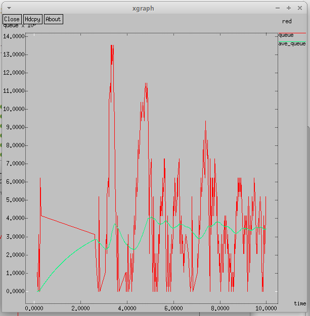
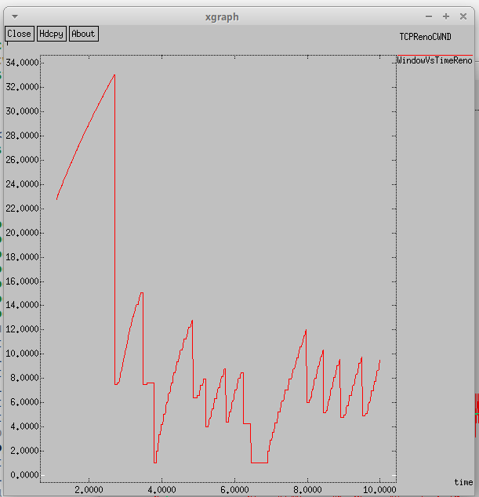
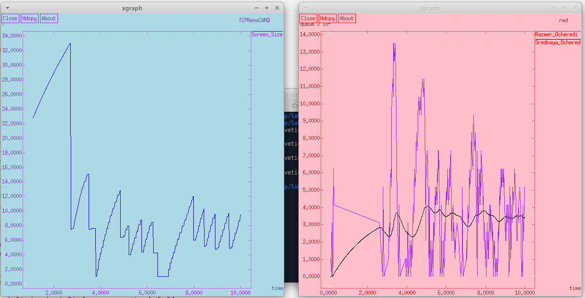
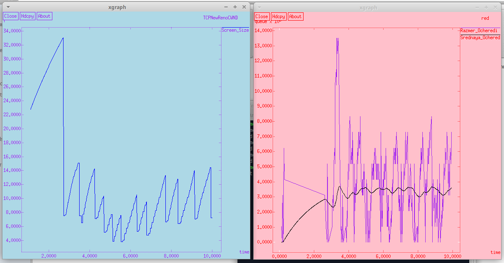
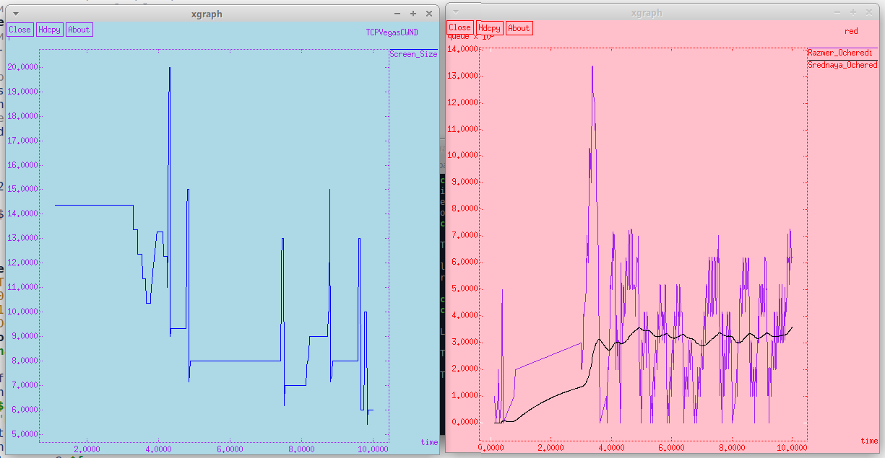

---
## Front matter
lang: ru-RU
title: "Лабораторная работа №2. Исследование протокола TCP и алгоритма управления очередью RED"
subtitle: "Дисциплина: Имитационное моделирование"
author:
  - Ганина Т. С.
institute:
  - Группа НФИбд-01-22
  - Российский университет дружбы народов, Москва, Россия
date: 21 февраля 2025

## i18n babel
babel-lang: russian
babel-otherlangs: english

## Formatting pdf
toc: false
toc-title: Содержание
slide_level: 2
aspectratio: 169
section-titles: true
theme: metropolis
header-includes:
 - \metroset{progressbar=frametitle,sectionpage=progressbar,numbering=fraction}
 - '\makeatletter'
 - '\beamer@ignorenonframefalse'
 - '\makeatother'
---

# Информация

## Докладчик

:::::::::::::: {.columns align=center}
::: {.column width="70%"}

  * Ганина Таисия Сергеевна
  * Студентка 3го курса, группа НФИбд-01-22
  * Фундаментальная информатика и информационные технологии
  * Российский университет дружбы народов
  * [Ссылка на репозиторий гитхаба tsganina](https://github.com/tsganina/study_2024-2025_simmod)

:::
::: {.column width="30%"}

:::
::::::::::::::

# Вводная часть

## Цели и задачи

Целью данной работы является исследование протокола TCP и алгоритма управления очередью RED.

## Задание

1. Повторить задание из файла с описанием лабораторной работой.
2. Изменить в модели на узле s1 тип протокола TCP с Reno на NewReno, затем на Vegas. Сравнить и пояснить результаты. Внесите изменения при отображении окон с графиками (измените цвет фона, цвет траекторий, подписи к осям, подпись траектории в легенде).

# Пример с дисциплиной RED.

## Результат моделирования изменения размера очереди

{#fig:002 width=30%}

## Результат моделирования изменения размера окна

{#fig:003 width=30%}

## Изменение цветов

```
puts $f "TitleText: red"
puts $f "0.Color: Purple"
puts $f "1.Color: Black"
...
puts $f \"Razmer_Ocheredi
exec cat temp.q >@ $f
puts $f \n\"Srednaya_Ochered
...
exec xgraph -fg purple -bg lightblue -bb -tk -x time -t "TCPNewRenoCWND" WindowVsTimeReno &
exec xgraph -fg red -bg pink -bb -tk -x time -y queue temp.queue &
exit 0
...
puts $windowVsTime "0.Color: blue"
puts $windowVsTime \"Screen_Size"
```

## Изменение цветов

{#fig:004 width=70%}

## Замена в модели на узле s1 тип протокола TCP с Reno на NewReno

```
# Агенты и приложения:
set tcp1 [$ns create-connection TCP/Newreno $node_(s1) TCPSink $node_(s3) 0]
$tcp1 set window_ 15
set tcp2 [$ns create-connection TCP/Reno $node_(s2) TCPSink $node_(s3) 1]
```
## Замена в модели на узле s1 тип протокола TCP с Reno на NewReno

{#fig:005 width=70%}

## Замена в модели на узле s1 тип протокола TCP с NewReno на Vegas

{#fig:006 width=70%}


# Результаты

В ходе работы было исследовано взаимодействие протокола TCP и алгоритма управления очередью RED. Алгоритм RED регулирует сброс пакетов, предотвращая перегрузку сети, а TCP Vegas показал лучшие результаты в минимизации потерь пакетов.
