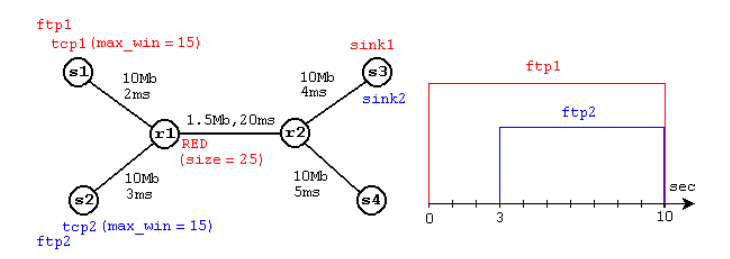
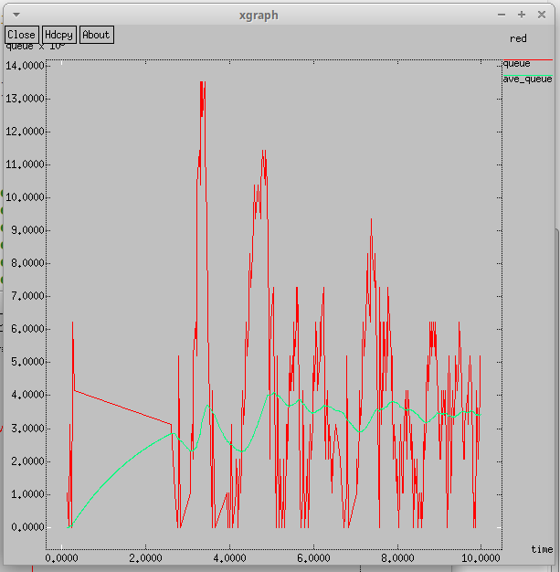
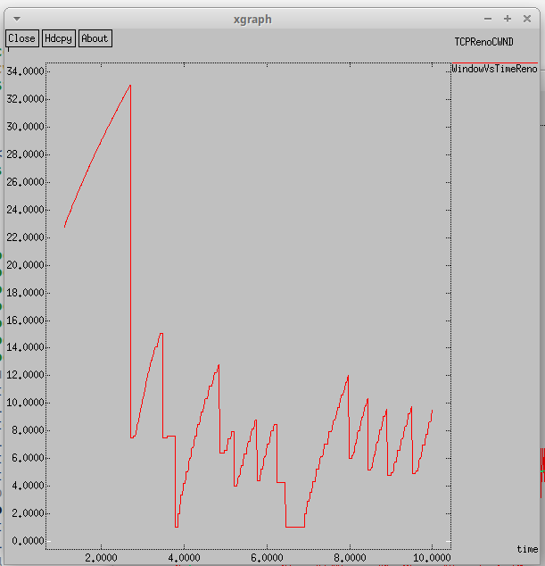
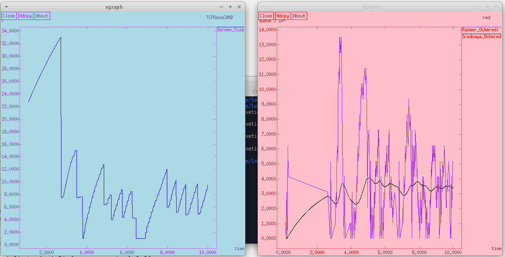
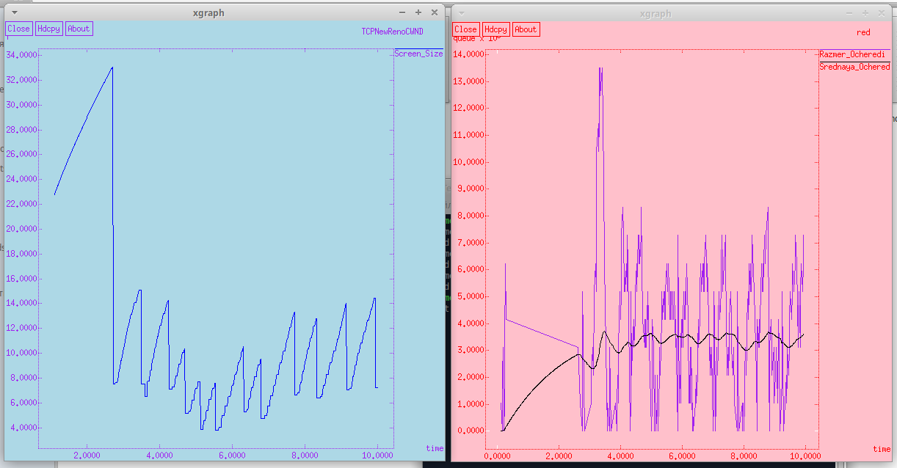
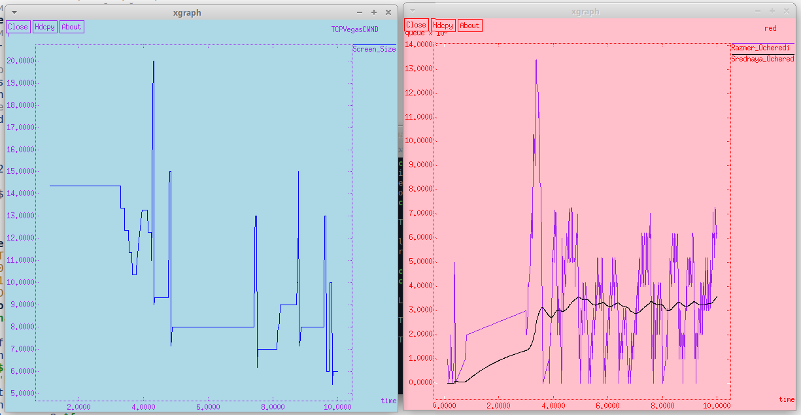

---
## Front matter
title: "Отчёт по лабораторной работе №2"
subtitle: "Дисциплина: Имитационное моделирование"
author: "Ганина Таисия Сергеевна, НФИбд-01-22"

## Generic otions
lang: ru-RU
toc-title: "Содержание"

## Bibliography
bibliography: bib/cite.bib
csl: pandoc/csl/gost-r-7-0-5-2008-numeric.csl

## Pdf output format
toc: true # Table of contents
toc-depth: 2
lof: true # List of figures
lot: true # List of tables
fontsize: 12pt
linestretch: 1.5
papersize: a4
documentclass: scrreprt
## I18n polyglossia
polyglossia-lang:
  name: russian
  options:
	- spelling=modern
	- babelshorthands=true
polyglossia-otherlangs:
  name: english
## I18n babel
babel-lang: russian
babel-otherlangs: english
## Fonts
mainfont: PT Serif
romanfont: PT Serif
sansfont: PT Sans
monofont: PT Mono
mainfontoptions: Ligatures=TeX
romanfontoptions: Ligatures=TeX
sansfontoptions: Ligatures=TeX,Scale=MatchLowercase
monofontoptions: Scale=MatchLowercase,Scale=0.9
## Biblatex
biblatex: true
biblio-style: "gost-numeric"
biblatexoptions:
  - parentracker=true
  - backend=biber
  - hyperref=auto
  - language=auto
  - autolang=other*
  - citestyle=gost-numeric
## Pandoc-crossref LaTeX customization
figureTitle: "Рис."
tableTitle: "Таблица"
listingTitle: "Листинг"
lofTitle: "Список иллюстраций"
lotTitle: "Список таблиц"
lolTitle: "Листинги"
## Misc options
indent: true
header-includes:
  - \usepackage{indentfirst}
  - \usepackage{float} # keep figures where there are in the text
  - \floatplacement{figure}{H} # keep figures where there are in the text
---

# Цель работы

Целью данной работы является исследование протокола TCP и алгоритма управления очередью RED.

# Задание

1. Повторить задание из файла с описанием лабораторной работой.
2. Изменить в модели на узле s1 тип протокола TCP с Reno на NewReno, затем на Vegas. Сравнить и пояснить результаты. Внесите изменения при отображении окон с графиками (измените цвет фона, цвет траекторий, подписи к осям, подпись траектории в легенде).

# Теоретическое введение

Протокол управления передачей (Transmission Control Protocol, TCP) имеет средства управления потоком и коррекции ошибок, ориентирован на установление соединения.

В ns-2 поддерживает следующие TCP-агенты односторонней передачи:

- Agent/TCP
- Agent/TCP/Reno
- Agent/TCP/Newreno
- Agent/TCP/Sack1 — TCP с выборочным повтором (RFC2018)
- Agent/TCP/Vegas
- Agent/TCP/Fack — Reno TCP с «последующим подтверждением»
- Agent/TCP/Linux — TCP-передатчик с поддержкой SACK, который использует TCP с перезагрузкой контрольных модулей из ядра Linux 

Односторонние агенты приёма:

- Agent/TCPSink
- Agent/TCPSink/DelAck
- Agent/TCPSink/Sack1
- Agent/TCPSink/Sack1/DelAck

Двунаправленный агент:

- Agent/TCP/FullTcp

**Изменение TCP-окна**

TCP-окно (или окно перегрузки) — это один из ключевых механизмов управления потоком данных в протоколе TCP. Оно определяет количество данных, которые отправитель может передать до получения подтверждения от получателя. То есть, чем больше окно, тем большее количество данных можно отправить перед ожиданием подтверждения.

Изменение размера TCP-окна связано с механизмами контроля перегрузки, которые включают:

1. **Медленный старт (Slow Start)**: Начальное увеличение размера окна перегрузки. Когда соединение только устанавливается, размер окна начинает с малого значения и постепенно увеличивается.
  
2. **Избежание перегрузки (Congestion Avoidance)**: После достижения определенного порога (порога медленного старта) окно перегрузки продолжает увеличиваться, но более медленно.
  
3. **Быстрый повтор передачи (Fast Retransmit)**: В случае потери данных отправитель снижает размер окна перегрузки вдвое.
  
4. **Быстрое восстановление (Fast Recovery)**: Если были получены три дублирующих подтверждения, отправитель снова увеличивает размер окна перегрузки, чтобы быстрее восстановиться после потери данных.
  
Таким образом, изменение размера TCP-окна отражает адаптацию протокола TCP к условиям сети и состоянию соединения.

**Изменение длины очереди**

Длина очереди изменяется в зависимости от количества данных, поступающих в очередь и покидающих ее. В контексте моделирования сети, длина очереди представляет собой количество пакетов, находящихся в данный момент в буфере маршрутизатора или другого сетевого устройства.

**Основные причины изменения длины очереди:**

1. **Поступление новых пакетов**: Чем больше данных отправляется в сеть, тем больше пакетов попадает в очередь.
  
2. **Обработка пакетов**: Пакеты обрабатываются и отправляются дальше по сети, что приводит к уменьшению длины очереди.
  
3. **Сброс пакетов (Dropping Packets)**: Некоторые пакеты могут быть отброшены, если очередь достигает своего максимального размера. В нашем случае, узел `r1` использует дисциплину RED для управления длиной очереди, что позволяет предотвратить её переполнение.
  
**Средняя длина очереди**

Средняя длина очереди рассчитывается как средневзвешенное значение длины очереди за определенный период времени. Это помогает получить представление о тенденциях изменения состояния очереди и позволяет лучше управлять сетью.


# Выполнение лабораторной работы

1. Пример с дисциплиной RED. 

Постановка задачи. Описание моделируемой сети:
- сеть состоит из 6 узлов;
- между всеми узлами установлено дуплексное соединение с различными пропускной способностью и задержкой 10 мс.
- узел r1 использует очередь с дисциплиной RED для накопления пакетов, максимальный размер которой составляет 25;
- TCP-источники на узлах s1 и s2 подключаются к TCP-приёмнику на узле s3;
- генераторы трафика FTP прикреплены к TCP-агентам.
(рис. @fig:001, @fig:002, @fig:003).

{#fig:001 width=70%}

{#fig:002 width=70%}

{#fig:003 width=70%}

Стоит отметить, что до добавления строчки:
```
after 1000
exec xgraph -fg purple -bg lightblue -bb -tk -x time -t 
  "TCPVegasCWND" WindowVsTimeReno &
exec xgraph -fg red -bg pink -bb -tk -x time -y queue temp.queue &

```

когда я пыталась запустить повторно скрипт, то выходил только один график -- с изменением размера очереди. 
`after` — это встроенная команда в Tcl, которая позволяет отложить выполнение следующей команды на заданное количество миллисекунд.
В моем случае `after 1000` задерживает выполнение следующей команды (в данном случае — вызова xgraph) на 1000 миллисекунд, то есть на 1 секунду. 

Как я поняла, связано это вот с чем:
После задержки в 1000 миллисекунд, команды `exec xgraph ...` выполняются и начинают строить графики на основе данных из файлов. Теперь, так как данные успели записаться в файлы, xgraph получает правильную информацию и отображает графики корректно.
Если не добавить задержку, команда `xgraph` может быть выполнена до того, как файлы с данными будут полностью обновлены.
Задержка гарантирует, что между записью данных и визуализацией есть достаточный интервал, чтобы все операции завершились.

2. Теперь я решила приступить к изменению цветов. Для этого я использовала следующие строки:
```
puts $f "TitleText: red"
puts $f "0.Color: Purple"
puts $f "1.Color: Black"
```
Это изменило цвет графиков(линий графиков) в окне xgraph, где чертились зависимость размера очереди от времени и средний размер очереди.

```
puts $f \"Razmer_Ocheredi
exec cat temp.q >@ $f
puts $f \n\"Srednaya_Ochered
```
Это изменило подписи графиков в легенде.

```
exec xgraph -fg purple -bg lightblue 
  -bb -tk -x time -t "TCPNewRenoCWND" <...>
exec xgraph -fg red -bg pink 
  -bb -tk -x time -y queue temp.queue &
exit 0
```

Это изменило цвет осей и фона за графиками. На графике с изменением размера окна фон стал светло голубым, а цвет осей -- фиолетовым. На втором же графике с очередями фон стал розовым, а оси -- красными. Я специально старалась подобрать цвета, которые бы хорошо сочетались и не делали графики нечитаемыми.

```
puts $windowVsTime "0.Color: blue"
puts $windowVsTime \"Screen_Size"
```
Это изменило подпись в легенде и цвет линии графика в окне xgraph с графиком размера TCP-окна.

Внешне теперь графики выглядят так:
(рис. @fig:004).

{#fig:004 width=70%}

3. Теперь я заменила в модели на узле s1 тип протокола TCP с Reno на NewReno. График остался похожим на протокол с Reno, rак и в графике для типа Reno, средняя длина очереди варьируется от 2 до 4, при этом максимальное значение достигает 14. В обоих случаях размер окна продолжает расти до тех пор, пока не происходит потеря сегмента. (рис. @fig:005)

```
# Агенты и приложения:
set tcp1 [$ns create-connection 
  TCP/Newreno $node_(s1) TCPSink $node_(s3) 0]
$tcp1 set window_ 15
set tcp2 [$ns create-connection 
  TCP/Reno $node_(s2) TCPSink $node_(s3) 1]
```

{#fig:005 width=70%}

4. Далее я заменила в модели на узле s1 тип протокола TCP с NewReno на Vegas.

Из графика видно, что средняя длина очереди снова колеблется в пределах от 2 до 4. Однако можно отметить, что в этом случае длина очереди увеличивается медленее, чаще она не сильно велика, меньше, чем при использовании типов Reno или NewReno. Максимальное значение длины очереди достигает 14. 

Одним из ключевых отличий является поведение графиков изменения размера окна. Для TCP Vegas максимальное значение окна ограничено 20, что меньше по сравнению с максимальным размером окна в 34 у NewReno. Важно подчеркнуть, что TCP Vegas использует иной подход к контролю перегрузки: он может обнаружить признаки перегрузки в сети прежде, чем произойдёт потеря пакетов, и уменьшает размер окна. Такой подход позволяет избегать потерь пакетов, поскольку размер окна адаптируется к текущей ситуации в сети, что позволяет избежать сильных перегрузок и потерь в данных. В результате, TCP Vegas более эффективно управляет пропускной способностью сети, минимизируя риски потерь и замедлений. (рис. @fig:006)

{#fig:006 width=70%}

# Листинги

1. Листинг с изменением при отображении окон с графиками (измените цвет фона, цвет траекторий, подписи к осям, подпись траектории в легенде).

```
# создание объекта Simulator
set ns [new Simulator]
# открытие на запись файла out.nam для визуализатора nam
set nf [open out.nam w]
# все результаты моделирования будут записаны в переменную nf
$ns namtrace-all $nf
# открытие на запись файла трассировки out.tr
# для регистрации всех событий
set f [open out.tr w]
# все регистрируемые события будут записаны в переменную f
$ns trace-all $f

# Процедура finish:
proc finish {} {
global tchan_
# подключение кода AWK:
set awkCode {
{
if ($1 == "Q" && NF>2) {
print $2, $3 >> "temp.q";
set end $2
}
else if ($1 == "a" && NF>2)
print $2, $3 >> "temp.a";
}
}
set f [open temp.queue w]
puts $f "TitleText: red"
puts $f "0.Color: Purple"
puts $f "1.Color: Black"
puts $f "Device: Postscript"
if { [info exists tchan_] } {
close $tchan_
}
exec rm -f temp.q temp.a
exec touch temp.a temp.q
exec awk $awkCode all.q
puts $f \"Razmer_Ocheredi
exec cat temp.q >@ $f
puts $f \n\"Srednaya_Ochered
exec cat temp.a >@ $f
close $f
# Запуск xgraph с графиками окна TCP и очереди:
exec xgraph -fg purple -bg lightblue -bb -tk -x time -t 
  "TCPRenoCWND" WindowVsTimeReno &
exec xgraph -fg red -bg pink -bb -tk -x time -y 
  queue temp.queue &
exit 0
}

# Формирование файла с данными о размере окна TCP:
proc plotWindow {tcpSource file} {
global ns
set time 0.01
set now [$ns now]
set cwnd [$tcpSource set cwnd_]
puts $file "$now $cwnd"
$ns at [expr $now+$time] "plotWindow $tcpSource $file"
}

# Узлы сети:
set N 5
for {set i 1} {$i < $N} {incr i} {
set node_(s$i) [$ns node]
}
set node_(r1) [$ns node]
set node_(r2) [$ns node]
# Соединения:
$ns duplex-link $node_(s1) $node_(r1) 10Mb 2ms DropTail
$ns duplex-link $node_(s2) $node_(r1) 10Mb 3ms DropTail
$ns duplex-link $node_(r1) $node_(r2) 1.5Mb 20ms RED
$ns queue-limit $node_(r1) $node_(r2) 25
$ns queue-limit $node_(r2) $node_(r1) 25
$ns duplex-link $node_(s3) $node_(r2) 10Mb 4ms DropTail
$ns duplex-link $node_(s4) $node_(r2) 10Mb 5ms DropTail

# Агенты и приложения:
set tcp1 [$ns create-connection TCP/Reno $node_(s1) 
  TCPSink $node_(s3) 0]
$tcp1 set window_ 15
set tcp2 [$ns create-connection TCP/Reno $node_(s2) 
  TCPSink $node_(s3) 1]
$tcp2 set window_ 15
set ftp1 [$tcp1 attach-source FTP]
set ftp2 [$tcp2 attach-source FTP]

# Мониторинг размера окна TCP:
set windowVsTime [open WindowVsTimeReno w]
puts $windowVsTime "0.Color: blue"
puts $windowVsTime \"Screen_Size"
set qmon [$ns monitor-queue $node_(r1) $node_(r2) [open qm.out w] 0.1];
[$ns link $node_(r1) $node_(r2)] queue-sample-timeout;

# Мониторинг очереди:
set redq [[$ns link $node_(r1) $node_(r2)] queue]
set tchan_ [open all.q w]
$redq trace curq_
$redq trace ave_
$redq attach $tchan_

# Добавление at-событий:
$ns at 0.0 "$ftp1 start"
$ns at 1.1 "plotWindow $tcp1 $windowVsTime"
$ns at 3.0 "$ftp2 start"
$ns at 10 "finish"
# запуск модели
$ns run
```


2. Измените в модели на узле s1 тип протокола TCP с Reno на NewReno.

```
# создание объекта Simulator
set ns [new Simulator]
# открытие на запись файла out.nam для визуализатора nam
set nf [open out.nam w]
# все результаты моделирования будут записаны в переменную nf
$ns namtrace-all $nf
# открытие на запись файла трассировки out.tr
# для регистрации всех событий
set f [open out.tr w]
# все регистрируемые события будут записаны в переменную f
$ns trace-all $f

# Процедура finish:
proc finish {} {
global tchan_
# подключение кода AWK:
set awkCode {
{
if ($1 == "Q" && NF>2) {
print $2, $3 >> "temp.q";
set end $2
}
else if ($1 == "a" && NF>2)
print $2, $3 >> "temp.a";
}
}
set f [open temp.queue w]
puts $f "TitleText: red"
puts $f "0.Color: Purple"
puts $f "1.Color: Black"
puts $f "Device: Postscript"
if { [info exists tchan_] } {
close $tchan_
}
exec rm -f temp.q temp.a
exec touch temp.a temp.q
exec awk $awkCode all.q
puts $f \"Razmer_Ocheredi
exec cat temp.q >@ $f
puts $f \n\"Srednaya_Ochered
exec cat temp.a >@ $f
close $f
# Запуск xgraph с графиками окна TCP и очереди:
exec xgraph -fg purple -bg lightblue -bb -tk -x 
  time -t "TCPRenoCWND" WindowVsTimeReno &
exec xgraph -fg red -bg pink -bb -tk -x time -y 
  queue temp.queue &
exit 0
}

# Формирование файла с данными о размере окна TCP:
proc plotWindow {tcpSource file} {
global ns
set time 0.01
set now [$ns now]
set cwnd [$tcpSource set cwnd_]
puts $file "$now $cwnd"
$ns at [expr $now+$time] "plotWindow $tcpSource $file"
}

# Узлы сети:
set N 5
for {set i 1} {$i < $N} {incr i} {
set node_(s$i) [$ns node]
}
set node_(r1) [$ns node]
set node_(r2) [$ns node]
# Соединения:
$ns duplex-link $node_(s1) $node_(r1) 10Mb 2ms DropTail
$ns duplex-link $node_(s2) $node_(r1) 10Mb 3ms DropTail
$ns duplex-link $node_(r1) $node_(r2) 1.5Mb 20ms RED
$ns queue-limit $node_(r1) $node_(r2) 25
$ns queue-limit $node_(r2) $node_(r1) 25
$ns duplex-link $node_(s3) $node_(r2) 10Mb 4ms DropTail
$ns duplex-link $node_(s4) $node_(r2) 10Mb 5ms DropTail


# Агенты и приложения:
set tcp1 [$ns create-connection TCP/Newreno 
  $node_(s1) TCPSink $node_(s3) 0]
$tcp1 set window_ 15
set tcp2 [$ns create-connection TCP/Reno 
  $node_(s2) TCPSink $node_(s3) 1]
$tcp2 set window_ 15
set ftp1 [$tcp1 attach-source FTP]
set ftp2 [$tcp2 attach-source FTP]

# Мониторинг размера окна TCP:
set windowVsTime [open WindowVsTimeReno w]
puts $windowVsTime "0.Color: blue"
puts $windowVsTime \"Screen_Size"
set qmon [$ns monitor-queue $node_(r1) $node_(r2) [open qm.out w] 0.1];
[$ns link $node_(r1) $node_(r2)] queue-sample-timeout;

# Мониторинг очереди:
set redq [[$ns link $node_(r1) $node_(r2)] queue]
set tchan_ [open all.q w]
$redq trace curq_
$redq trace ave_
$redq attach $tchan_

# Добавление at-событий:
$ns at 0.0 "$ftp1 start"
$ns at 1.1 "plotWindow $tcp1 $windowVsTime"
$ns at 3.0 "$ftp2 start"
$ns at 10 "finish"
# запуск модели
$ns run
```


3. Измените в модели на узле s1 тип протокола TCP с Reno на Vegas.

```
# создание объекта Simulator
set ns [new Simulator]
# открытие на запись файла out.nam для визуализатора nam
set nf [open out.nam w]
# все результаты моделирования будут записаны в переменную nf
$ns namtrace-all $nf
# открытие на запись файла трассировки out.tr
# для регистрации всех событий
set f [open out.tr w]
# все регистрируемые события будут записаны в переменную f
$ns trace-all $f

# Процедура finish:
proc finish {} {
global tchan_
# подключение кода AWK:
set awkCode {
{
if ($1 == "Q" && NF>2) {
print $2, $3 >> "temp.q";
set end $2
}
else if ($1 == "a" && NF>2)
print $2, $3 >> "temp.a";
}
}
set f [open temp.queue w]
puts $f "TitleText: red"
puts $f "0.Color: Purple"
puts $f "1.Color: Black"
puts $f "Device: Postscript"
if { [info exists tchan_] } {
close $tchan_
}
exec rm -f temp.q temp.a
exec touch temp.a temp.q
exec awk $awkCode all.q
puts $f \"Razmer_Ocheredi
exec cat temp.q >@ $f
puts $f \n\"Srednaya_Ochered
exec cat temp.a >@ $f
close $f
# Запуск xgraph с графиками окна TCP и очереди:
exec xgraph -fg purple -bg lightblue -bb -tk -x time -t 
  "TCPVegasCWND" WindowVsTimeReno &
exec xgraph -fg red -bg pink -bb -tk -x time -y 
  queue temp.queue &
exit 0
}

# Формирование файла с данными о размере окна TCP:
proc plotWindow {tcpSource file} {
global ns
set time 0.01
set now [$ns now]
set cwnd [$tcpSource set cwnd_]
puts $file "$now $cwnd"
$ns at [expr $now+$time] "plotWindow $tcpSource $file"
}

# Узлы сети:
set N 5
for {set i 1} {$i < $N} {incr i} {
set node_(s$i) [$ns node]
}
set node_(r1) [$ns node]
set node_(r2) [$ns node]
# Соединения:
$ns duplex-link $node_(s1) $node_(r1) 10Mb 2ms DropTail
$ns duplex-link $node_(s2) $node_(r1) 10Mb 3ms DropTail
$ns duplex-link $node_(r1) $node_(r2) 1.5Mb 20ms RED
$ns queue-limit $node_(r1) $node_(r2) 25
$ns queue-limit $node_(r2) $node_(r1) 25
$ns duplex-link $node_(s3) $node_(r2) 10Mb 4ms DropTail
$ns duplex-link $node_(s4) $node_(r2) 10Mb 5ms DropTail

# Агенты и приложения:
set tcp1 [$ns create-connection TCP/Vegas 
  $node_(s1) TCPSink $node_(s3) 0]
$tcp1 set window_ 15
set tcp2 [$ns create-connection TCP/Reno 
  $node_(s2) TCPSink $node_(s3) 1]
$tcp2 set window_ 15
set ftp1 [$tcp1 attach-source FTP]
set ftp2 [$tcp2 attach-source FTP]

# Мониторинг размера окна TCP:
set windowVsTime [open WindowVsTimeReno w]
puts $windowVsTime "0.Color: blue"
puts $windowVsTime \"Screen_Size"
set qmon [$ns monitor-queue $node_(r1) 
  $node_(r2) [open qm.out w] 0.1];
[$ns link $node_(r1) $node_(r2)] queue-sample-timeout;

# Мониторинг очереди:
set redq [[$ns link $node_(r1) $node_(r2)] queue]
set tchan_ [open all.q w]
$redq trace curq_
$redq trace ave_
$redq attach $tchan_

# Добавление at-событий:
$ns at 0.0 "$ftp1 start"
$ns at 1.1 "plotWindow $tcp1 $windowVsTime"
$ns at 3.0 "$ftp2 start"
$ns at 10 "finish"
# запуск модели
$ns run
```

# Выводы

В ходе работы было исследовано взаимодействие протокола TCP и алгоритма управления очередью RED. Результаты показали, что различные реализации TCP, такие как Reno, NewReno и Vegas, по-разному реагируют на изменение длины очереди и размера окна. Алгоритм RED эффективно регулирует сброс пакетов, предотвращая перегрузку сети, а TCP Vegas показал лучшие результаты в минимизации потерь пакетов.

# Список литературы{.unnumbered}

1. [Руководство к лабораторной работе](https://esystem.rudn.ru/mod/resource/view.php?id=1223333)

::: {#refs}
:::

