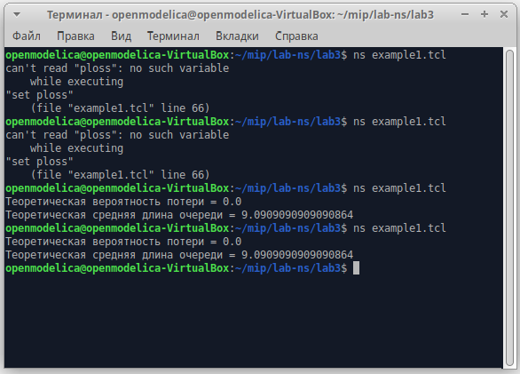
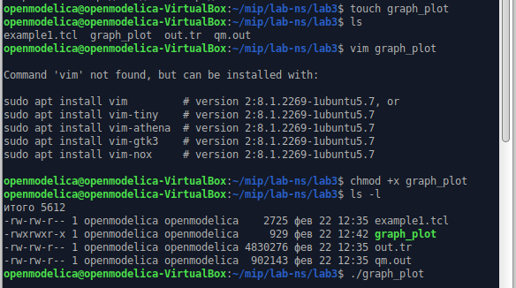
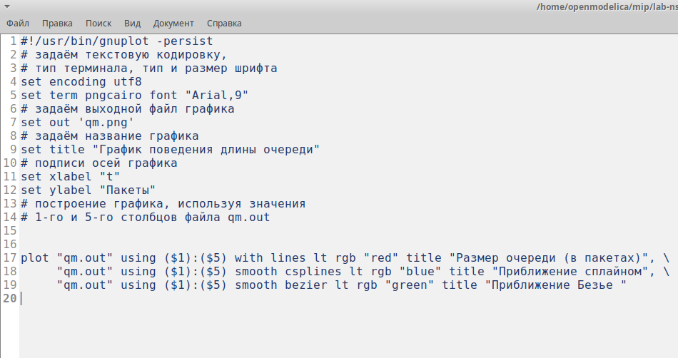
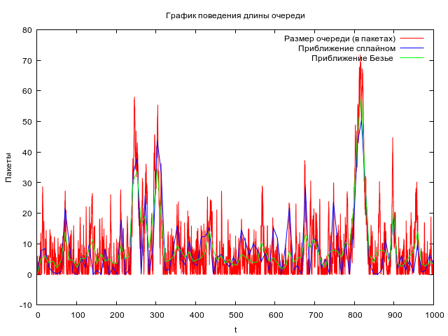

---
## Front matter
lang: ru-RU
title: "Лабораторная работа №3. Моделирование стохастических процессов"
subtitle: "Дисциплина: Имитационное моделирование"
author:
  - Ганина Т. С.
institute:
  - Группа НФИбд-01-22
  - Российский университет дружбы народов, Москва, Россия
date: 22 февраля 2025

## i18n babel
babel-lang: russian
babel-otherlangs: english

## Formatting pdf
toc: false
toc-title: Содержание
slide_level: 2
aspectratio: 169
section-titles: true
theme: metropolis
header-includes:
 - \metroset{progressbar=frametitle,sectionpage=progressbar,numbering=fraction}
 - '\makeatletter'
 - '\beamer@ignorenonframefalse'
 - '\makeatother'
---

# Информация

## Докладчик

:::::::::::::: {.columns align=center}
::: {.column width="70%"}

  * Ганина Таисия Сергеевна
  * Студентка 3го курса, группа НФИбд-01-22
  * Фундаментальная информатика и информационные технологии
  * Российский университет дружбы народов
  * [Ссылка на репозиторий гитхаба tsganina](https://github.com/tsganina/study_2024-2025_simmod)

:::
::: {.column width="30%"}

:::
::::::::::::::

# Вводная часть

## Цели и задачи

Исследование работы системы массового обслуживания, моделирование передачи пакетов в сети с использованием симулятора NS-2, анализ зависимости вероятности потерь и длины очереди от интенсивности входного потока.

## Задание

1. Реализация модели на NS-2.
2. График в GNUplot.

## Реализация модели на NS-2

{#fig:001 width=60%}

## График в GNUplot

{#fig:002 width=70%}

## График в GNUplot

{#fig:003 width=70%}

## График в GNUplot

{#fig:004 width=50%}

# Результаты

В ходе работы была смоделирована передача пакетов в сети с заданной пропускной способностью и ограниченной очередью. Было показано, что:

- При низкой загрузке системы потери минимальны, а средняя длина очереди мала.
