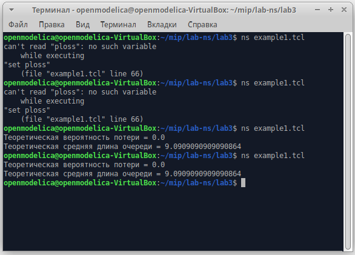
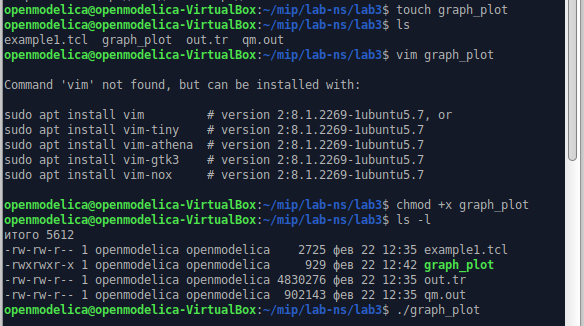
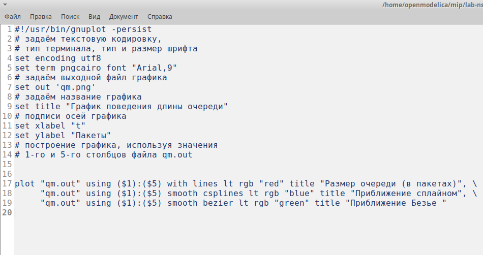
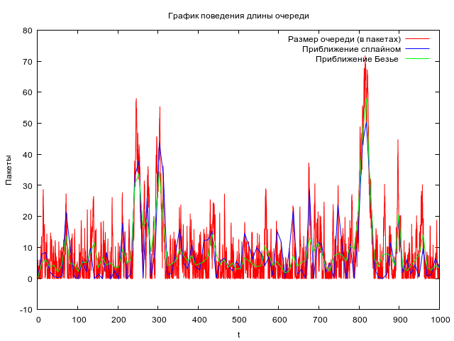

---
## Front matter
title: "Отчёт по лабораторной работе №3"
subtitle: "Дисциплина: Имитационное моделирование"
author: "Ганина Таисия Сергеевна, НФИбд-01-22"

## Generic otions
lang: ru-RU
toc-title: "Содержание"

## Bibliography
bibliography: bib/cite.bib
csl: pandoc/csl/gost-r-7-0-5-2008-numeric.csl

## Pdf output format
toc: true # Table of contents
toc-depth: 2
lof: true # List of figures
lot: true # List of tables
fontsize: 12pt
linestretch: 1.5
papersize: a4
documentclass: scrreprt
## I18n polyglossia
polyglossia-lang:
  name: russian
  options:
	- spelling=modern
	- babelshorthands=true
polyglossia-otherlangs:
  name: english
## I18n babel
babel-lang: russian
babel-otherlangs: english
## Fonts
mainfont: PT Serif
romanfont: PT Serif
sansfont: PT Sans
monofont: PT Mono
mainfontoptions: Ligatures=TeX
romanfontoptions: Ligatures=TeX
sansfontoptions: Ligatures=TeX,Scale=MatchLowercase
monofontoptions: Scale=MatchLowercase,Scale=0.9
## Biblatex
biblatex: true
biblio-style: "gost-numeric"
biblatexoptions:
  - parentracker=true
  - backend=biber
  - hyperref=auto
  - language=auto
  - autolang=other*
  - citestyle=gost-numeric
## Pandoc-crossref LaTeX customization
figureTitle: "Рис."
tableTitle: "Таблица"
listingTitle: "Листинг"
lofTitle: "Список иллюстраций"
lotTitle: "Список таблиц"
lolTitle: "Листинги"
## Misc options
indent: true
header-includes:
  - \usepackage{indentfirst}
  - \usepackage{float} # keep figures where there are in the text
  - \floatplacement{figure}{H} # keep figures where there are in the text
---

# Цель работы

Исследование работы системы массового обслуживания, моделирование передачи пакетов в сети с использованием симулятора NS-2, анализ зависимости вероятности потерь и длины очереди от интенсивности входного потока.

# Задание

1. Реализация модели на NS-2.
2. График в GNUplot.

# Теоретическое введение

M|M|1 — однолинейная СМО с накопителем бесконечной ёмкости. Поступающий поток заявок — пуассоновский с интенсивностью $\lambda$. Времена обслуживания заявок — независимые в совокупности случайные величины, распределённые по экспоненциальному закону с параметром $\mu$.

Коэффициент загрузки системы определяется формулой:  

$$ \rho = \frac{\lambda}{\mu} $$

где: 

- **$\lambda$** – интенсивность поступления пакетов.  
- **$\mu$** – интенсивность обработки пакетов.  

Вероятность потери пакетов вычисляется как:  

$$ P_{\text{loss}} = \frac{(1 - \rho) \cdot \rho^{qsize}}{1 - \rho^{qsize+1}} $$

Средняя длина очереди:

$$ L_q = \frac{\rho^2}{1 - \rho} $$

В данной лабораторной работе с помощью **NS-2** моделируется передача пакетов по каналу связи между двумя узлами. Анализируются потери пакетов и длина очереди при разных параметрах системы.  


# Выполнение лабораторной работы

1. Реализация модели на NS-2.

Результат выполнения кода: (рис. @fig:001). Так как очередь мы задали очень большую (`set qsize 100000`), а загружается она в среднем на 9 позиций, то и вероятность потери равна 0.0.

{#fig:001 width=70%}

2. График в GNUplot.

В каталоге с проектом создала отдельный файл graph_plot (рис. @fig:002): 
`touch graph_plot`

{#fig:002 width=70%}

Открыла его на редактирование и добавила следующий код(рис. @fig:003), обращая внимание на синтаксис GNUplot.

{#fig:003 width=70%}

Результат выполнения кода видно на изображении. (рис. @fig:004)

{#fig:004 width=70%}

На графике изображена динамика изменения длины очереди в зависимости от времени.

* **Оси**:
    * Ось X (горизонтальная): "t" (время). Показывает время в условных единицах.
    * Ось Y (вертикальная): "Пакеты". Показывает количество пакетов в очереди в данный момент времени.
* **Линии**:
    * Красная линия: "Размер очереди (в пакетах)". Это фактический размер очереди в каждый момент времени, отражающий мгновенную загрузку очереди.
    * Синяя линия: "Приближение сплайном". Это сглаженная версия данных о размере очереди, полученная с использованием сплайн-интерполяции. Сплайны помогают выделить общие тенденции и сгладить случайные колебания.
    * Зелёная линия: "Приближение Безье". Еще один метод сглаживания данных, использующий кривые Безье. Как и сплайны, он помогает увидеть общую картину без резких колебаний.
    
График показывает, что длина очереди постоянно меняется. Есть периоды с низкой загрузкой (близко к 0), и периоды с высокой загрузкой (пики до 60-70 пакетов).
Приближения сплайном и Безье показывают общую тенденцию изменения длины очереди. Они помогают отфильтровать краткосрочные колебания и увидеть более плавное изменение нагрузки.

# Листинги

1. Реализация модели на NS-2.
```
# создание объекта Simulator
set ns [new Simulator]
# открытие на запись файла out.tr для регистрации событий
set tf [open out.tr w]
$ns trace-all $tf

# задаём значения параметров системы
set lambda 30.0
set mu 33.0
# размер очереди для M|M|1 (для M|M|1|R: set qsize R)
set qsize 100000
# устанавливаем длительность эксперимента
set duration 1000.0
# задаём узлы и соединяем их симплексным соединением
# с полосой пропускания 100 Кб/с и задержкой 0 мс,
# очередью с обслуживанием типа DropTail
set n1 [$ns node]
set n2 [$ns node]

set link [$ns simplex-link $n1 $n2 100kb 0ms DropTail]
# наложение ограничения на размер очереди:
$ns queue-limit $n1 $n2 $qsize

# задаём распределения интервалов времени
# поступления пакетов и размера пакетов
set InterArrivalTime [new RandomVariable/Exponential]
$InterArrivalTime set avg_ [expr 1/$lambda]
set pktSize [new RandomVariable/Exponential]
$pktSize set avg_ [expr 100000.0/(8*$mu)]

# задаём агент UDP и присоединяем его к источнику,
# задаём размер пакета
set src [new Agent/UDP]
$src set packetSize_ 100000
$ns attach-agent $n1 $src

# задаём агент-приёмник и присоединяем его
set sink [new Agent/Null]
$ns attach-agent $n2 $sink
$ns connect $src $sink

# мониторинг очереди
set qmon [$ns monitor-queue $n1 $n2 [open qm.out w] 0.1]
$link queue-sample-timeout
# процедура finish закрывает файлы трассировки

proc finish {} {
	global ns tf
	$ns flush-trace
	close $tf
	exit 0
}
# процедура случайного генерирования пакетов
proc sendpacket {} {
global ns src InterArrivalTime pktSize
set time [$ns now]
$ns at [expr $time +[$InterArrivalTime value]] "sendpacket"
set bytes [expr round ([$pktSize value])]
$src send $bytes
}
# планировщик событий
$ns at 0.0001 "sendpacket"
$ns at $duration "finish"
# расчет загрузки системы и вероятности потери пакетов
set rho [expr $lambda/$mu]
set ploss [expr (1-$rho)*pow($rho,$qsize)/(1-pow($rho,($qsize+1)))]
puts "Теоретическая вероятность потери = $ploss"


set aveq [expr $rho*$rho/(1-$rho)]
puts "Теоретическая средняя длина очереди = $aveq"
# запуск модели
$ns run
```


2. График в GNUplot.

```
#!/usr/bin/gnuplot -persist
# задаём текстовую кодировку,
# тип терминала, тип и размер шрифта
set encoding utf8
set term pngcairo font "Arial,9"
# задаём выходной файл графика
set out 'qm.png'
# задаём название графика
set title "График поведения длины очереди"
# подписи осей графика
set xlabel "t"
set ylabel "Пакеты"
# построение графика, используя значения
# 1-го и 5-го столбцов файла qm.out

plot "qm.out" using ($1):($5) with lines 
        lt rgb "red" title "Размер очереди (в пакетаx)", \
     "qm.out" using ($1):($5) smooth csplines 
        lt rgb "blue" title "Приближение сплайном", \
     "qm.out" using ($1):($5) smooth bezier 
        lt rgb "green" title "Приближение Безье "
```

# Выводы

В ходе работы была смоделирована передача пакетов в сети с заданной пропускной способностью и ограниченной очередью. Было показано, что:

- При низкой загрузке системы потери минимальны, а средняя длина очереди мала.


# Список литературы{.unnumbered}

1. [Руководство к лабораторной работе №3](https://esystem.rudn.ru/mod/resource/view.php?id=1223336)

::: {#refs}
:::
