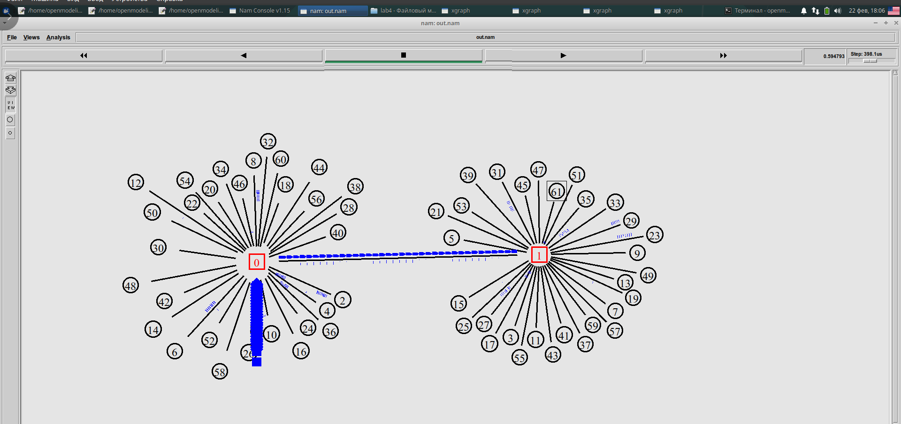
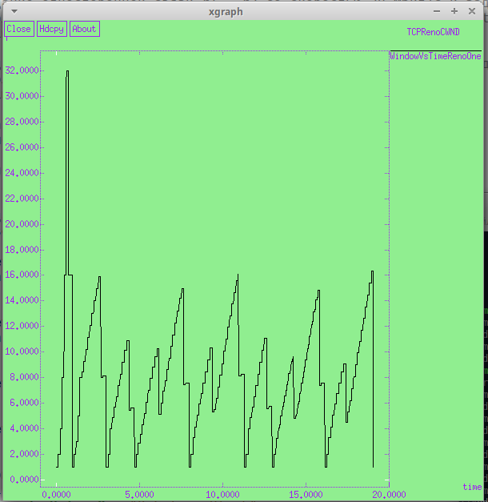
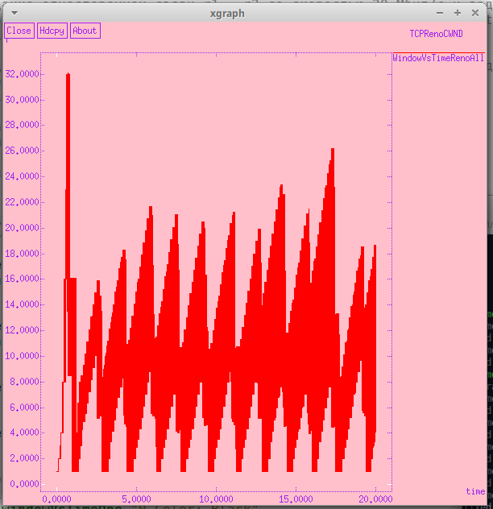
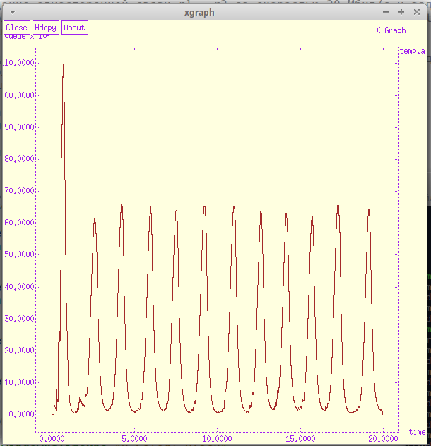
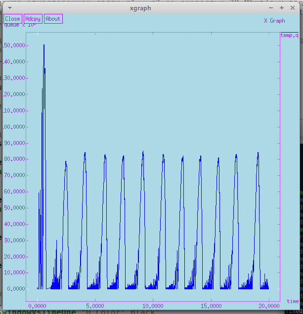
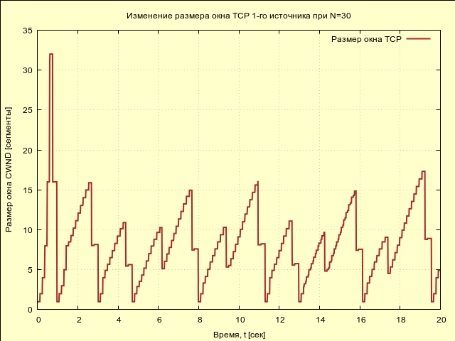
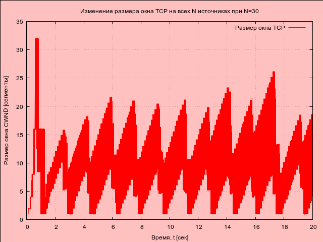
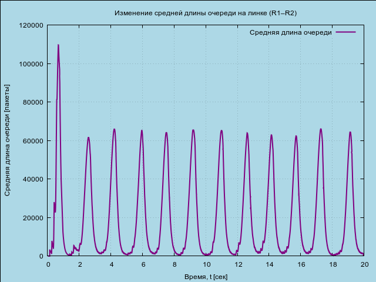
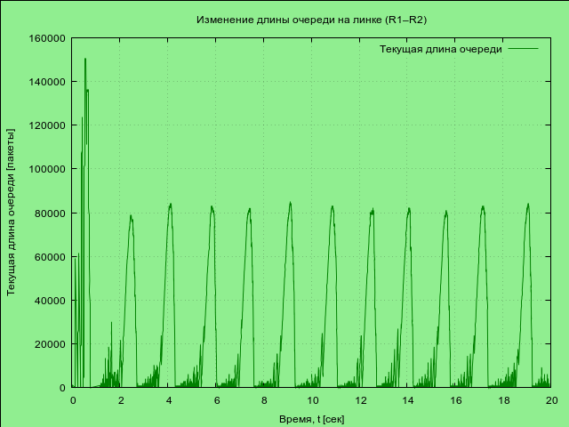

---
## Front matter
lang: ru-RU
title: "Лабораторная работа №4. Самостоятельная работа"
subtitle: "Дисциплина: Имитационное моделирование"
author:
  - Ганина Т. С.
institute:
  - Группа НФИбд-01-22
  - Российский университет дружбы народов, Москва, Россия
date: 01 марта 2025

## i18n babel
babel-lang: russian
babel-otherlangs: english

## Formatting pdf
toc: false
toc-title: Содержание
slide_level: 2
aspectratio: 169
section-titles: true
theme: metropolis
header-includes:
 - \metroset{progressbar=frametitle,sectionpage=progressbar,numbering=fraction}
 - '\makeatletter'
 - '\beamer@ignorenonframefalse'
 - '\makeatother'
---

# Информация

## Докладчик

:::::::::::::: {.columns align=center}
::: {.column width="70%"}

  * Ганина Таисия Сергеевна
  * Студентка 3го курса, группа НФИбд-01-22
  * Фундаментальная информатика и информационные технологии
  * Российский университет дружбы народов
  * [Ссылка на репозиторий гитхаба tsganina](https://github.com/tsganina/study_2024-2025_simmod)

:::
::: {.column width="30%"}

:::
::::::::::::::

# Вводная часть

## Цели и задачи

Самостоятельно написать два кода, разработать имитационную модель в пакете NS-2 и построить графики изменения размера окна TCP, изменения длины очереди и средней длины очереди на первом
маршрутизаторе (в Xgraph и в GNUPlot).

## Задание

1. Для приведённой схемы разработать имитационную модель в пакете NS-2.
2. Построить график изменения размера окна TCP (в Xgraph и в GNUPlot);
3. Построить график изменения длины очереди и средней длины очереди на первом маршрутизаторе.

# Выполнение лабораторной работы

## Файлы, созданные в ходе моделирования

- WindowVsTimeRenoOne - содержит размер TCP-окна (в зависимости от времени) на линке первого источника.
- WindowVsTimeRenoAll - содержит размер TCP-окна (в зависимости от времени) для всех соединений.
- qm.out - записывает данные мониторинга очереди между маршрутизаторами каждые 0.1 секунды.
- all.q – записывает данные о заполненности RED-очереди.
- temp.q – содержит данные о текущей длине очереди (из all.q).
- temp.a – содержит данные о средней длине очереди (из all.q).


## Листинг

```
# создание объекта Simulator
set ns [new Simulator]
# открытие файла out.nam для записи данных о моделировании,
# этот файл будет использоваться 
# визуализатором nam для анимации процесса
set nf [open out.nam w]
# указываем, что все результаты 
# моделирования будут записываться в nf (out.nam)
$ns namtrace-all $nf
# открытие файла out.tr для трассировки событий
# в этом файле будут фиксироваться все сетевые события
set f [open out.tr w]
```

## Листинг

```

# указываем, что все трассируемые 
# события будут записываться в f (out.tr)
$ns trace-all $f

# установка параметров TCP-агента:
# максимальный размер окна TCP равен 32
Agent/TCP set window_ 32

# размер пакетов TCP установлен в 500 байт
Agent/TCP set pktSize_ 500

```

## Листинг

```
proc finish {} {
    global tchan_
    set awkCode {{
            # если первая колонка содержит 
            # "Q" и строка имеет больше двух полей
            if ($1 == "Q" && NF>2) {
                # записываем второе и третье поле в temp.q
                print $2, $3 >> "temp.q";
                set end $2}
            else if ($1 == "a" && NF>2)
                print $2, $3 >> "temp.a";}}
```

## Листинг

```
    # удаляем временные файлы
    exec rm -f temp.q temp.a
    exec touch temp.a temp.q
    set f [open temp.q w]
    puts $f "0.Color: Blue"
    close $f
    set f [open temp.a w]
    puts $f "0.Color: Brown"
    close $f
    # выполняем AWK-скрипт для обработки данных
    exec awk $awkCode all.q
```

## Листинг

```
    after 1000
    # запуск xgraph для отображения графиков TCP-окна и очереди
    exec xgraph -fg purple -bg lightgreen -bb -tk -x time 
    -t "TCPRenoCWND" WindowVsTimeRenoOne &
    exec xgraph -fg purple -bg pink -bb -tk -x time 
    -t "TCPRenoCWND" WindowVsTimeRenoAll &
    exec xgraph -fg purple -bg lightblue -bb -tk -x time -y queue temp.q &
    exec xgraph -fg purple -bg lightyellow -bb -tk -x time -y queue temp.a &
    # запуск nam для визуализации сети
    exec nam out.nam &
    exit 0
}
```

## Листинг

```
# процедура для записи данных о размере окна TCP в файл
proc plotWindow {tcpSource file} {
    global ns
    set time 0.01 ;# интервал времени между измерениями
    set now [$ns now] ;# текущее время моделирования
    set cwnd [$tcpSource set cwnd_] ;# текущее значение TCP-окна
    # записываем текущее время и размер окна в файл
    puts $file "$now $cwnd"
    # планируем следующий вызов этой процедуры через 0.01 секунды
    $ns at [expr $now+$time] "plotWindow $tcpSource $file"
}
```

## Листинг

```
# создание двух узлов r1 и r2
set r1 [$ns node]
set r2 [$ns node]
# изменение формы и цвета маршрутизаторов
$r1 shape square
$r1 color red
$r2 shape square
$r2 color red
```

## Листинг

```
# создание связи r1-r2 с пропускной 
# способностью 20 Мбит/с и задержкой 15 мс,
# используется очередь типа RED
$ns simplex-link $r1 $r2 20Mb 15ms RED
# создание связи r2-r1 со пропускной 
# способностью 15 Мбит/с и задержкой 20 мс,
# с очередью DropTail
$ns simplex-link $r2 $r1 15Mb 20ms DropTail
# установка лимита очереди между r1 и r2 (300 пакетов)
$ns queue-limit $r1 $r2 300
```

## Листинг

```
# N клиентов загружают файлы с N 
# серверов через маршрутизаторы r1 и r2
# количество пар клиентов и серверов TCP
set N 30

# Назначаем цвет пакетов TCP (синий)
$ns color 1 Blue
```

## Листинг

```
# создание N TCP-соединений
for {set i 0} {$i < $N} {incr i} {
    # создаем узел-клиент n1(i) и соединяем его с r1
    set n1($i) [$ns node]
    $ns duplex-link $n1($i) $r1 100Mb 20ms DropTail

    # создаем узел-сервер n2(i) и соединяем его с r2
    set n2($i) [$ns node]
    $ns duplex-link $n2($i) $r2 100Mb 20ms DropTail
```

## Листинг

```
    # создаем TCP-соединение между 
    # n1(i) и n2(i), используя TCP Reno
    set tcp($i) [$ns create-connection 
    TCP/Reno $n1($i) TCPSink $n2($i) $i]
    # Присваиваем идентификатор потока 
    #(fid) для цветового обозначения
    $ns at 0.0 "$tcp($i) set fid_ 1"
    # привязываем FTP-источник к TCP-соединению
    set ftp($i) [$tcp($i) attach-source FTP]
}

```

## Листинг

```
# открываем файлы для записи данных о размере окна TCP
set windowVsTimeOne [open WindowVsTimeRenoOne w]
puts $windowVsTimeOne "0.Color: Black"
set windowVsTimeAll [open WindowVsTimeRenoAll w]
puts $windowVsTimeAll "0.Color: Red"
# мониторинг очереди в r1-r2 с интервалом 0.1 секунды
set qmon [$ns monitor-queue $r1 $r2 [open qm.out w] 0.1]
# установка времени выборки данных о состоянии очереди
[$ns link $r1 $r2] queue-sample-timeout
# получаем объект RED-очереди между r1 и r2
set redq [[$ns link $r1 $r2] queue]
```

## Листинг

```
# настройка параметров RED-очереди:
# порог минимального заполнения - 75 пакетов
$redq set thresh_ 75
# порог максимального заполнения - 150 пакетов
$redq set maxthresh_ 150
# вес средней очереди
$redq set q_weight_ 0.002
# параметр, определяющий вероятность отбрасывания пакетов
$redq set linterm_ 10
set tchan_ [open all.q w]
```
## Листинг
```
# включаем трассировку текущей длины очереди
$redq trace curq_
# включаем трассировку среднего размера очереди
$redq trace ave_
# привязываем файл all.q к объекту очереди, чтобы записывать данные
$redq attach $tchan_
```

## Листинг

```
# запуск всех FTP-серверов и мониторинг окон TCP
for {set i 0} {$i < $N} {incr i} {
# запускаем FTP-трафик через TCP-соединение $tcp($i)
    $ns at 0.0 "$ftp($i) start"
# запуск мониторинга окна TCP для всех соединений
    $ns at 0.0 "plotWindow $tcp($i) $windowVsTimeAll"
}
```

## Листинг

```
# запуск мониторинга окна TCP для первого TCP-соединения отдельно
$ns at 0.0 "plotWindow $tcp(1) $windowVsTimeOne"
$ns at 20.0 "finish"
$ns run
```

## Моделируемой сети при N=30

{#fig:004 width=50%}

## Графики в xgraph

{#fig:005 width=40%}

## Графики в xgraph

{#fig:006 width=40%}

## Графики в xgraph

{#fig:007 width=40%}

## Графики в xgraph

{#fig:008 width=40%}

## Листинг для построения графиков в GNUPlot

```
#!/usr/bin/gnuplot -persist

# Устанавливаем кодировку UTF-8 для поддержки русских символов
set encoding utf8

# Устанавливаем терминал вывода PNG с поддержкой прозрачности (cairo)
# Задаём шрифт Arial размером 9
set term pngcairo font "Arial,9" enhanced
```
## Листинг для построения графиков в GNUPlot
```
set output 'window_1.png'
set title "Изменение размера окна TCP 1-го источника при N=30"
set xlabel "Время, t [сек]"
set ylabel "Размер окна CWND [сегменты]"
set grid

# Задаём цвета графика: 
# линии — brown, фон — светло-жёлтый
set style line 1 lc rgb "brown" lt 1 lw 2 pt 7
set object 1 rectangle from screen 0,0 to screen 
1,1 behind fillcolor rgb "#FFFFCC" fillstyle solid

# Построение графика, используя 1-й и 2-й столбцы файла
plot "WindowVsTimeRenoOne" using 1:2 with lines ls 1 title "Размер окна TCP"

```
## Листинг для построения графиков в GNUPlot
```
set output 'window_all.png'
set title "Изменение размера окна TCP на всех N источниках при N=30"
set xlabel "Время, t [сек]"
set ylabel "Размер окна CWND [сегменты]"
set object 2 rectangle from screen 0,0 to screen 
1,1 behind fillcolor rgb "pink" fillstyle solid
set style line 2 lc rgb "#FF0000" lt 1 lw 1 pt 7
plot "WindowVsTimeRenoAll" using 1:2 with lines ls 2 title "Размер окна TCP"

```
## Листинг для построения графиков в GNUPlot
```
set output 'queue.png'
set title "Изменение длины очереди на линке (R1–R2)"
set xlabel "Время, t [сек]"
set ylabel "Текущая длина очереди [пакеты]"
set object 3 rectangle from screen 0,0 to screen 
1,1 behind fillcolor rgb "#90EE90" fillstyle solid
set style line 3 lc rgb "#008000" lt 1 lw 1 pt 7
plot "temp.q" using 1:2 with 
lines ls 3 title "Текущая длина очереди"
```
## Листинг для построения графиков в GNUPlot
```
set output 'average_queue.png'
set title "Изменение средней длины очереди на линке (R1–R2)"
set xlabel "Время, t [сек]"
set ylabel "Средняя длина очереди [пакеты]"
# Фон — светло-голубой
set object 4 rectangle from screen 0,0 to screen 
1,1 behind fillcolor rgb "#ADD8E6" fillstyle solid
set style line 4 lc rgb "#800080" lt 1 lw 2 pt 7
plot "temp.a" using 1:2 with 
lines ls 4 title "Средняя длина очереди"

```
## Графики в GNUPlot

{#fig:009 width=50%}

## Графики в GNUPlot

{#fig:010 width=50%}

## Графики в GNUPlot

{#fig:011 width=50%}

## Графики в GNUPlot

{#fig:012 width=50%}

# Результаты

В ходе работы была смоделирована передача данных по TCP, исследовано изменение размера окна и заполняемость очереди. Полученные графики в xgraph и GNUPlot позволили проанализировать динамику управления перегрузками и эффективности передачи.
