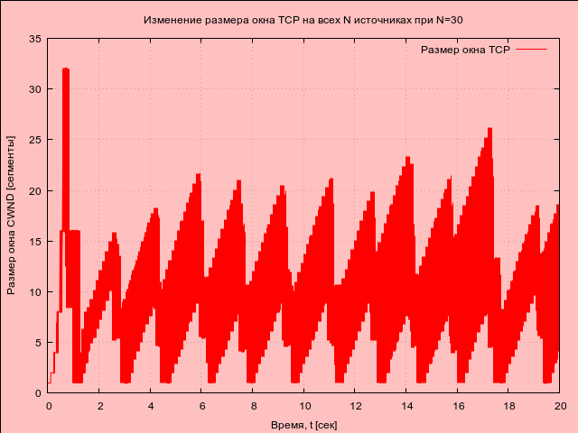

---
## Front matter
title: "Отчёт по лабораторной работе №4"
subtitle: "Дисциплина: Имитационное моделирование"
author: "Ганина Таисия Сергеевна, НФИбд-01-22"

## Generic otions
lang: ru-RU
toc-title: "Содержание"

## Bibliography
bibliography: bib/cite.bib
csl: pandoc/csl/gost-r-7-0-5-2008-numeric.csl

## Pdf output format
toc: true # Table of contents
toc-depth: 2
lof: true # List of figures
lot: true # List of tables
fontsize: 12pt
linestretch: 1.5
papersize: a4
documentclass: scrreprt
## I18n polyglossia
polyglossia-lang:
  name: russian
  options:
	- spelling=modern
	- babelshorthands=true
polyglossia-otherlangs:
  name: english
## I18n babel
babel-lang: russian
babel-otherlangs: english
## Fonts
mainfont: PT Serif
romanfont: PT Serif
sansfont: PT Sans
monofont: PT Mono
mainfontoptions: Ligatures=TeX
romanfontoptions: Ligatures=TeX
sansfontoptions: Ligatures=TeX,Scale=MatchLowercase
monofontoptions: Scale=MatchLowercase,Scale=0.9
## Biblatex
biblatex: true
biblio-style: "gost-numeric"
biblatexoptions:
  - parentracker=true
  - backend=biber
  - hyperref=auto
  - language=auto
  - autolang=other*
  - citestyle=gost-numeric
## Pandoc-crossref LaTeX customization
figureTitle: "Рис."
tableTitle: "Таблица"
listingTitle: "Листинг"
lofTitle: "Список иллюстраций"
lotTitle: "Список таблиц"
lolTitle: "Листинги"
## Misc options
indent: true
header-includes:
  - \usepackage{indentfirst}
  - \usepackage{float} # keep figures where there are in the text
  - \floatplacement{figure}{H} # keep figures where there are in the text
---

# Цель работы

Самостоятельно написать два кода, разработать имитационную модель в пакете NS-2 и построить графики изменения размера окна TCP, изменения длины очереди и средней длины очереди на первом
маршрутизаторе (в Xgraph и в GNUPlot).

# Задание

1. Для приведённой схемы разработать имитационную модель в пакете NS-2.
2. Построить график изменения размера окна TCP (в Xgraph и в GNUPlot);
3. Построить график изменения длины очереди и средней длины очереди на первом маршрутизаторе.

# Теоретическое введение

**NS-2** — программный пакет для имитационного моделирования компьютерных сетей с открытым исходным кодом.

Некоторые особенности пакета:

- Модели различных уровней иерархии OSI: модели трафика и уровня приложений (Web, FTP, telnet, constant-bit rate, real audio), транспортные протоколы (unicast: TCP (Reno, Vegas и др.), UDP), маршрутизация и постановка в очередь (Wired routing, ad hoc routing, queueing protocols: RED, drop-tail и др.), физический уровень (wired (point-to-point, LANs), wireless (multiple propagation models), satellite).
- Компоненты пакета: симулятор Ns, аниматор сети Nam, Xgraph (визуализация результатов моделирования ns), препроцессор (генераторы топологии и трафика).
- Для создания файла сценария моделирования NS-2 использует язык Tcl.

С помощью NS-2 можно описать топологию сети, конфигурацию источников и приёмников трафика, параметры соединений (полосу пропускания, задержку, вероятность потерь пакетов) и множество других параметров моделируемой системы.

При моделировании имеется возможность управления параметрами буферов, мониторинга принятых, отправленных и потерянных пакетов, сбора статистики, а также может быть получена информация о динамике трафика, состоянии соединений и объектов сети, а также работе протоколов.

**GNUPlot** — это инструмент для построения графиков, предназначенный для визуализации числовых данных. Он широко применяется в научных исследованиях, инженерных расчётах и анализе сетевых протоколов.  

Основные особенности GNUPlot:  

- Поддержка двумерных и трёхмерных графиков.  
- Гибкая настройка осей, подписей, легенды и стиля отображения.  
- Возможность работы с различными форматами данных.  
- Автоматизация через скрипты.  
- Экспорт в различные форматы (PNG, SVG, PDF и др.).  

GNUPlot принимает данные в виде текстовых файлов или команд, вводимых в интерактивном режиме. Данные представляются в виде колонок, где каждая строка содержит числовые значения, используемые для построения графиков.  

Основной механизм построения графиков заключается в использовании команды `plot` (для двумерных графиков) и `splot` (для трёхмерных графиков), где указываются источники данных и параметры их отображения.  


# Выполнение лабораторной работы

В задании лабораторной работы описана такая модель:

- сеть состоит из _N_ TCP-источников, _N_ TCP-приёмников, двух маршрутизаторов R1 и R2 между источниками и приёмниками (_N_ — не менее 20);
- между TCP-источниками и первым маршрутизатором установлены дуплексные соединения с пропускной способностью 100 Мбит/с и задержкой 20 мс очередью типа DropTail;
- между TCP-приёмниками и вторым маршрутизатором установлены дуплексные соединения с пропускной способностью 100 Мбит/с и задержкой 20 мс очередью типа DropTail;
- между маршрутизаторами установлено симплексное соединение (R1–R2) с пропускной способностью 20 Мбит/с и задержкой 15 мс очередью типа RED, размером буфера 300 пакетов; в обратную сторону — симплексное соединение (R2–R1) с пропускной способностью 15 Мбит/с и задержкой 20 мс очередью типа DropTail;
- данные передаются по протоколу FTP поверх TCPReno;
- параметры алгоритма RED: $q_{min}$ = 75, $q_{max}$ = 150, $q_w$ = 0, 002, $p_{max}$ = 0.1;
- максимальный размер TCP-окна 32; размер передаваемого пакета 500 байт; время моделирования — не менее 20 единиц модельного времени.

Я выбрала _N_ равное 30, так как мне было важно, чтобы моя модель хорошо читалась, и все источники и приемники можно было бы расположить так, чтобы они не закрывали друг друга. То есть 30 клиентов скачивают файлы с 30 серверов через маршрутизаторы. Используется TCP Reno.

Для начала разработаем имитационную модель в пакете NS-2 и получим вот такой результат (рис. @fig:001, @fig:002). Код написан в файле с расширением .tcl, запущен командой `ns exercise1.tcl`.

Данные о моделировании записываются в файлы out.nam (для визуализации в nam) и out.tr (для трассировки событий). Процедура finish обрабатывает данные, удаляет временные файлы, запускает xgraph для построения графиков и nam для анимации, затем завершает симуляцию. 

Также у нас будут созданы следующие файлы:

- WindowVsTimeRenoOne - содержит размер TCP-окна (в зависимости от времени) на линке первого источника.
- WindowVsTimeRenoAll - содержит размер TCP-окна (в зависимости от времени) для всех соединений.
- qm.out - записывает данные мониторинга очереди между маршрутизаторами каждые 0.1 секунды.
- all.q – записывает данные о заполненности RED-очереди.
- temp.q – содержит данные о текущей длине очереди (из all.q).
- temp.a – содержит данные о средней длине очереди (из all.q).

{#fig:001 width=70%}

{#fig:002 width=70%}

После этого я решила сделать модель чуть более похожей на ту, что у нас приведена в качестве примера и сделала маршрутизаторы красными и квадратными (рис. @fig:003).

Код, отвечающий за смену цвета и формы маршрутизаторов:
```
# изменение формы и цвета маршрутизаторов
$r1 shape square
$r1 color red
$r2 shape square
$r2 color red
```

Код, отвечающий за смену цвета пакетов:
```
# Назначаем цвет пакетов TCP (синий)
$ns color 1 Blue
<...>
# Присваиваем идентификатор потока 
# (fid) для цветового обозначения
$ns at 0.0 "$tcp($i) set fid_ 1"

```

{#fig:003 width=70%}

После запуска симуляции, модель выглядит так (рис. @fig:004)

{#fig:004 width=70%}

Здесь мы видим, что некоторые пакеты теряются.
У нас указано, что соединение R1-R2 имеет пропускную способность 20 Мбит/с и использует очередь RED с ограниченным размером буфера (300 пакетов). Если количество TCP-источников достаточно велико (в моем случае их 30), то общая скорость входящего трафика от TCP-источников может превысить пропускную способность этого соединения. Это приводит к переполнению очереди RED, и RED начинает отбрасывать пакеты, чтобы избежать полной перегрузки.

Также я получила следующие графики (построены при помощи xgraph):

- График изменения TCP-окна на линке 1-го источника (рис. @fig:005)
- График изменения TCP-окна на всех источниках (рис. @fig:006).
- График Изменения размера средней длины очереди на линке (R1–R2) при N=30, $q_{min}$ = 75, $q_{max}$ = 150 (рис. @fig:007).
- График изменения размера длины очереди в зависимости от времени на линке (R1-R2) при N=30, $q_{min}$ = 75, $q_{max}$ = 150 (рис. @fig:008).

{#fig:005 width=70%}

График пилообразный. Размер окна линейно увеличивается, затем резко уменьшается при обнаружении потери пакета (обычно из-за перегрузки сети), и цикл повторяется. Максимальный размер окна достигает 32 в самом начале, после же максимально поднимается примерно до 16, что меньше максимального размера TCP-окна 32, указанного в конфигурации сети.

{#fig:006 width=70%}

Амплитуда колебаний больше, чем у одного источника, я думаю, это потому, что график отражает общее изменение размера окна всех 30 источников. Этот график выглядит "заполненным" внутри цветом.

{#fig:007 width=70%}

На графике видны периодические пики средней длины очереди, достигающие значений около 110000 пакетов. Длина очереди увеличивается, а затем резко уменьшается. Это связано с тем, как RED управляет очередью. Когда очередь приближается к порогу максимального размера, RED начинает активно отбрасывать пакеты, чтобы предотвратить переполнение. Периодичность пиков соответствует периодичности "падений" размера окна TCP, что подтверждает связь между перегрузкой на линке R1-R2 и потерями пакетов.

{#fig:008 width=70%}

По сравнению со средней длиной очереди, этот график более "шумный". Когда длина очереди достигает высоких значений, RED начинает отбрасывать пакеты, что приводит к резкому снижению длины очереди.

**Код полностью (листинг 1):**

```
# создание объекта Simulator
set ns [new Simulator]

# открытие файла out.nam для записи данных о моделировании,
# этот файл будет использоваться 
# визуализатором nam для анимации процесса
set nf [open out.nam w]

# указываем, что все результаты 
# моделирования будут записываться в nf (out.nam)
$ns namtrace-all $nf

# открытие файла out.tr для трассировки событий
# в этом файле будут фиксироваться все сетевые события
set f [open out.tr w]

# указываем, что все трассируемые 
# события будут записываться в f (out.tr)
$ns trace-all $f

# установка параметров TCP-агента:
# максимальный размер окна TCP равен 32
Agent/TCP set window_ 32

# размер пакетов TCP установлен в 500 байт
Agent/TCP set pktSize_ 500

# процедура finish вызывается в конце моделирования
proc finish {} {
    global tchan_

    # блок кода AWK для обработки выходных данных
    # awk используется для извлечения данных из all.q 
    # и сохранения их в temp.q и temp.a
    set awkCode {
        {
            # если первая колонка содержит 
            # "Q" и строка имеет больше двух полей
            if ($1 == "Q" && NF>2) {
                # записываем второе и третье поле в temp.q
                print $2, $3 >> "temp.q";
                set end $2
            }
            # если первая колонка содержит 
            # "a" и строка имеет больше двух полей
            else if ($1 == "a" && NF>2)
                # записываем второе и третье поле в temp.a
                print $2, $3 >> "temp.a";
        }
    }

    # удаляем временные файлы
    exec rm -f temp.q temp.a

    # создаем пустые файлы temp.q и temp.a
    exec touch temp.a temp.q

    # открываем temp.q, записываем в него цвет для графика
    set f [open temp.q w]
    puts $f "0.Color: Blue"
    close $f

    # открываем temp.a, записываем в него цвет для графика
    set f [open temp.a w]
    puts $f "0.Color: Brown"
    close $f

    # выполняем AWK-скрипт для обработки данных
    exec awk $awkCode all.q

    after 1000
    # запуск xgraph для отображения графиков TCP-окна и очереди
    exec xgraph -fg purple -bg lightgreen -bb -tk -x time 
    -t "TCPRenoCWND" WindowVsTimeRenoOne &
    exec xgraph -fg purple -bg pink -bb -tk -x time 
    -t "TCPRenoCWND" WindowVsTimeRenoAll &
    exec xgraph -fg purple -bg lightblue -bb -tk -x time 
    -y queue temp.q &
    exec xgraph -fg purple -bg lightyellow -bb -tk -x time 
    -y queue temp.a &

    # запуск nam для визуализации сети
    exec nam out.nam &

    # завершение программы
    exit 0
}

# процедура для записи данных о размере окна TCP в файл
proc plotWindow {tcpSource file} {
    global ns
    set time 0.01 ;# интервал времени между измерениями
    set now [$ns now] ;# текущее время моделирования
    set cwnd [$tcpSource set cwnd_] ;# текущее значение TCP-окна

    # записываем текущее время и размер окна в файл
    puts $file "$now $cwnd"

    # планируем следующий вызов этой процедуры через 0.01 секунды
    $ns at [expr $now+$time] "plotWindow $tcpSource $file"
}


# создание двух узлов r1 и r2
set r1 [$ns node]
set r2 [$ns node]

# изменение формы и цвета маршрутизаторов
$r1 shape square
$r1 color red
$r2 shape square
$r2 color red

# создание связи r1-r2 с пропускной 
# способностью 20 Мбит/с и задержкой 15 мс,
# используется очередь типа RED
$ns simplex-link $r1 $r2 20Mb 15ms RED

# создание связи r2-r1 со пропускной 
# способностью 15 Мбит/с и задержкой 20 мс,
# с очередью DropTail
$ns simplex-link $r2 $r1 15Mb 20ms DropTail

# установка лимита очереди между r1 и r2 (300 пакетов)
$ns queue-limit $r1 $r2 300


# N клиентов загружают файлы с N 
# серверов через маршрутизаторы r1 и r2
# количество пар клиентов и серверов TCP
set N 30

# Назначаем цвет пакетов TCP (синий)
$ns color 1 Blue

# создание N TCP-соединений
for {set i 0} {$i < $N} {incr i} {
    # создаем узел-клиент n1(i) и соединяем его с r1
    set n1($i) [$ns node]
    $ns duplex-link $n1($i) $r1 100Mb 20ms DropTail

    # создаем узел-сервер n2(i) и соединяем его с r2
    set n2($i) [$ns node]
    $ns duplex-link $n2($i) $r2 100Mb 20ms DropTail

    # создаем TCP-соединение между 
    # n1(i) и n2(i), используя TCP Reno
    set tcp($i) [$ns create-connection 
    TCP/Reno $n1($i) TCPSink $n2($i) $i]

    # Присваиваем идентификатор потока 
    #(fid) для цветового обозначения
    $ns at 0.0 "$tcp($i) set fid_ 1"

    # привязываем FTP-источник к TCP-соединению
    set ftp($i) [$tcp($i) attach-source FTP]
}


# открываем файлы для записи данных о размере окна TCP
set windowVsTimeOne [open WindowVsTimeRenoOne w]
puts $windowVsTimeOne "0.Color: Black"

set windowVsTimeAll [open WindowVsTimeRenoAll w]
puts $windowVsTimeAll "0.Color: Red"

# мониторинг очереди в r1-r2 с интервалом 0.1 секунды
set qmon [$ns monitor-queue $r1 $r2 [open qm.out w] 0.1]

# установка времени выборки данных о состоянии очереди
[$ns link $r1 $r2] queue-sample-timeout

# получаем объект RED-очереди между r1 и r2
set redq [[$ns link $r1 $r2] queue]

# настройка параметров RED-очереди:
# порог минимального заполнения - 75 пакетов
$redq set thresh_ 75

# порог максимального заполнения - 150 пакетов
$redq set maxthresh_ 150

# вес средней очереди
$redq set q_weight_ 0.002

# параметр, определяющий вероятность отбрасывания пакетов
$redq set linterm_ 10

# открываем файл all.q для записи данных о заполненности очереди
set tchan_ [open all.q w]

# включаем трассировку текущей длины очереди
$redq trace curq_

# включаем трассировку среднего размера очереди
$redq trace ave_

# привязываем файл all.q к объекту очереди, чтобы записывать данные
$redq attach $tchan_

# запуск всех FTP-серверов и мониторинг окон TCP
for {set i 0} {$i < $N} {incr i} {
# запускаем FTP-трафик через TCP-соединение $tcp($i)
    $ns at 0.0 "$ftp($i) start"
# запуск мониторинга окна TCP для всех соединений
    $ns at 0.0 "plotWindow $tcp($i) $windowVsTimeAll"
}

# запуск мониторинга окна TCP для первого TCP-соединения отдельно
$ns at 0.0 "plotWindow $tcp(1) $windowVsTimeOne"

# планируем завершение моделирования через 20 секунд
$ns at 20.0 "finish"

# запускаем симуляцию
$ns run
```

2. Далее я выполнила построение графиков в GNUPlot при помощи вот такого скрипта:

```
#!/usr/bin/gnuplot -persist

# Устанавливаем кодировку UTF-8 для поддержки русских символов
set encoding utf8

# Устанавливаем терминал вывода PNG с поддержкой прозрачности (cairo)
# Задаём шрифт Arial размером 9
set term pngcairo font "Arial,9" enhanced

# == График 1: Окно TCP 1-го источника ==

# Определяем выходной файл для графика
set output 'window_1.png'

# Задаём заголовок графика
set title "Изменение размера окна TCP 1-го источника при N=30"

# Подписи осей координат
set xlabel "Время, t [сек]"
set ylabel "Размер окна CWND [сегменты]"

# Устанавливаем стиль сетки
set grid

# Задаём цвета графика: 
# линии — brown, фон — светло-жёлтый
set style line 1 lc rgb "brown" lt 1 lw 2 pt 7
set object 1 rectangle from screen 0,0 to screen 
1,1 behind fillcolor rgb "#FFFFCC" fillstyle solid

# Построение графика, используя 1-й и 
# 2-й столбцы файла WindowVsTimeRenoOne
plot "WindowVsTimeRenoOne" using 1:2 
with lines ls 1 title "Размер окна TCP"

# == График 2: Окно TCP всех источников ==

# Определяем выходной файл для графика
set output 'window_all.png'

# Задаём заголовок графика
set title "Изменение размера окна TCP на всех N источниках при N=30"

# Подписи осей координат
set xlabel "Время, t [сек]"
set ylabel "Размер окна CWND [сегменты]"

# Построение графика
set object 2 rectangle from screen 0,0 to screen 
1,1 behind fillcolor rgb "pink" fillstyle solid
set style line 2 lc rgb "#FF0000" lt 1 lw 1 pt 7

plot "WindowVsTimeRenoAll" 
using 1:2 with lines ls 2 title "Размер окна TCP"

# == График 3: Длина очереди ==

# Определяем выходной файл для графика
set output 'queue.png'

# Заголовок графика
set title "Изменение длины очереди на линке (R1–R2)"

# Подписи осей
set xlabel "Время, t [сек]"
set ylabel "Текущая длина очереди [пакеты]"

# Фон — светло-зеленый
set object 3 rectangle from screen 0,0 to screen 
1,1 behind fillcolor rgb "#90EE90" fillstyle solid
set style line 3 lc rgb "#008000" lt 1 lw 1 pt 7

# Построение графика, используя 1-й и 2-й столбцы файла temp.q
plot "temp.q" using 1:2 with 
lines ls 3 title "Текущая длина очереди"

# == График 4: Средняя длина очереди ==

# Определяем выходной файл
set output 'average_queue.png'

# Заголовок графика
set title "Изменение средней длины очереди на линке (R1–R2)"

# Подписи осей
set xlabel "Время, t [сек]"
set ylabel "Средняя длина очереди [пакеты]"

# Фон — светло-голубой
set object 4 rectangle from screen 0,0 to screen 
1,1 behind fillcolor rgb "#ADD8E6" fillstyle solid
set style line 4 lc rgb "#800080" lt 1 lw 2 pt 7

# Построение графика, используя 1-й и 2-й столбцы файла temp.a
plot "temp.a" using 1:2 with 
lines ls 4 title "Средняя длина очереди"

```

Результатом стали 4 графика, идентичные полученным ранее:

- График изменения TCP-окна на линке 1-го источника (рис. @fig:009)
- График изменения TCP-окна на всех источниках (рис. @fig:010).
- График Изменения размера средней длины очереди на линке (R1–R2) при N=30, $q_{min}$ = 75, $q_{max}$ = 150 (рис. @fig:011).
- График изменения размера длины очереди в зависимости от времени на линке (R1-R2) при N=30, $q_{min}$ = 75, $q_{max}$ = 150 (рис. @fig:012).

{#fig:009 width=70%}

{#fig:010 width=70%}

{#fig:011 width=70%}

{#fig:012 width=70%}

# Выводы

В ходе работы была смоделирована передача данных по TCP, исследовано изменение размера окна и заполняемость очереди. Полученные графики в xgraph и GNUPlot позволили проанализировать динамику управления перегрузками и эффективности передачи.

# Список литературы{.unnumbered}

[Задание для лабораторной работы №4](https://esystem.rudn.ru/mod/resource/view.php?id=1223339)

::: {#refs}
:::
