---
## Front matter
lang: ru-RU
title: "Лабораторная работа №5. Модель эпидемии (SIR)"
subtitle: "Дисциплина: Имитационное моделирование"
author:
  - Ганина Т. С.
institute:
  - Группа НФИбд-01-22
  - Российский университет дружбы народов, Москва, Россия
date: 08 марта 2025

## i18n babel
babel-lang: russian
babel-otherlangs: english

## Formatting pdf
toc: false
toc-title: Содержание
slide_level: 2
aspectratio: 169
section-titles: true
theme: metropolis
header-includes:
 - \metroset{progressbar=frametitle,sectionpage=progressbar,numbering=fraction}
 - '\makeatletter'
 - '\beamer@ignorenonframefalse'
 - '\makeatother'
---

# Информация

## Докладчик

:::::::::::::: {.columns align=center}
::: {.column width="70%"}

  * Ганина Таисия Сергеевна
  * Студентка 3го курса, группа НФИбд-01-22
  * Фундаментальная информатика и информационные технологии
  * Российский университет дружбы народов
  * [Ссылка на репозиторий гитхаба tsganina](https://github.com/tsganina/study_2024-2025_simmod)

:::
::: {.column width="30%"}

:::
::::::::::::::

# Вводная часть

## Цели и задачи

Выполнить задания и получить практические навыки работы со средствами моделирования xcos, Modelica и OpenModelica. Рассмотреть модель эпидемии (SIR).

## Задание

1. Реализовать имитационную модель эпидемии в xcos;
2. Реализовать имитационную модель эпидемии в Modelica;
3. Реализовать имитационную модель эпидемии в OpenModelica (упражнение);
4. Выполнить задание для самостоятельной работы.

# Реализация учебной модели в xcos

##

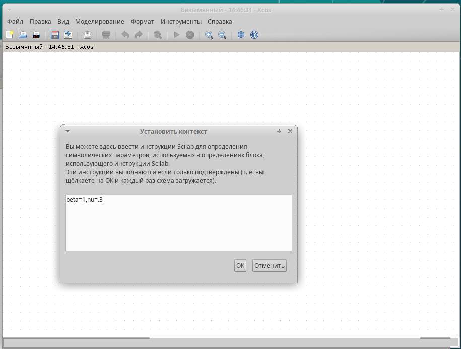{#fig:001 width=60%}

##

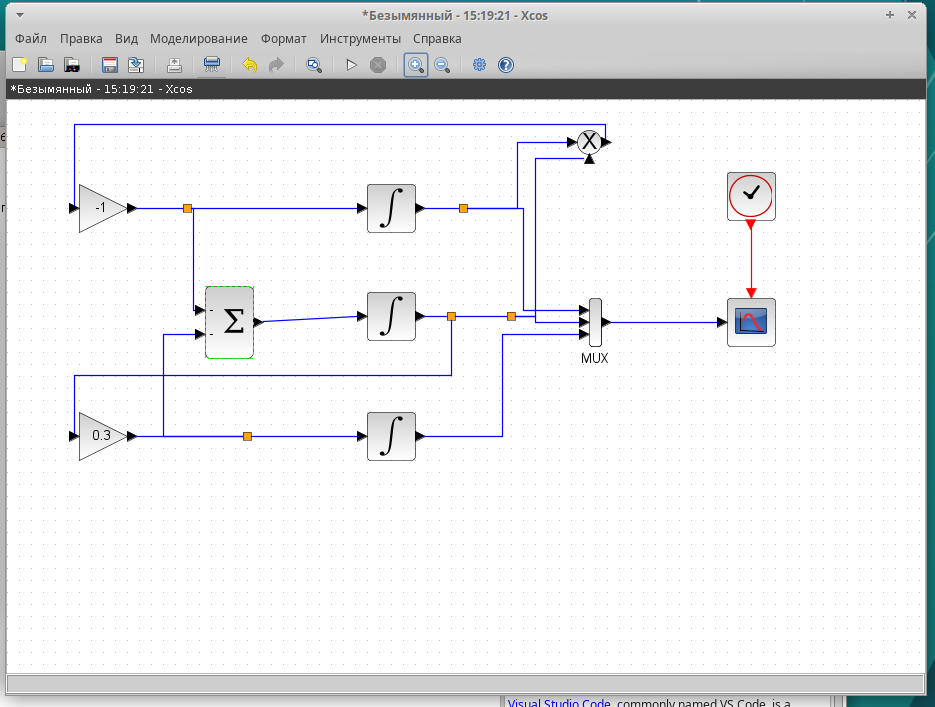{#fig:002 width=60%}

##

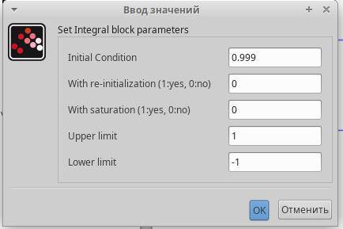{#fig:003 width=60%}

##

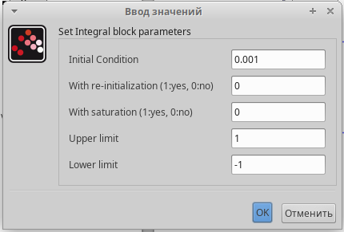{#fig:004 width=60%}

##

{#fig:005 width=60%}

##

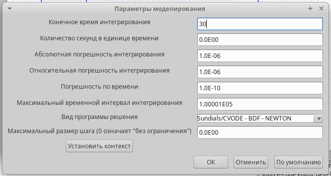{#fig:006 width=70%}

##

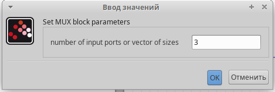{#fig:007 width=70%}

##

{#fig:008 width=60%}

##

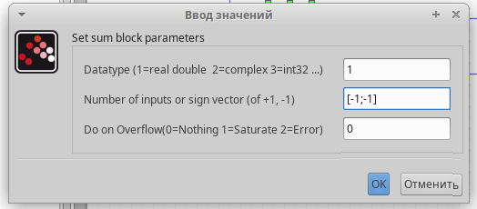{#fig:009 width=70%}

##

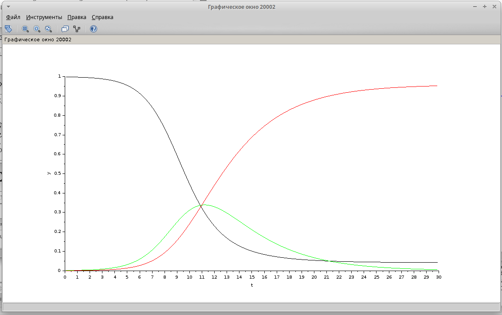{#fig:012 width=70%}

# Реализация учебной модели с помощью блока Modelica в xcos

##

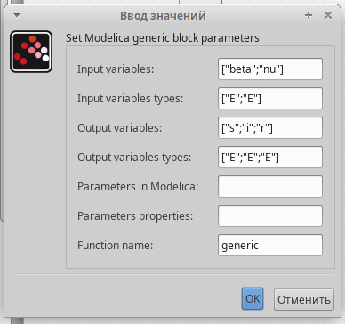{#fig:013 width=50%}

##

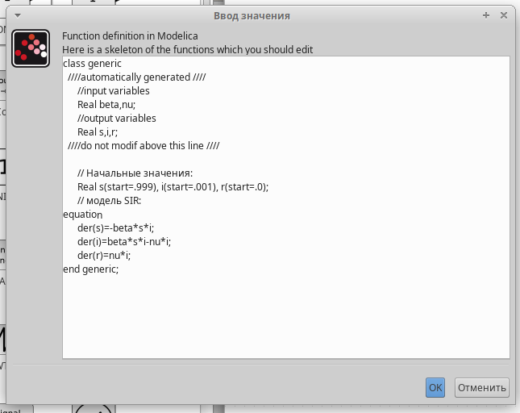{#fig:014 width=50%}

##

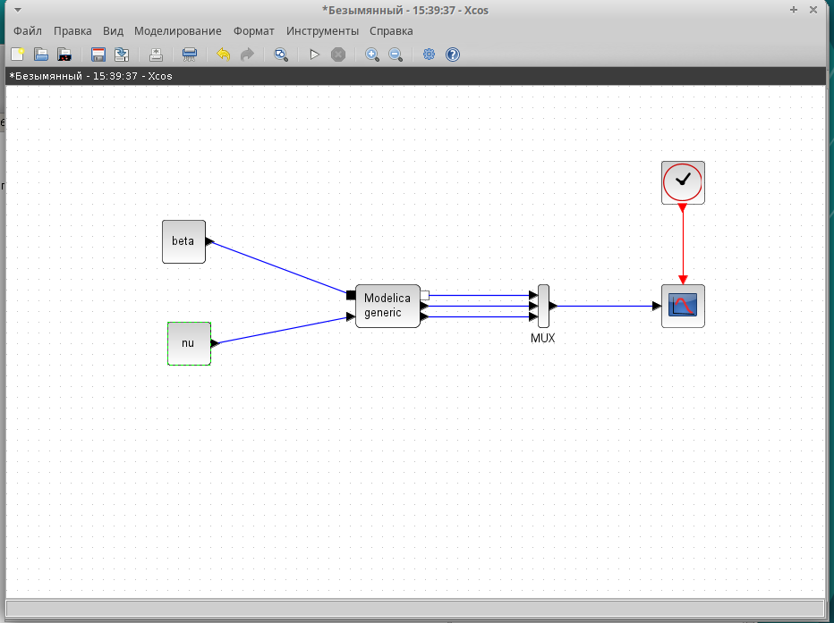{#fig:017 width=60%}

##

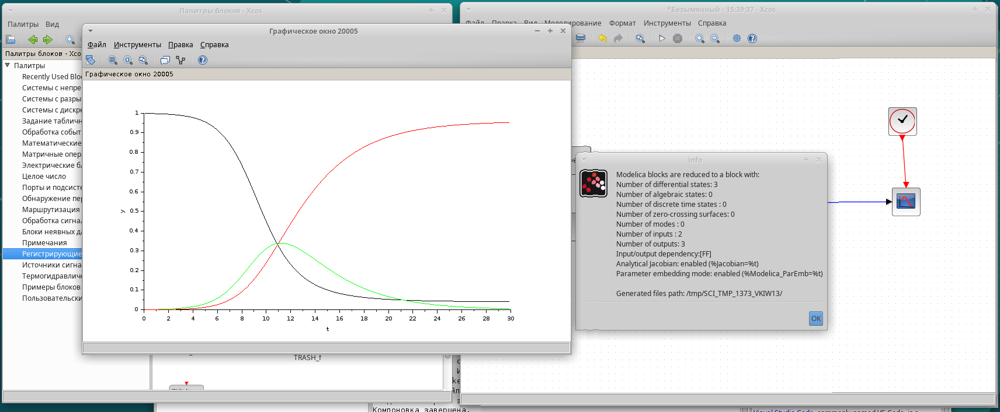{#fig:018 width=78%}

# Упражнение. Реализация модели SIR в OpenModelica

##

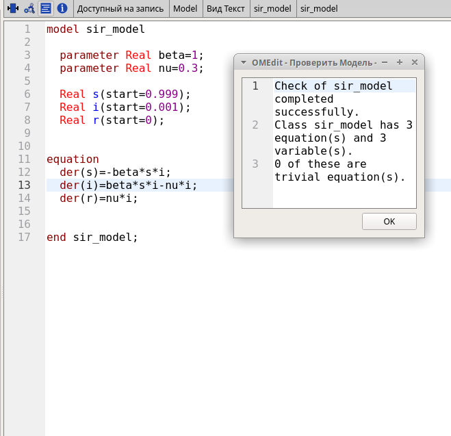{#fig:019 width=50%}

##

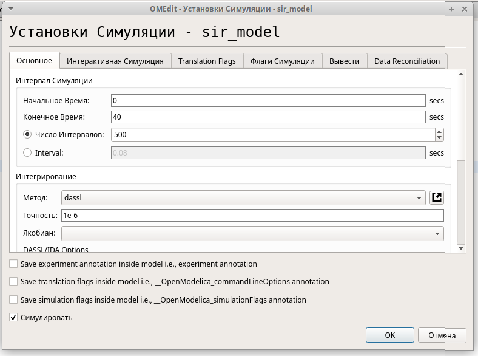{#fig:020 width=60%}

##

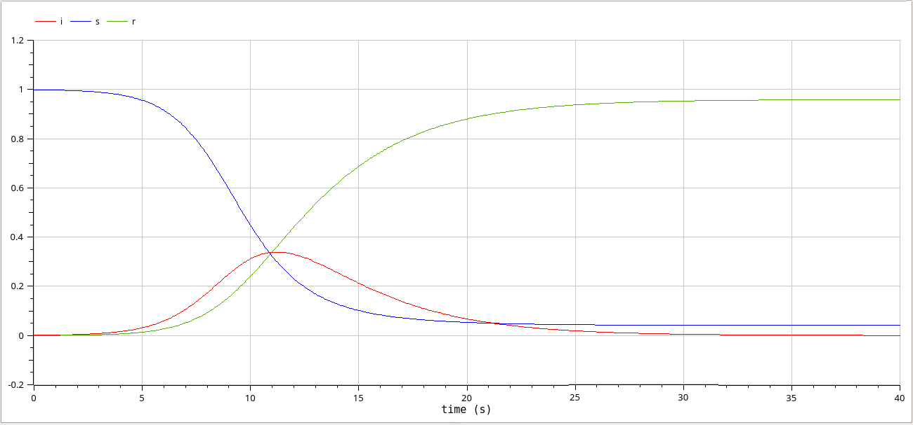{#fig:021 width=75%}

# Задание для самостоятельной работы. Реализация модели в xcos

##

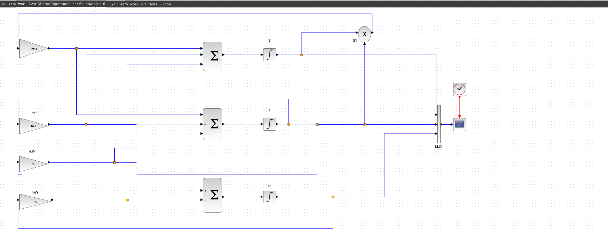{#fig:026 width=70%}

##

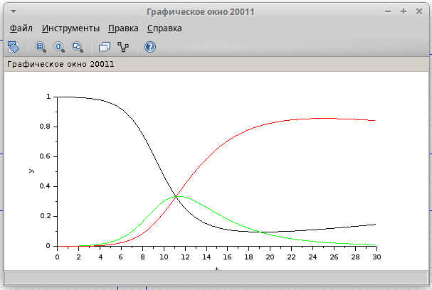{#fig:027 width=65%}

# Задание для самостоятельной работы. Реализация модели с помощью блока Modelica в xcos

##

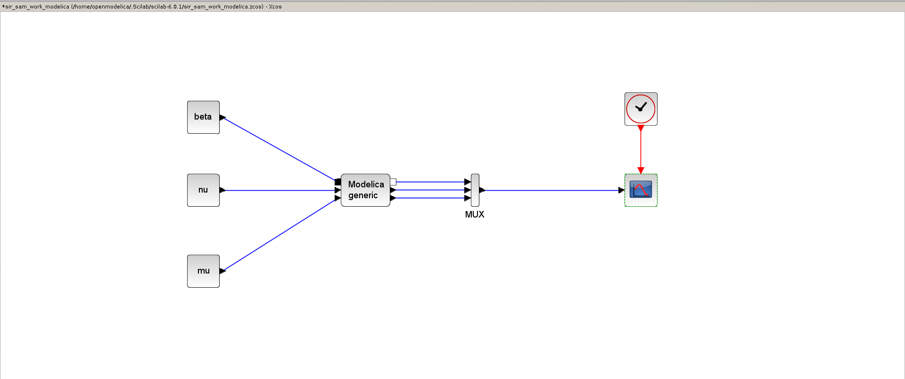{#fig:028 width=70%}

##

{#fig:029 width=70%}

##

{#fig:030 width=70%}

##

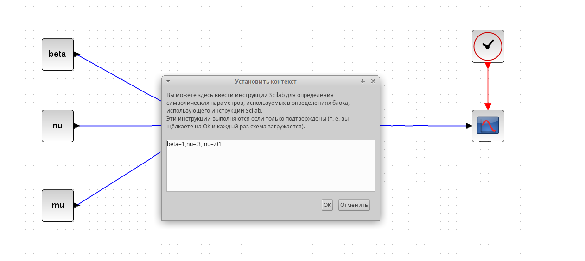{#fig:031 width=70%}

##

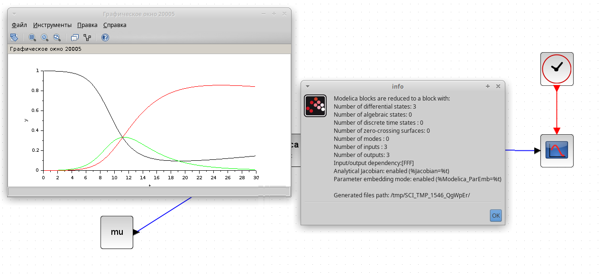{#fig:032 width=70%}

# Задание для самостоятельной работы. Реализация модели в OpenModelica

##

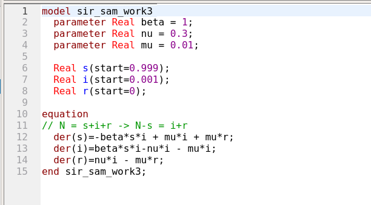{#fig:038 width=70%}

##

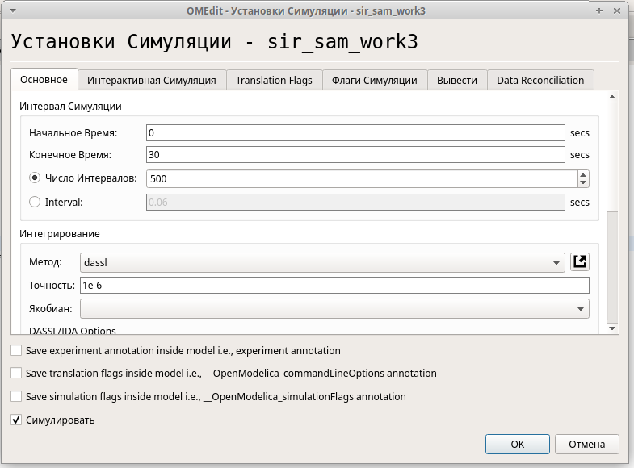{#fig:039 width=60%}

##

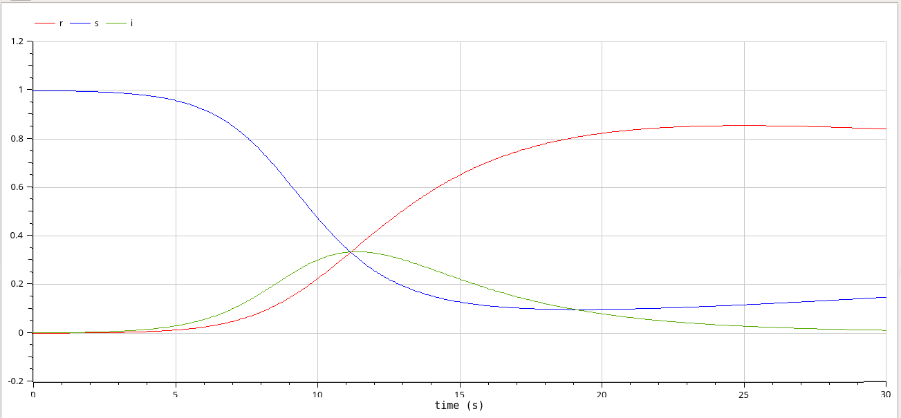{#fig:040 width=70%}

# Графики эпидемического порога при различных значениях параметров модели

##

{#fig:043 width=70%}

##

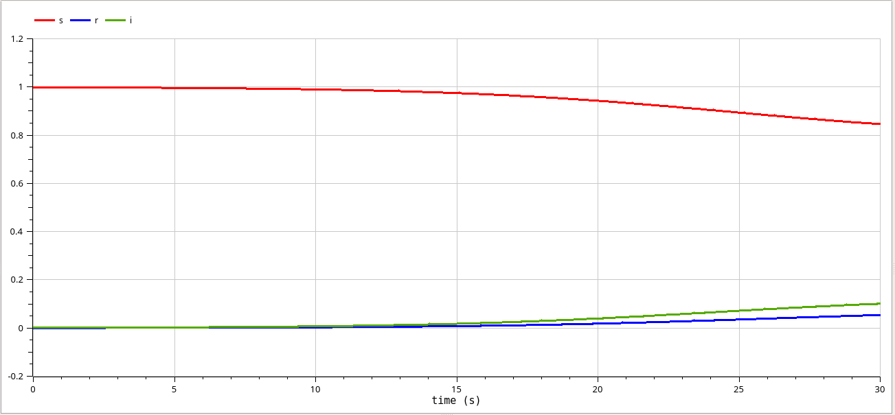{#fig:044 width=70%}

##

{#fig:045 width=70%}

##

{#fig:046 width=70%}

##

{#fig:047 width=70%}

##

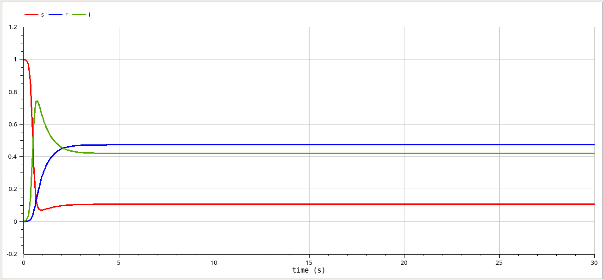{#fig:048 width=70%}

# Результаты

Я получила практические навыки работы со средствами моделирования xcos, Modelica и OpenModelica. Была рассмотрена модель эпидемии (SIR).
