---
## Front matter
lang: ru-RU
title: "Лабораторная работа №6. Модель хищник-жертва"
subtitle: "Дисциплина: Имитационное моделирование"
author:
  - Ганина Т. С.
institute:
  - Группа НФИбд-01-22
  - Российский университет дружбы народов, Москва, Россия
date: 09 марта 2025

## i18n babel
babel-lang: russian
babel-otherlangs: english

## Formatting pdf
toc: false
toc-title: Содержание
slide_level: 2
aspectratio: 169
section-titles: true
theme: metropolis
header-includes:
 - \metroset{progressbar=frametitle,sectionpage=progressbar,numbering=fraction}
 - '\makeatletter'
 - '\beamer@ignorenonframefalse'
 - '\makeatother'
---

# Информация

## Докладчик

:::::::::::::: {.columns align=center}
::: {.column width="70%"}

  * Ганина Таисия Сергеевна
  * Студентка 3го курса, группа НФИбд-01-22
  * Фундаментальная информатика и информационные технологии
  * Российский университет дружбы народов
  * [Ссылка на репозиторий гитхаба tsganina](https://github.com/tsganina/study_2024-2025_simmod)

:::
::: {.column width="30%"}

:::
::::::::::::::

# Вводная часть

## Цели и задачи

Целью данной работы является приобретение навыков создания модели "хищник-жертва" в xcos, в xcos с использованием блока Modelica и в OpenModelica.

## Задание

1. Создать модель "хищник-жертва" в xcos.
2. Создать модель "хищник-жертва" в xcos с использованием блока Modelica.
3. Создать модель "хищник-жертва" в OpenModelica (упражнение).

# Создать модель "хищник-жертва" в xcos

## Отражение блоков (зеркально)

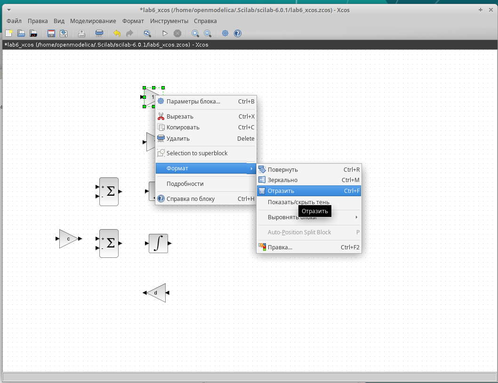{#fig:001 width=50%}

## Модель "хищник–жертва" в xcos

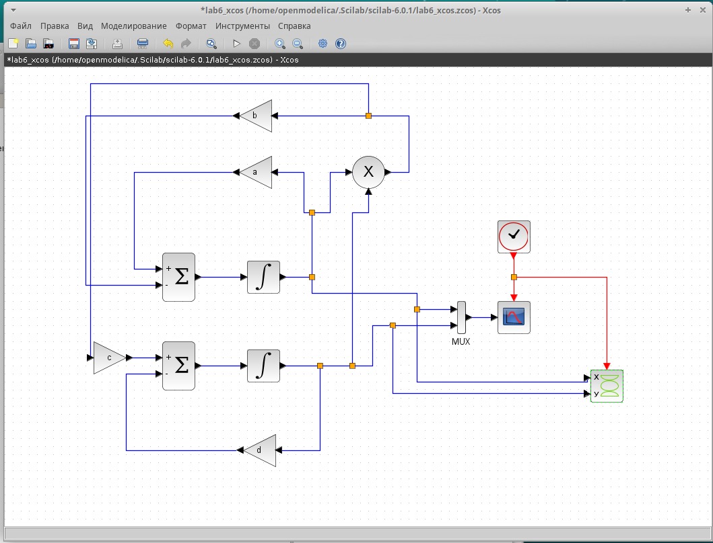{#fig:002 width=60%}

## Редактирование параметров блока cscope

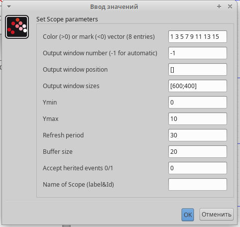{#fig:004 width=50%}

## Редактирование параметров блока cscopexy

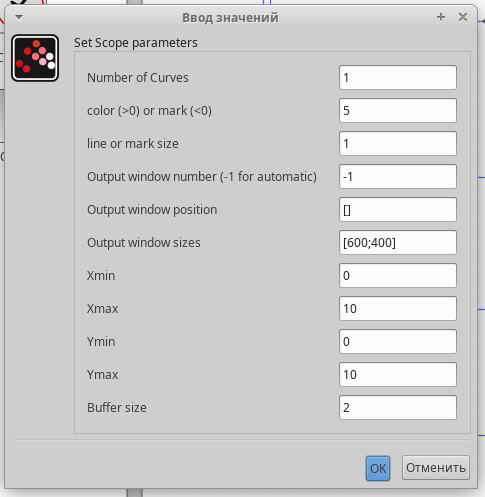{#fig:005 width=30%}

## Динамика изменения численности хищников и жертв

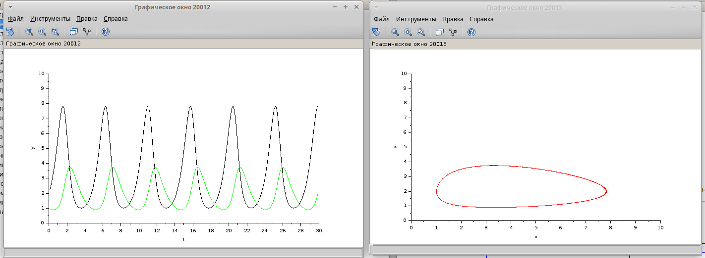{#fig:003 width=80%}

# Создать модель "хищник-жертва" в xcos с использованием блока Modelica

## Параметры блока Modelica для модели. Ввод значений

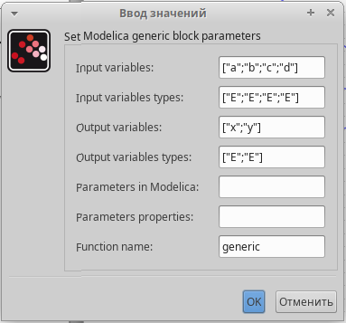{#fig:006 width=50%}

## Параметры блока Modelica для модели. Ввод значений - функция

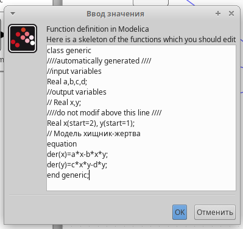{#fig:007 width=50%}

## Модель "хищник–жертва" в xcos с применением блока Modelica

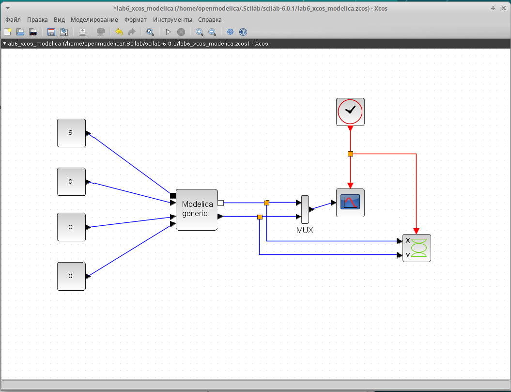{#fig:008 width=60%}

## Динамика изменения численности хищников и жертв и фазовый портрет

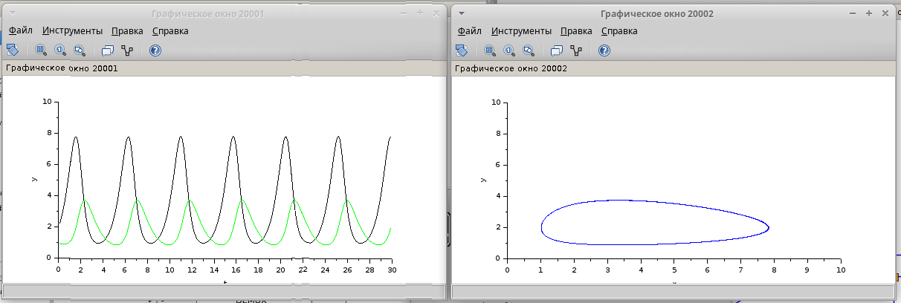{#fig:009 width=70%}

# Создать модель "хищник-жертва" в OpenModelica (упражнение)

## Код для модели "хищник–жертва" в OpenModelica

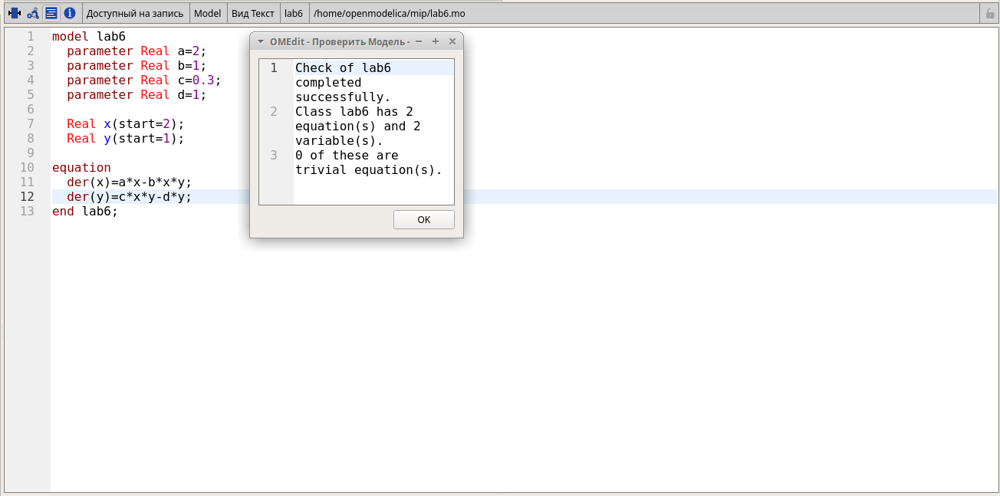{#fig:010 width=60%}

## Установки симуляции (конечное время = 30)

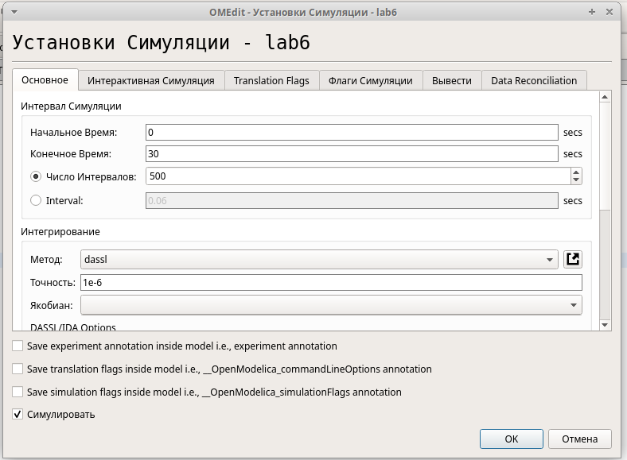{#fig:011 width=50%}

## Динамика изменения численности хищников и жертв

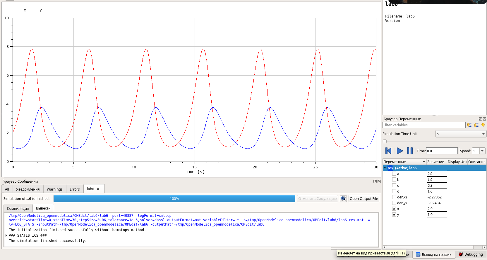{#fig:012 width=80%}

## Фазовый портрет

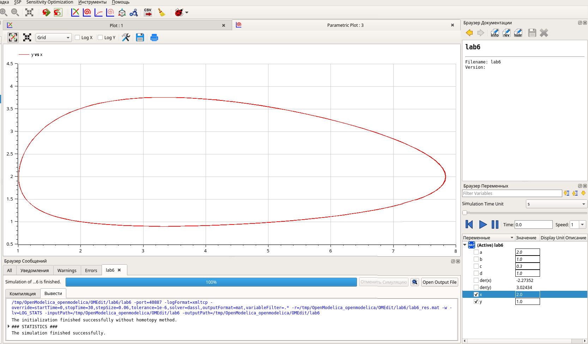{#fig:013 width=70%}

# Результаты

В ходе данной работы я приобрела навыки создания модели "хищник-жертва" в xcos, в xcos с использованием блока Modelica и в OpenModelica.
