---
## Front matter
title: "Отчёт по лабораторной работе №6"
subtitle: "Дисциплина: Имитационное моделирование"
author: "Ганина Таисия Сергеевна, НФИбд-01-22"

## Generic otions
lang: ru-RU
toc-title: "Содержание"

## Bibliography
bibliography: bib/cite.bib
csl: pandoc/csl/gost-r-7-0-5-2008-numeric.csl

## Pdf output format
toc: true # Table of contents
toc-depth: 2
lof: true # List of figures
lot: true # List of tables
fontsize: 12pt
linestretch: 1.5
papersize: a4
documentclass: scrreprt
## I18n polyglossia
polyglossia-lang:
  name: russian
  options:
	- spelling=modern
	- babelshorthands=true
polyglossia-otherlangs:
  name: english
## I18n babel
babel-lang: russian
babel-otherlangs: english
## Fonts
mainfont: PT Serif
romanfont: PT Serif
sansfont: PT Sans
monofont: PT Mono
mainfontoptions: Ligatures=TeX
romanfontoptions: Ligatures=TeX
sansfontoptions: Ligatures=TeX,Scale=MatchLowercase
monofontoptions: Scale=MatchLowercase,Scale=0.9
## Biblatex
biblatex: true
biblio-style: "gost-numeric"
biblatexoptions:
  - parentracker=true
  - backend=biber
  - hyperref=auto
  - language=auto
  - autolang=other*
  - citestyle=gost-numeric
## Pandoc-crossref LaTeX customization
figureTitle: "Рис."
tableTitle: "Таблица"
listingTitle: "Листинг"
lofTitle: "Список иллюстраций"
lotTitle: "Список таблиц"
lolTitle: "Листинги"
## Misc options
indent: true
header-includes:
  - \usepackage{indentfirst}
  - \usepackage{float} # keep figures where there are in the text
  - \floatplacement{figure}{H} # keep figures where there are in the text
---

# Цель работы

Целью данной работы является приобретение навыков создания модели "хищник-жертва" в xcos, в xcos с использованием блока Modelica и в OpenModelica.

# Задание

1. Создать модель "хищник-жертва" в xcos.
2. Создать модель "хищник-жертва" в xcos с использованием блока Modelica.
3. Создать модель "хищник-жертва" в OpenModelica (упражнение).

# Теоретическое введение

Модель «хищник–жертва» (модель Лотки — Вольтерры) представляет собой модель межвидовой конкуренции. В математической форме модель имеет вид:

$$
\begin{cases}
  \dot x = ax - bxy \\
  \dot y = cxy - dy,
\end{cases}
$$

где $x$ — количество жертв; $y$ — количество хищников; $a, b, c, d$ — коэффициенты, отражающие взаимодействия между видами: $a$ — коэффициент рождаемости
жертв; $b$ — коэффициент убыли жертв; $c$ — коэффициент рождения хищников; $d$ —
коэффициент убыли хищников. [@lab_ruk] [@math_mod_trubetskoi]

# Выполнение лабораторной работы

## Создать модель "хищник-жертва" в xcos

В начале я составила модель из блоков, задавая необходимые значения (рис. @fig:001, @fig:002, @fig:003, @fig:004, @fig:005). 

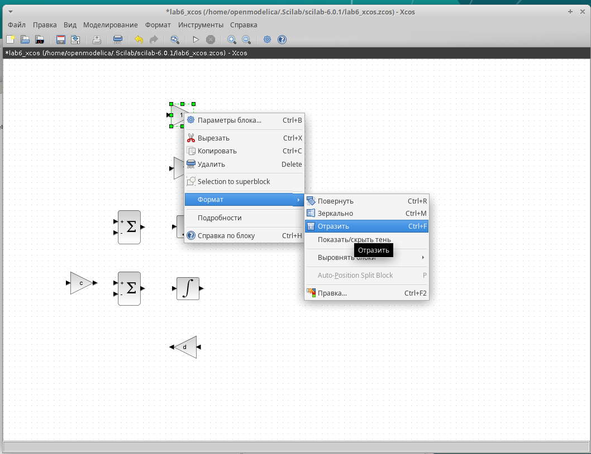{#fig:001 width=70%}

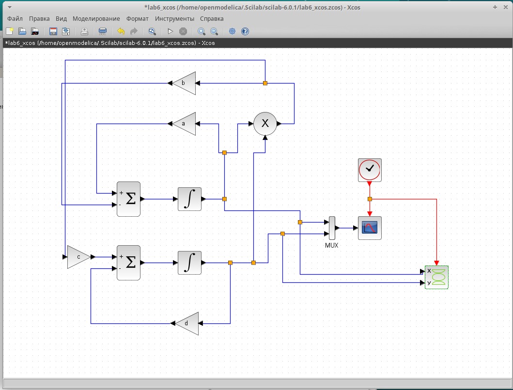{#fig:002 width=70%}

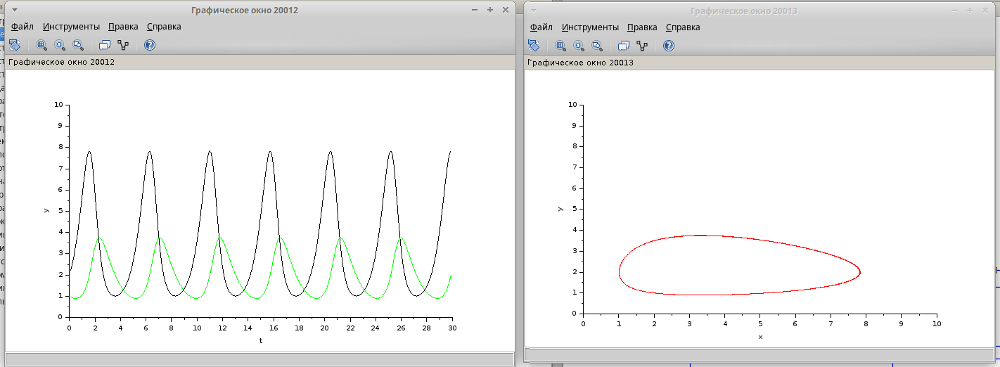{#fig:003 width=70%}

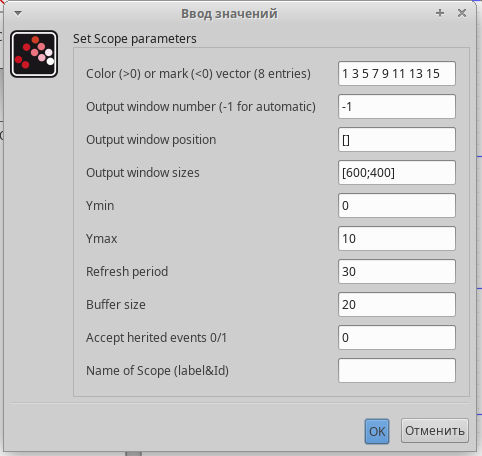{#fig:004 width=70%}

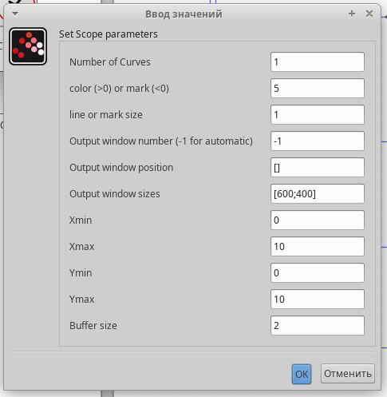{#fig:005 width=70%}

## Создать модель "хищник-жертва" в xcos с использованием блока Modelica

Затем я открыла новое окно для создания модели с использованием блока Modelica  (рис. @fig:006, @fig:007, @fig:008, @fig:009).

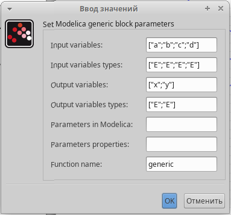{#fig:006 width=70%}

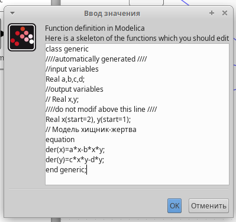{#fig:007 width=70%}

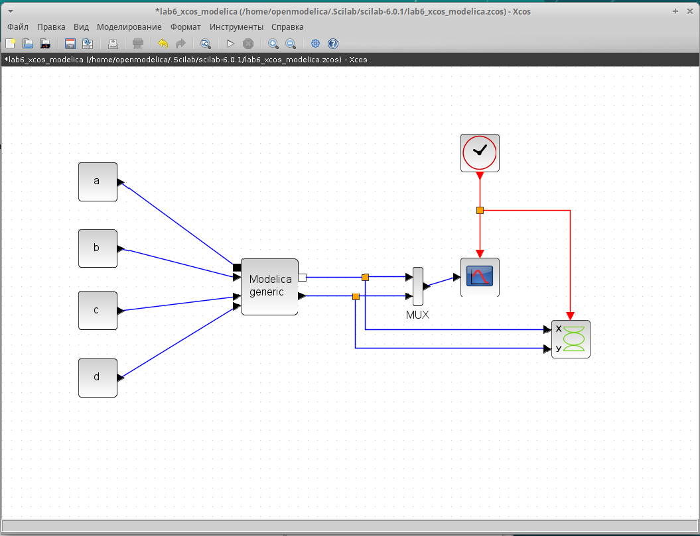{#fig:008 width=70%}

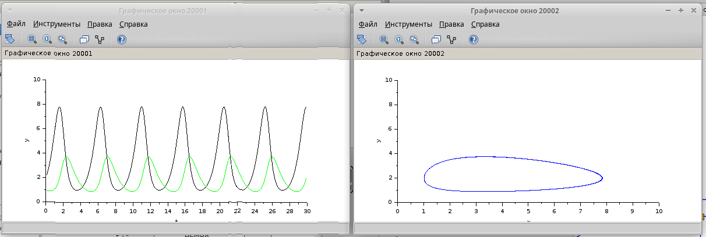{#fig:009 width=70%}

## Создать модель "хищник-жертва" в OpenModelica (упражнение)

Для начала я создала класс, а после написала код (рис. @fig:010, @fig:011).

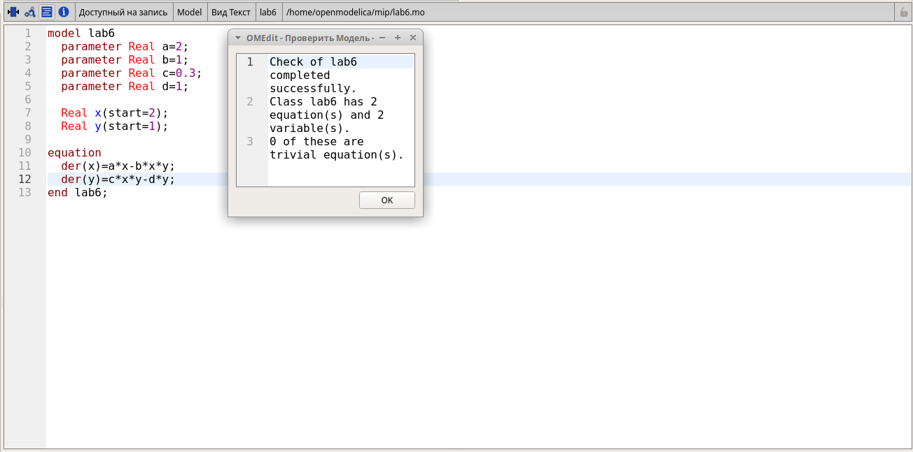{#fig:010 width=70%}

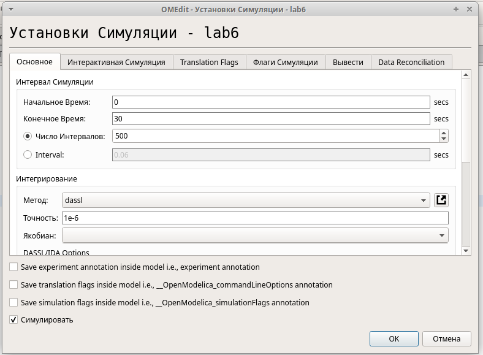{#fig:011 width=70%}

Получила динамики изменения численности (рис. @fig:012):

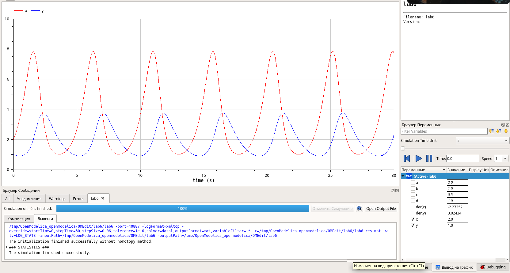{#fig:012 width=70%}

Для построения фазового портрета нужно было использовать Parametric Plot (рис. @fig:013):

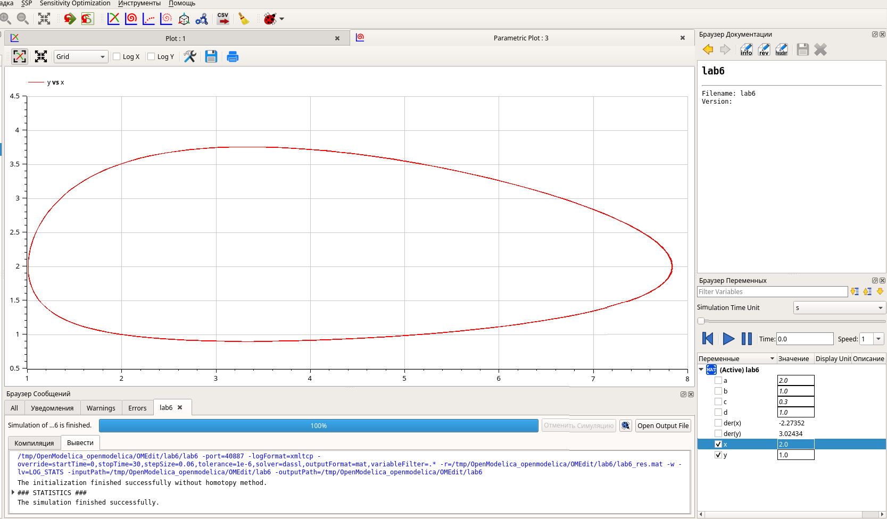{#fig:013 width=70%}

# Выводы

В ходе данной работы я приобрела навыки создания модели "хищник-жертва" в xcos, в xcos с использованием блока Modelica и в OpenModelica.

# Список литературы{.unnumbered}

::: {#refs}
:::

