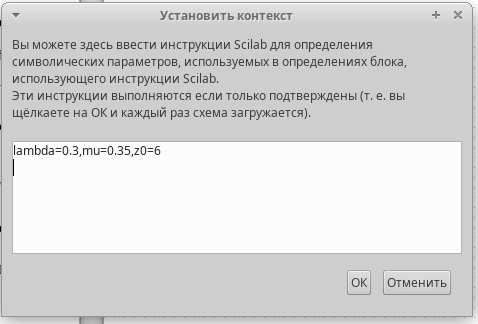
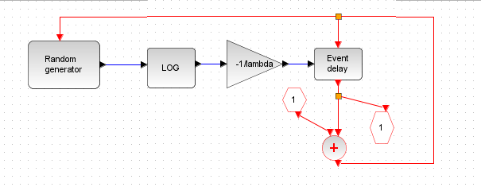
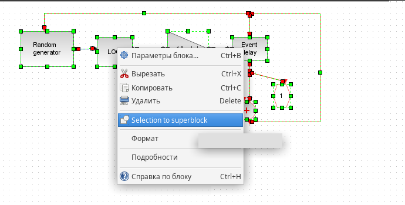
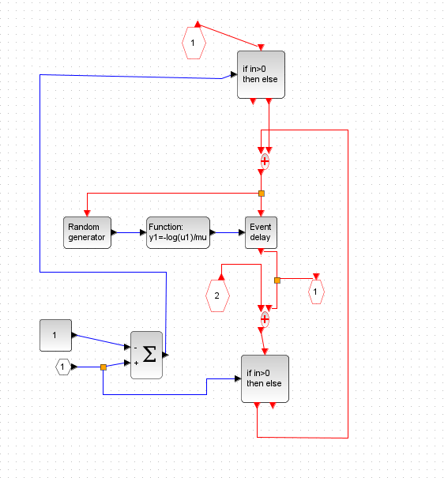
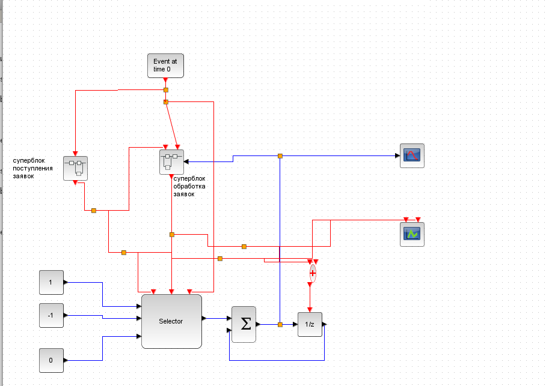
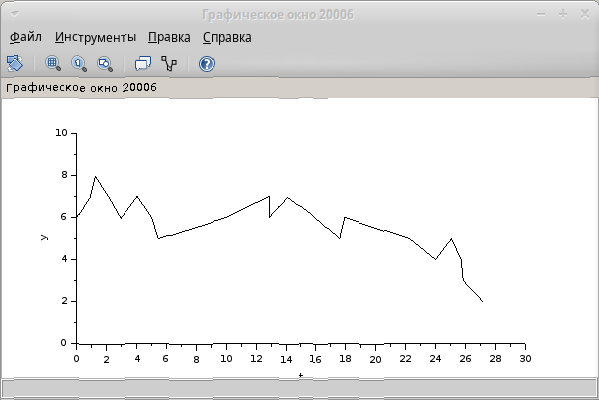
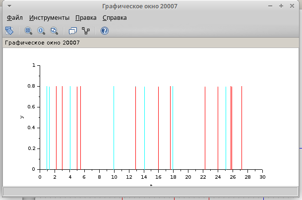

---
## Front matter
lang: ru-RU
title: "Лабораторная работа №7"
subtitle: "Дисциплина: Имитационное моделирование"
author:
  - Ганина Т. С.
institute:
  - Группа НФИбд-01-22
  - Российский университет дружбы народов, Москва, Россия
date: 21 марта 2025

## i18n babel
babel-lang: russian
babel-otherlangs: english

## Formatting pdf
toc: false
toc-title: Содержание
slide_level: 2
aspectratio: 169
section-titles: true
theme: metropolis
header-includes:
 - \metroset{progressbar=frametitle,sectionpage=progressbar,numbering=fraction}
 - '\makeatletter'
 - '\beamer@ignorenonframefalse'
 - '\makeatother'
---

# Информация

## Докладчик

:::::::::::::: {.columns align=center}
::: {.column width="70%"}

  * Ганина Таисия Сергеевна
  * Студентка 3го курса, группа НФИбд-01-22
  * Фундаментальная информатика и информационные технологии
  * Российский университет дружбы народов
  * [Ссылка на репозиторий гитхаба tsganina](https://github.com/tsganina/study_2024-2025_simmod)

:::
::: {.column width="30%"}

:::
::::::::::::::

# Вводная часть

## Цели и задачи

Рассмотреть пример моделирования в *xcos* системы массового обслуживания типа $M|M|1|\infty$.

## Задание

1. Реализовать модель системы массового обслуживания типа $M|M|1|\infty$;
2. Построить график поступления и обработки заявок;
3. Построить график динамики размера очереди.

## Задание переменных окружения в xcos для модели

{#fig:001 width=70%}

## Суперблок, моделирующий поступление заявок

{#fig:002 width=70%}

## Объединение в суперблок

{#fig:003 width=70%}

## Суперблок, моделирующий обработку заявок

{#fig:004 width=50%}

## Модель $M|M|1|\infty$ в xcos

{#fig:005 width=60%}

## Динамика размера очереди

{#fig:006 width=50%}

## Поступление и обработка заявок

{#fig:007 width=50%}

# Результаты

В процессе выполнения данной лабораторной работы я рассмотрела пример моделирования в *xcos* системы массового обслуживания типа $M|M|1|\infty$.
