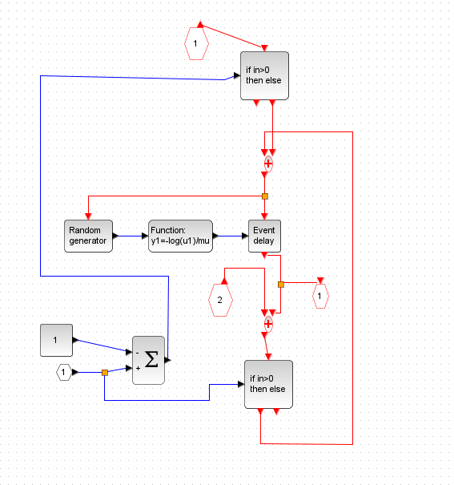

---
## Front matter
title: "Отчёт по лабораторной работе №7"
subtitle: "Имитационное моделирование"
author: "Ганина Таисия Сергеевна, НФИбд-01-22"

## Generic otions
lang: ru-RU
toc-title: "Содержание"

## Bibliography
bibliography: bib/cite.bib
csl: pandoc/csl/gost-r-7-0-5-2008-numeric.csl

## Pdf output format
toc: true # Table of contents
toc-depth: 2
lof: true # List of figures
lot: true # List of tables
fontsize: 12pt
linestretch: 1.5
papersize: a4
documentclass: scrreprt
## I18n polyglossia
polyglossia-lang:
  name: russian
  options:
	- spelling=modern
	- babelshorthands=true
polyglossia-otherlangs:
  name: english
## I18n babel
babel-lang: russian
babel-otherlangs: english
## Fonts
mainfont: PT Serif
romanfont: PT Serif
sansfont: PT Sans
monofont: PT Mono
mainfontoptions: Ligatures=TeX
romanfontoptions: Ligatures=TeX
sansfontoptions: Ligatures=TeX,Scale=MatchLowercase
monofontoptions: Scale=MatchLowercase,Scale=0.9
## Biblatex
biblatex: true
biblio-style: "gost-numeric"
biblatexoptions:
  - parentracker=true
  - backend=biber
  - hyperref=auto
  - language=auto
  - autolang=other*
  - citestyle=gost-numeric
## Pandoc-crossref LaTeX customization
figureTitle: "Рис."
tableTitle: "Таблица"
listingTitle: "Листинг"
lofTitle: "Список иллюстраций"
lotTitle: "Список таблиц"
lolTitle: "Листинги"
## Misc options
indent: true
header-includes:
  - \usepackage{indentfirst}
  - \usepackage{float} # keep figures where there are in the text
  - \floatplacement{figure}{H} # keep figures where there are in the text
---

# Цель работы

Рассмотреть пример моделирования в *xcos* системы массового обслуживания типа $M|M|1|\infty$.

# Задание

1. Реализовать модель системы массового обслуживания типа $M|M|1|\infty$;
2. Построить график поступления и обработки заявок;
3. Построить график динамики размера очереди.

# Теоретическое введение

Системы массового обслуживания (СМО) представляют собой математическую модель, которая используется для анализа и оптимизации процессов обслуживания клиентов в различных организациях, таких как банки, магазины, автосервисы, аэропорты и многие другие. Эта модель помогает прогнозировать и улучшать эффективность обслуживания клиентов, оптимизировать количество обслуживающего персонала и ресурсов, а также учитывать важные характеристики, такие как время ожидания и уровень обслуживания.

Согласно общему описанию система $M|M|1|\infty$ - система, состоящая из единственного экспоненциального прибора (с интенсивностью обслуживания µ), в которую поступает простейший поток заявок (с параметром λ).Число мест для ожидания заявок бесконечно, т.е. система с ожиданием.[@SMO; @lab]

# Выполнение лабораторной работы

Зафиксируем начальные данные: $\lambda = 0.3, \, \mu = 0.35, \, z_0 = 6$. В меню Моделирование, Установить контекст зададим значения коэффициентов (рис. @fig:001).

{#fig:001 width=70%}

Суперблок, моделирующий поступление заявок, представлен на рис. @fig:002, @fig:003. Тут у нас заявки поступают в систему по пуассоновскому закону. Поступает заявка в суперблок, идет в синхронизатор входных и выходных сигналов, происходит равномерное распределение на интервале $[0; 1]$ (также заявка идет в обработчик событий), далее идет преобразование в экспоненциальное распределение с параметром $\lambda$, далее заявка опять попадает в обработчик событий и выходит из суперблока.

{#fig:002 width=70%}

{#fig:003 width=70%}

Суперблок, моделирующий процесс обработки заявок, представлен на рис. @fig:004. Тут происходит обработка заявок в очереди по экспоненциальному закону.

{#fig:004 width=70%}

Готовая модель $M|M|1|\infty$ представлена на рис. @fig:005. Тут есть селектор, два суперблока, построенных ранее, первоначальное событие на вход в суперблок, суммирование, оператор задержки (имитация очереди), также есть регистрирующие блоки: регистратор размера очереди и регистратор событий.

{#fig:005 width=70%}

Результат моделирования представлен на рис. @fig:006 и @fig:007. График динамики размера очереди начинается со значения 6, потому что мы указали $z_0 = 6$.

{#fig:006 width=70%}

{#fig:007 width=70%}

# Выводы

В процессе выполнения данной лабораторной работы я рассмотрела пример моделирования в *xcos* системы массового обслуживания типа $M|M|1|\infty$.

# Список литературы{.unnumbered}

::: {#refs}
:::
