---
## Front matter
lang: ru-RU
title: "Лабораторная работа №8"
subtitle: "Дисциплина: Имитационное моделирование"
author:
  - Ганина Т. С.
institute:
  - Группа НФИбд-01-22
  - Российский университет дружбы народов, Москва, Россия
date: 25 марта 2025

## i18n babel
babel-lang: russian
babel-otherlangs: english

## Formatting pdf
toc: false
toc-title: Содержание
slide_level: 2
aspectratio: 169
section-titles: true
theme: metropolis
header-includes:
 - \metroset{progressbar=frametitle,sectionpage=progressbar,numbering=fraction}
 - '\makeatletter'
 - '\beamer@ignorenonframefalse'
 - '\makeatother'
---

# Информация

## Докладчик

:::::::::::::: {.columns align=center}
::: {.column width="70%"}

  * Ганина Таисия Сергеевна
  * Студентка 3го курса, группа НФИбд-01-22
  * Фундаментальная информатика и информационные технологии
  * Российский университет дружбы народов
  * [Ссылка на репозиторий гитхаба tsganina](https://github.com/tsganina/study_2024-2025_simmod)

:::
::: {.column width="30%"}

:::
::::::::::::::

# Вводная часть

## Цели и задачи

Реализовать модель TCP/AQM в xcos и OpenModelica.

## Задание

1. Построить модель TCP/AQM в xcos;
2. Построить графики динамики изменения размера TCP окна $W(t)$ и размера очереди $Q(t)$;
3. Построить модель TCP/AQM в OpenModelica;

## Задание переменных окружения в xcos для модели

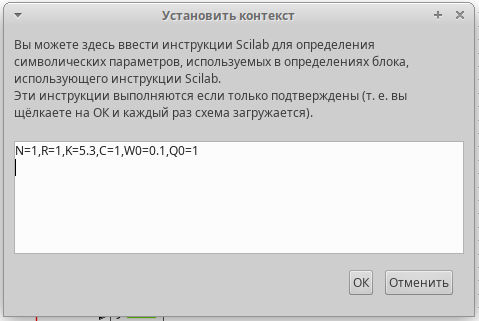{#fig:001 width=70%}

## Параметры

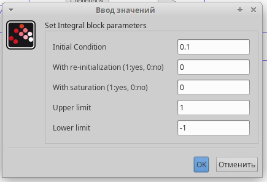{#fig:002 width=70%}

## Параметры

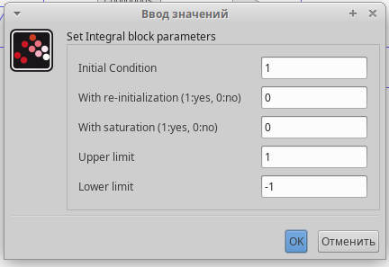{#fig:003 width=70%}

## Параметры

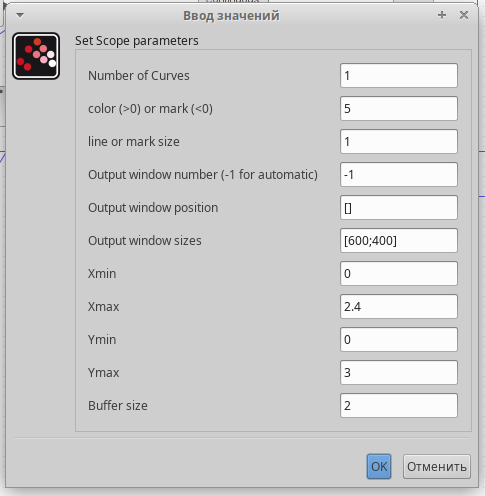{#fig:004 width=40%}

## Параметры

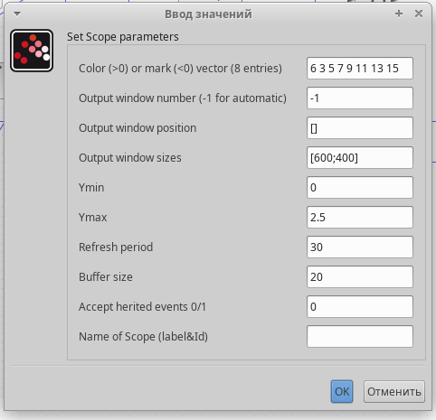{#fig:005 width=50%}

## Параметры

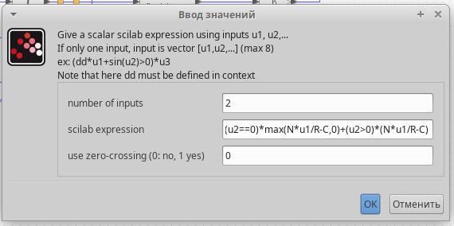{#fig:006 width=70%}

## Модель

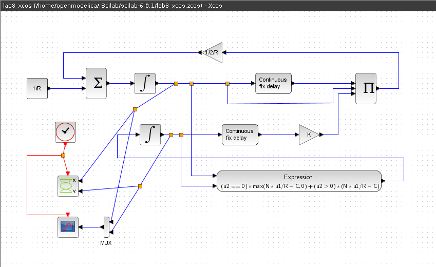{#fig:007 width=60%}

## Графики

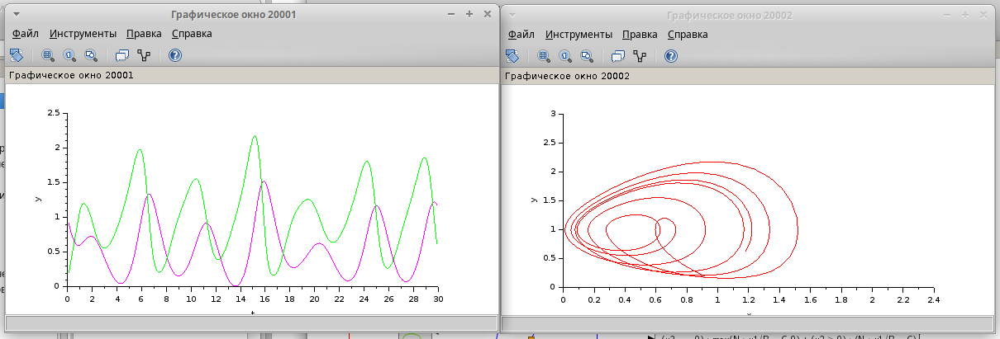{#fig:008 width=80%}

## Графики

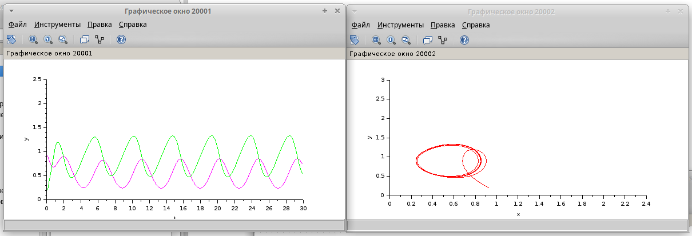{#fig:009 width=80%}

## Реализация модели в OpenModelica

```
model lab8_mip
  parameter Real N=1;
  parameter Real R=1;
  parameter Real K=5.3;
  parameter Real C=0.9;
  Real W(start=0.1);
  Real Q(start=1);
equation
  der(W)= 1/R - W*delay(W, R)/(2*R)*K*delay(Q, R);
  der(Q)= if (Q==0) then max(N*W/R-C,0) else (N*W/R-C);
end lab8_mip;
```

## Графики

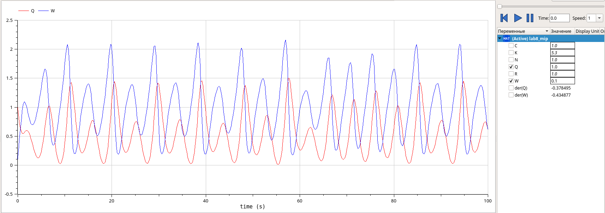{#fig:010 width=70%}

## Графики

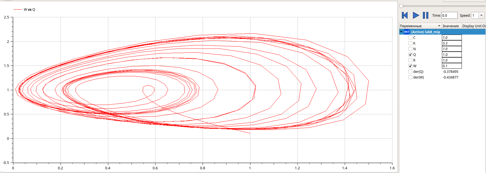{#fig:011 width=70%}

## Графики

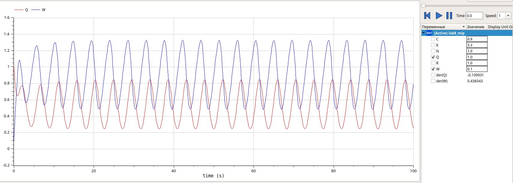{#fig:012 width=70%}

## Графики

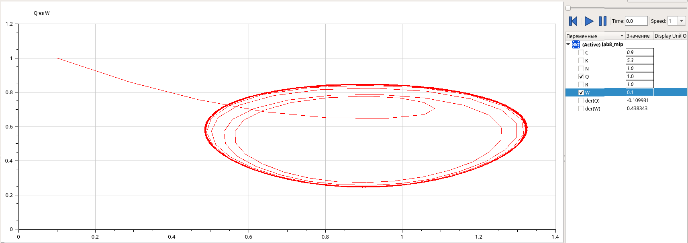{#fig:013 width=70%}

# Результаты

В процессе выполнения данной лабораторной работы я реализовала модель TCP/AQM в xcos и OpenModelica.
