---
## Front matter
title: "Отчёт по лабораторной работе №8"
subtitle: "Имитационное моделирование"
author: "Ганина Таисия Сергеевна, НФИбд-01-22"

## Generic otions
lang: ru-RU
toc-title: "Содержание"

## Bibliography
bibliography: bib/cite.bib
csl: pandoc/csl/gost-r-7-0-5-2008-numeric.csl

## Pdf output format
toc: true # Table of contents
toc-depth: 2
lof: true # List of figures
lot: true # List of tables
fontsize: 12pt
linestretch: 1.5
papersize: a4
documentclass: scrreprt
## I18n polyglossia
polyglossia-lang:
  name: russian
  options:
	- spelling=modern
	- babelshorthands=true
polyglossia-otherlangs:
  name: english
## I18n babel
babel-lang: russian
babel-otherlangs: english
## Fonts
mainfont: PT Serif
romanfont: PT Serif
sansfont: PT Sans
monofont: PT Mono
mainfontoptions: Ligatures=TeX
romanfontoptions: Ligatures=TeX
sansfontoptions: Ligatures=TeX,Scale=MatchLowercase
monofontoptions: Scale=MatchLowercase,Scale=0.9
## Biblatex
biblatex: true
biblio-style: "gost-numeric"
biblatexoptions:
  - parentracker=true
  - backend=biber
  - hyperref=auto
  - language=auto
  - autolang=other*
  - citestyle=gost-numeric
## Pandoc-crossref LaTeX customization
figureTitle: "Рис."
tableTitle: "Таблица"
listingTitle: "Листинг"
lofTitle: "Список иллюстраций"
lotTitle: "Список таблиц"
lolTitle: "Листинги"
## Misc options
indent: true
header-includes:
  - \usepackage{indentfirst}
  - \usepackage{float} # keep figures where there are in the text
  - \floatplacement{figure}{H} # keep figures where there are in the text
---

# Цель работы

Реализовать модель TCP/AQM в xcos и OpenModelica.

# Задание

1. Построить модель TCP/AQM в xcos;
2. Построить графики динамики изменения размера TCP окна $W(t)$ и размера очереди $Q(t)$;
3. Построить модель TCP/AQM в OpenModelica;

# Теоретическое введение

Протокол TCP использует механизм динамической регулировки размера окна для предотвращения перегрузок. Уравнение $W(t) = 1/R(t) − (W(t)W(t−R(t)))/(2R(t−R(t)))·p(t−R(t))$ отражает два ключевых режима:  

- **Фаза медленного старта** (первое слагаемое) — линейный рост окна до достижения порога ssthresh;  
- **Фаза избежания перегрузок** (второе слагаемое) — мультипликативное уменьшение окна при детектировании потерь пакетов через функцию p(t).  

Функция p(t) реализует алгоритм AQM (Active Queue Management), который proactively управляет очередью маршрутизатора для минимизации задержек и потерь.

1. **Постоянные N и R** — позволяют анализировать устойчивость системы методами теории управления.  
2. **Линейная зависимость p(t) от Q(t)** — упрощает анализ влияния длины очереди на динамику окна.  

Модель позволяет:  
- Исследовать баланс между скоростью обработки пакетов (C) и интенсивностью трафика (NW/R);  
- Анализировать стабильность системы при различных значениях K;  
- Оптимизировать параметры AQM для соблюдения QoS-требований ($IPTD ≤ 150 мс, IPLR ≤ 10^{-3}$).  

Для учебных целей упрощения оправданы, так как фокусируют внимание на ключевых аспектах взаимодействия TCP и AQM, игнорируя второстепенные факторы (например, вариативность RTT)
[@first; @second].

# Выполнение лабораторной работы

## Реализация в xcos

Построим схему xcos, моделирующую нашу систему, с начальными значениями параметров $N = 1, R = 1, K = 5.3, C = 1, W(0) = 0.1, Q(0) = 1$.
Для этого сначала зададим переменные окружения (рис. @fig:001).

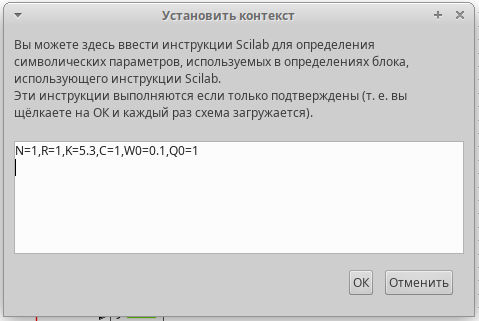{#fig:001 width=70%}

Затем реализуем модель TCP/AQM, разместив блоки интегрирования, суммирования, произведения, констант, а также регистрирующие устройства (рис. @fig:002, @fig:003, @fig:004, @fig:005, @fig:006, @fig:007)

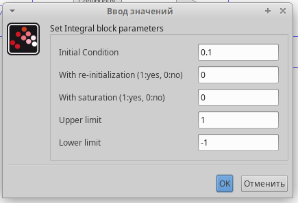{#fig:002 width=70%}

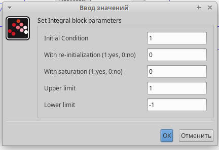{#fig:003 width=70%}

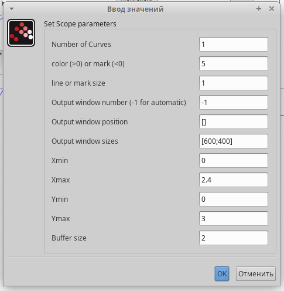{#fig:004 width=70%}

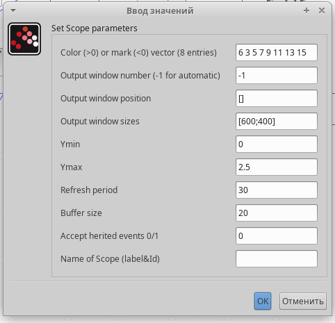{#fig:005 width=70%}

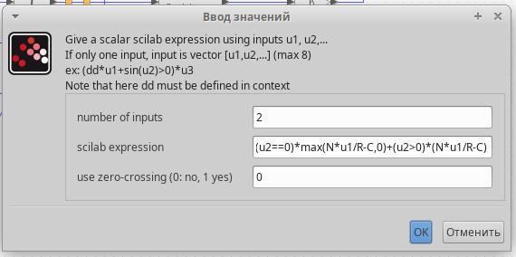{#fig:006 width=70%}

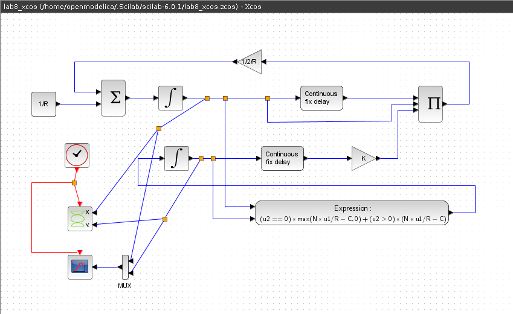{#fig:007 width=70%}

В результате получим динамику изменения размера TCP окна W(t) и размера очереди Q(t), а также фазовый портрет, который показывает наличие автоколебаний параметров системы — фазовая траектория осциллирует вокруг своей стационарной точки (рис. @fig:008).

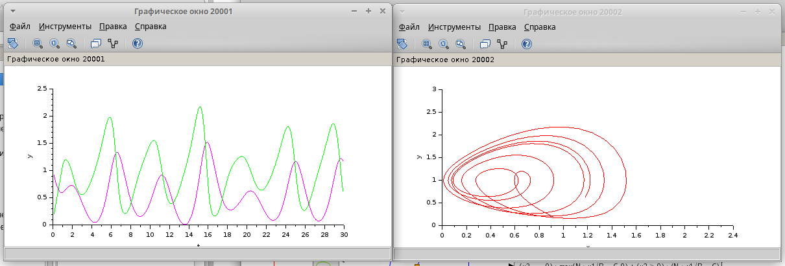{#fig:008 width=70%}

Уменьшив скорость обработки пакетов $C$ до $0.9$ увидим, что автоколебания стали более выраженными (рис. @fig:009). 

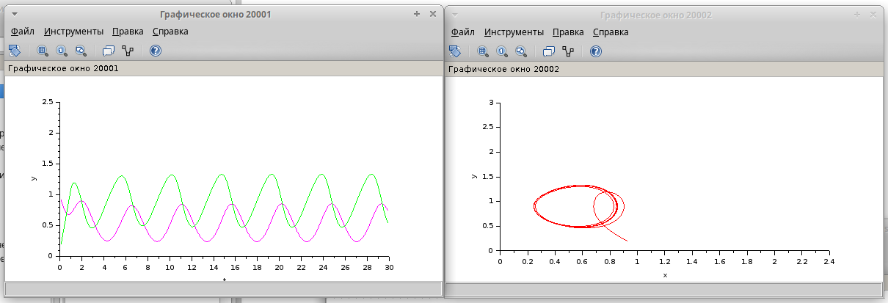{#fig:009 width=70%}

## Реализация модели в OpenModelica

Перейдем к реализации модели в OpenModelica. Я написала вот такой код:

```
model lab8_mip
  parameter Real N=1;
  parameter Real R=1;
  parameter Real K=5.3;
  parameter Real C=0.9;
  Real W(start=0.1);
  Real Q(start=1);
equation
  der(W)= 1/R - W*delay(W, R)/(2*R)*K*delay(Q, R);
  der(Q)= if (Q==0) then max(N*W/R-C,0) else (N*W/R-C);
end lab8_mip;
```

Выполнив симуляцию, получим динамику изменения размера TCP окна W(t) и размера очереди Q(t), а также фазовый портрет, который показывает наличие автоколебаний параметров системы — фазовая траектория осциллирует вокруг своей стационарной точки (рис. @fig:010,  @fig:011,  @fig:012, @fig:013).

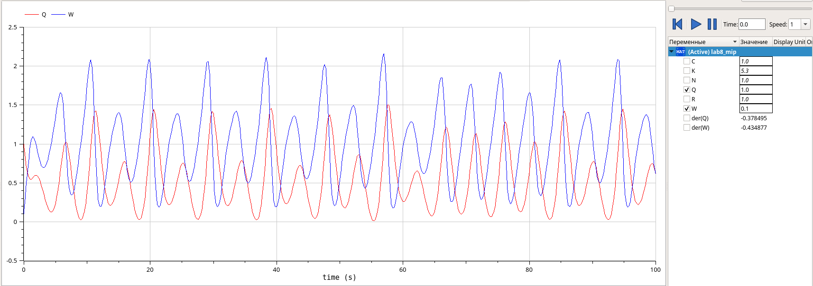{#fig:010 width=70%}

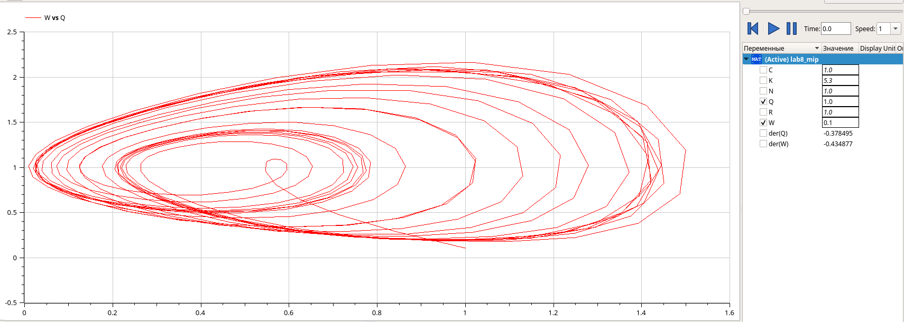{#fig:011 width=70%}

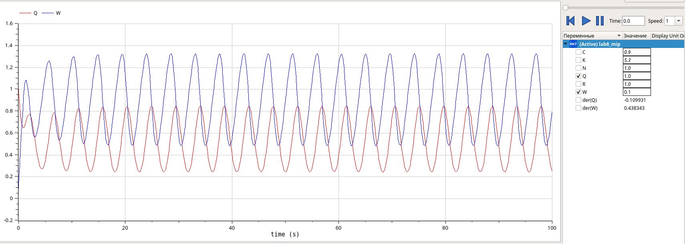{#fig:012 width=70%}

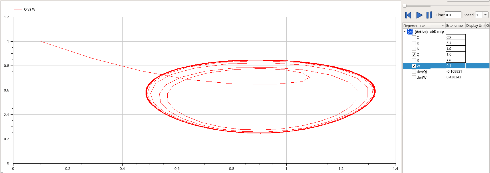{#fig:013 width=70%}

# Выводы

В процессе выполнения данной лабораторной работы я реализовала модель TCP/AQM в xcos и OpenModelica.

# Список литературы{.unnumbered}

::: {#refs}
:::
