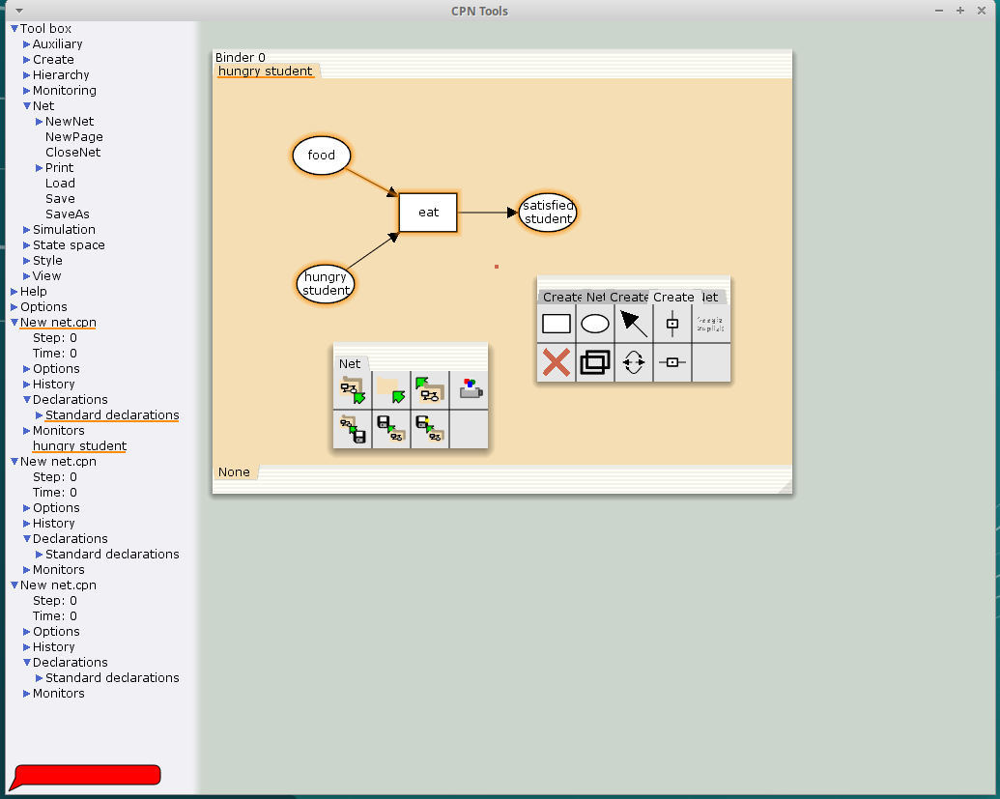
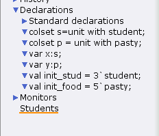
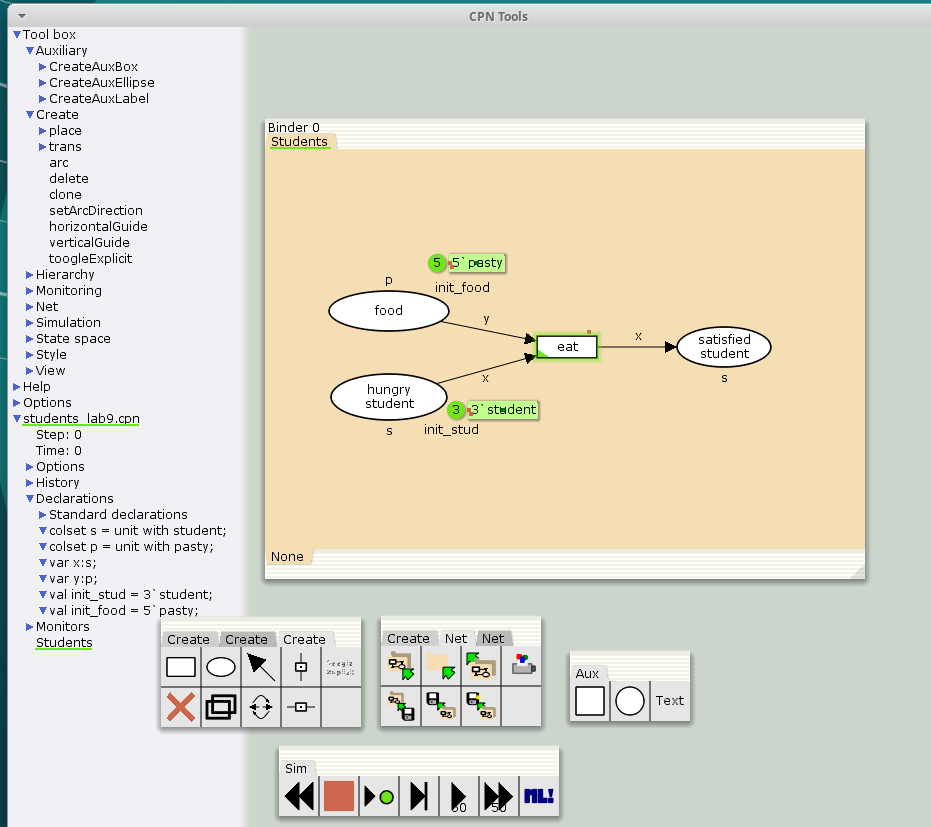
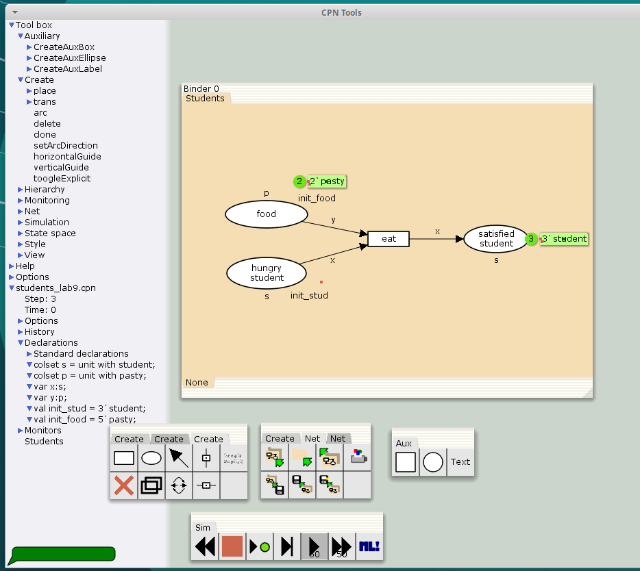
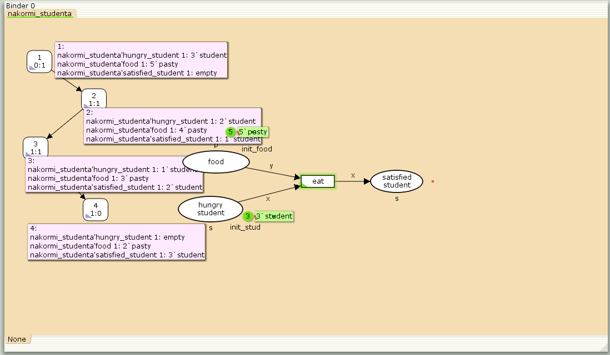

---
## Front matter
title: "Отчёт по лабораторной работе №9"
subtitle: "Имитационное моделирование"
author: "Ганина Таисия Сергеевна, НФИбд-01-22"

## Generic otions
lang: ru-RU
toc-title: "Содержание"

## Bibliography
bibliography: bib/cite.bib
csl: pandoc/csl/gost-r-7-0-5-2008-numeric.csl

## Pdf output format
toc: true # Table of contents
toc-depth: 2
lof: true # List of figures
lot: true # List of tables
fontsize: 12pt
linestretch: 1.5
papersize: a4
documentclass: scrreprt
## I18n polyglossia
polyglossia-lang:
  name: russian
  options:
	- spelling=modern
	- babelshorthands=true
polyglossia-otherlangs:
  name: english
## I18n babel
babel-lang: russian
babel-otherlangs: english
## Fonts
mainfont: PT Serif
romanfont: PT Serif
sansfont: PT Sans
monofont: PT Mono
mainfontoptions: Ligatures=TeX
romanfontoptions: Ligatures=TeX
sansfontoptions: Ligatures=TeX,Scale=MatchLowercase
monofontoptions: Scale=MatchLowercase,Scale=0.9
## Biblatex
biblatex: true
biblio-style: "gost-numeric"
biblatexoptions:
  - parentracker=true
  - backend=biber
  - hyperref=auto
  - language=auto
  - autolang=other*
  - citestyle=gost-numeric
## Pandoc-crossref LaTeX customization
figureTitle: "Рис."
tableTitle: "Таблица"
listingTitle: "Листинг"
lofTitle: "Список иллюстраций"
lotTitle: "Список таблиц"
lolTitle: "Листинги"
## Misc options
indent: true
header-includes:
  - \usepackage{indentfirst}
  - \usepackage{float} # keep figures where there are in the text
  - \floatplacement{figure}{H} # keep figures where there are in the text
---

# Цель работы

Реализовать модель "Накорми студентов" в CPN Tools.

# Задание

- Реализовать модель "Накорми студентов" в CPN Tools;
- Вычислить пространство состояний, сформировать отчет о нем и построить граф.

# Теоретическое введение

CPN Tools — специальное программное средство, предназначенное для моделирования иерархических временных раскрашенных сетей Петри. Такие сети эквивалентны машине Тьюринга и составляют универсальную алгоритмическую систему, позволяющую описать произвольный объект.
CPN Tools позволяет визуализировать модель с помощью графа сети Петри и применить язык программирования CPN ML (Colored Petri Net Markup Language) для формализованного описания модели.

**Назначение CPN Tools:**

- разработка сложных объектов и моделирование процессов в различных приклад-
ных областях, в том числе:
- моделирование производственных и бизнес-процессов;
- моделирование систем управления производственными системами и роботами;
- спецификация и верификация протоколов, оценка пропускной способности сетей
и качества обслуживания, проектирование телекоммуникационных устройств
и сетей.

**Основные функции CPN Tools:**

- создание (редактирование) моделей;
- анализ поведения моделей с помощью имитации динамики сети Петри;
- построение и анализ пространства состояний модели.

[@first; @second].

# Выполнение лабораторной работы

Рассмотрим пример студентов, обедающих пирогами. Голодный студент становится сытым после того, как съедает пирог.

Таким образом, имеем:
- два типа фишек: «пироги» и «студенты»;
- три позиции: «голодный студент», «пирожки», «сытый студент»;
- один переход: «съесть пирожок».

Сначала нарисуем граф сети. Для этого с помощью контекстного меню создаём новую
сеть, добавляем позиции, переход и дуги (рис. fig:001).

{#fig:001 width=70%}

В меню задаём новые декларации модели: типы фишек, начальные значения
позиций, выражения для дуг. Для этого наведя мышку на меню Standart declarations,
правой кнопкой вызываем контекстное меню и выбираем New Decl (рис. @fig:002).

{#fig:002 width=70%}

После этого задаем тип s фишкам, относящимся к студентам, тип p — фишкам,
относящимся к пирогам, задаём значения переменных x и y для дуг и начальные
значения мультимножеств `init_stud` и `init_food`. В результате получаем работающую модель (рис. @fig:003).

{#fig:003 width=70%}

После запуска фишки типа «пирожки» из позиции «еда» и фишки типа «студенты» из позиции «голодный студент», пройдя через переход «кушать», попадают
в позицию «сытый студент» и преобразуются в тип «студенты» (рис. @fig:004).

{#fig:004 width=70%}

## Упражнение

Вычислим пространство состояний. Прежде, чем пространство состояний может быть вычислено и проанализировано, необходимо сформировать код пространства состояний. Этот код создается, когда используется инструмент Войти в пространство состояний. Вход в пространство состояний занимает некоторое время. Затем, если ожидается, что пространство состояний будет небольшим, можно просто применить инструмент Вычислить пространство состояний к листу, содержащему страницу сети. Сформируем отчёт о пространстве состояний и проанализируем его.  Чтобы сохранить отчет, необходимо применить инструмент Сохранить отчет о пространстве состояний к листу, содержащему страницу сети и ввести имя файла отчета.

Из полученного отчета можно узнать:

- Пространство состояний содержит **4 маркировки** и **3 перехода** между ними.
- Модель полностью построена за **0 секунд**, что указывает на её небольшую размерность.
- Все состояния образуют единый граф сильно связных компонентов (SCC).
  
- **Еда (`food`):**
  - Максимальное количество: **5 порций** (`pasty`)
  - Минимальное количество: **2 порции**
  - Пища частично расходуется, но не восполняется в текущей модели

- **Гарантированное завершение:**
  - Существует **терминальное состояние** (Dead Marking ``), достижимое из любой маркировки (Home Marking).
  - В финальном состоянии:
    - Все студенты сыты
    - Остаётся **2 порции еды** (нижний предел)

- **Отсутствие циклов:**
  - Нет бесконечных последовательностей переходов (`No infinite occurrence sequences`)
  - *Вывод:* Модель описывает **одноразовый процесс** обслуживания без возможности повторения

```
CPN Tools state space report for:
/home/openmodelica/students_lab9.cpn
Report generated: Sat Mar 22 22:04:13 2025


 Statistics
--------------------------

  State Space
     Nodes:  4
     Arcs:   3
     Secs:   0
     Status: Full

  Scc Graph
     Nodes:  4
     Arcs:   3
     Secs:   0


 Boundedness Properties
-------------------------

  Best Integer Bounds
                             Upper      Lower
     nakormi_studenta'food 1 5          2
     nakormi_studenta'hungry_student 1
                             3          0
     nakormi_studenta'satisfied_student 1
                             3          0

  Best Upper Multi-set Bounds
     nakormi_studenta'food 1
                         5`pasty
     nakormi_studenta'hungry_student 1
                         3`student
     nakormi_studenta'satisfied_student 1
                         3`student

  Best Lower Multi-set Bounds
     nakormi_studenta'food 1
                         2`pasty
     nakormi_studenta'hungry_student 1
                         empty
     nakormi_studenta'satisfied_student 1
                         empty


 Home Properties
------------------------

  Home Markings
     [4]


 Liveness Properties
------------------------

  Dead Markings
     [4]

  Dead Transition Instances
     None

  Live Transition Instances
     None


 Fairness Properties
-----------------------
     No infinite occurrence sequences.

```

Построим граф пространства состояний (рис. @fig:005):

{#fig:005 width=70%}

# Выводы

В процессе выполнения данной лабораторной работы я реализовала модель "Накорми студентов" в CPN Tools.

# Список литературы{.unnumbered}

::: {#refs}
:::
