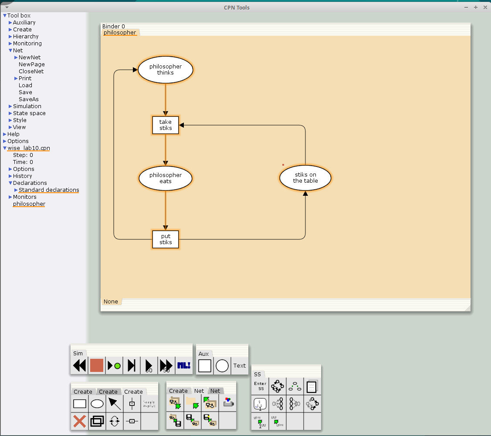
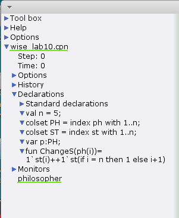
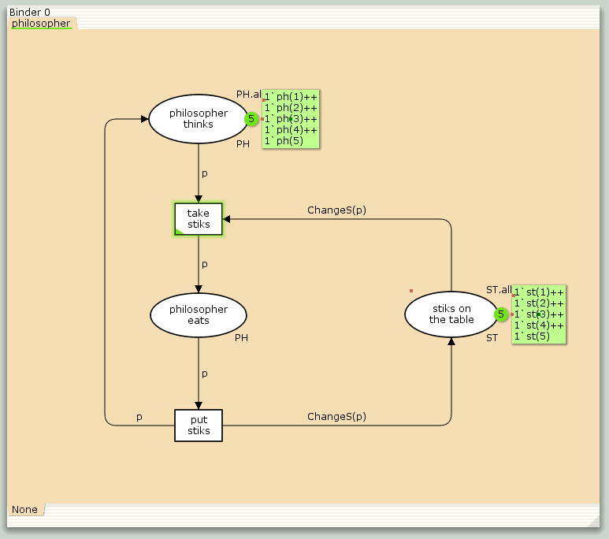
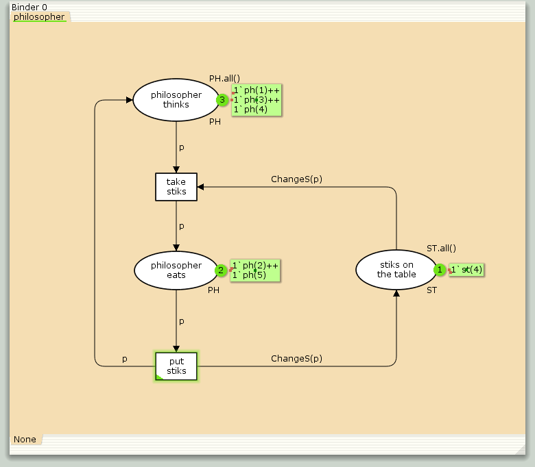
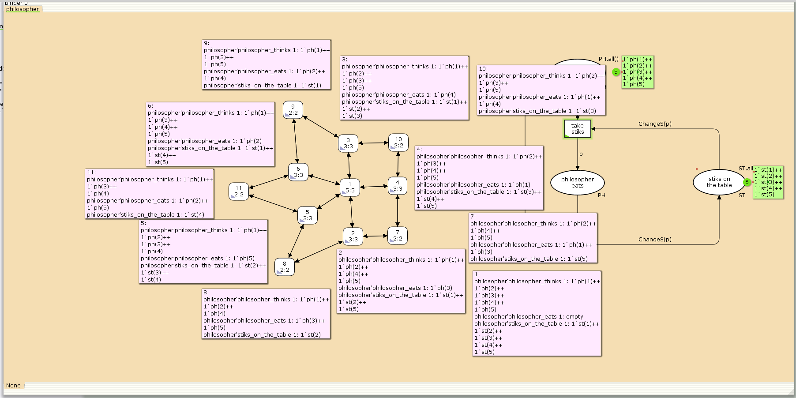

---
## Front matter
lang: ru-RU
title: "Лабораторная работа №10"
subtitle: "Дисциплина: Имитационное моделирование"
author:
  - Ганина Т. С.
institute:
  - Группа НФИбд-01-22
  - Российский университет дружбы народов, Москва, Россия
date: 05 апреля 2025

## i18n babel
babel-lang: russian
babel-otherlangs: english

## Formatting pdf
toc: false
toc-title: Содержание
slide_level: 2
aspectratio: 169
section-titles: true
theme: metropolis
header-includes:
 - \metroset{progressbar=frametitle,sectionpage=progressbar,numbering=fraction}
 - '\makeatletter'
 - '\beamer@ignorenonframefalse'
 - '\makeatother'
---

# Информация

## Докладчик

:::::::::::::: {.columns align=center}
::: {.column width="70%"}

  * Ганина Таисия Сергеевна
  * Студентка 3го курса, группа НФИбд-01-22
  * Фундаментальная информатика и информационные технологии
  * Российский университет дружбы народов
  * [Ссылка на репозиторий гитхаба tsganina](https://github.com/tsganina/study_2024-2025_simmod)

:::
::: {.column width="30%"}

:::
::::::::::::::

# Вводная часть

## Цели и задачи

Реализовать модель задачи об обедающих мудрецах в CPN Tools.

## Задание

- Реализовать модель задачи об обедающих мудрецах в CPN Tools;
- Вычислить пространство состояний, сформировать отчет о нем и построить граф.

## Граф сети модели «Задача об обедающих мудрецах»

{#fig:001 width=50%}

## Декларации модели «Задача об обедающих мудрецах»

{#fig:002 width=30%}

## Модель «Задача об обедающих мудрецах»

{#fig:003 width=50%}

## Запуск модели «Задача об обедающих мудрецах»

{#fig:004 width=50%}

## Отчёт о Пространстве состояний для модели «Задача об обедающих мудрецах»

```
 Statistics
------------------------------------------------------------------------
  State Space
     Nodes:  11
     Arcs:   30
     Secs:   0
     Status: Full
  Scc Graph
     Nodes:  1
     Arcs:   0
     Secs:   0
```

## Отчёт о Пространстве состояний для модели «Задача об обедающих мудрецах»

```
 Boundedness Properties
------------------------------------------------------------------------
  Best Integer Bounds
                             Upper      Lower
     philosopher'philosopher_eats 1
                             2          0
     philosopher'philosopher_thinks 1
                             5          3
     philosopher'stiks_on_the_table 1
                             5          1
```

## Отчёт о Пространстве состояний для модели «Задача об обедающих мудрецах»

```
 Fairness Properties
------------------------------------------------------------------------
       philosopher'put_stiks 1
                         Impartial
       philosopher'take_stiks 1
                         Impartial

```

## Пространство состояний для модели «Задача об обедающих мудрецах»

{#fig:006 width=70%}


# Результаты

В ходе 10 лабораторной работы была реализована модель задачи об обедающих мудрецах в CPN Tools, вычислено пространство состояний, сформирован отчет о нем и построен граф.
