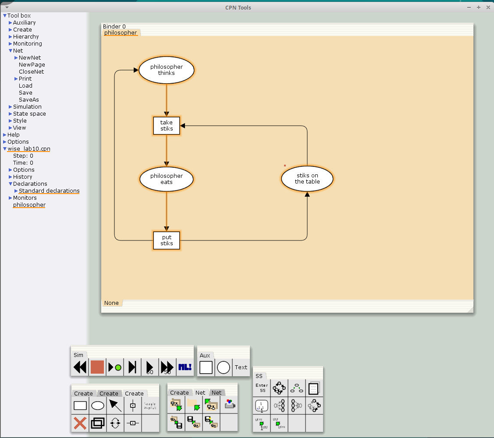
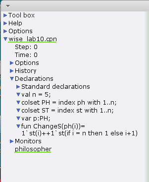
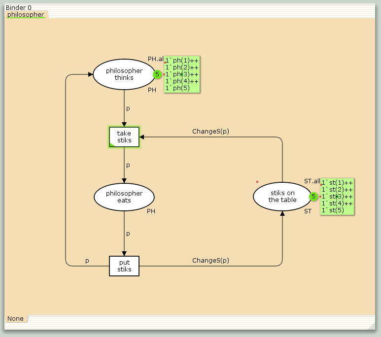
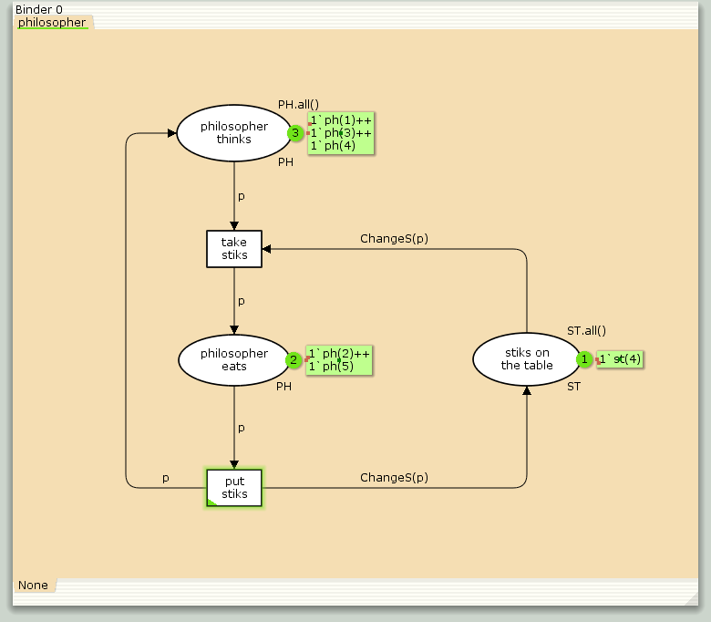
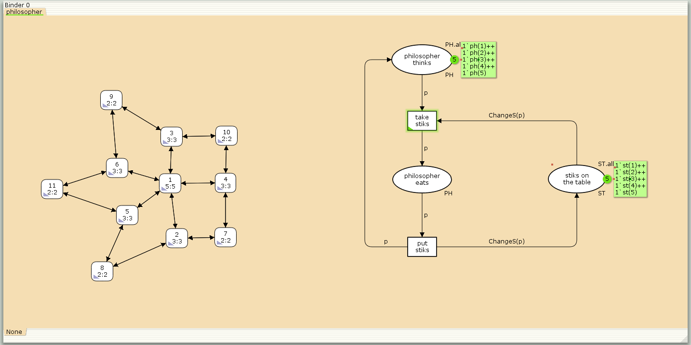
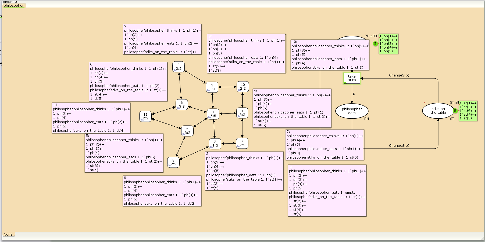

---
## Front matter
title: "Отчёт по лабораторной работе №10"
subtitle: "Имитационное моделирование"
author: "Ганина Таисия Сергеевна, НФИбд-01-22"

## Generic otions
lang: ru-RU
toc-title: "Содержание"

## Bibliography
bibliography: bib/cite.bib
csl: pandoc/csl/gost-r-7-0-5-2008-numeric.csl

## Pdf output format
toc: true # Table of contents
toc-depth: 2
lof: true # List of figures
lot: true # List of tables
fontsize: 12pt
linestretch: 1.5
papersize: a4
documentclass: scrreprt
## I18n polyglossia
polyglossia-lang:
  name: russian
  options:
	- spelling=modern
	- babelshorthands=true
polyglossia-otherlangs:
  name: english
## I18n babel
babel-lang: russian
babel-otherlangs: english
## Fonts
mainfont: PT Serif
romanfont: PT Serif
sansfont: PT Sans
monofont: PT Mono
mainfontoptions: Ligatures=TeX
romanfontoptions: Ligatures=TeX
sansfontoptions: Ligatures=TeX,Scale=MatchLowercase
monofontoptions: Scale=MatchLowercase,Scale=0.9
## Biblatex
biblatex: true
biblio-style: "gost-numeric"
biblatexoptions:
  - parentracker=true
  - backend=biber
  - hyperref=auto
  - language=auto
  - autolang=other*
  - citestyle=gost-numeric
## Pandoc-crossref LaTeX customization
figureTitle: "Рис."
tableTitle: "Таблица"
listingTitle: "Листинг"
lofTitle: "Список иллюстраций"
lotTitle: "Список таблиц"
lolTitle: "Листинги"
## Misc options
indent: true
header-includes:
  - \usepackage{indentfirst}
  - \usepackage{float} # keep figures where there are in the text
  - \floatplacement{figure}{H} # keep figures where there are in the text
---

# Цель работы

Реализовать модель задачи об обедающих мудрецах в CPN Tools.

# Задание

- Реализовать модель задачи об обедающих мудрецах  в CPN Tools;
- Вычислить пространство состояний, сформировать отчет о нем и построить граф.

# Теоретическое введение

CPN Tools — специальное программное средство, предназначенное для моделирования иерархических временных раскрашенных сетей Петри. Такие сети эквивалентны машине Тьюринга и составляют универсальную алгоритмическую систему, позволяющую описать произвольный объект.
CPN Tools позволяет визуализировать модель с помощью графа сети Петри и применить язык программирования CPN ML (Colored Petri Net Markup Language) для формализованного описания модели.

**Назначение CPN Tools:**

- разработка сложных объектов и моделирование процессов в различных приклад-
ных областях, в том числе:
- моделирование производственных и бизнес-процессов;
- моделирование систем управления производственными системами и роботами;
- спецификация и верификация протоколов, оценка пропускной способности сетей
и качества обслуживания, проектирование телекоммуникационных устройств
и сетей.

**Основные функции CPN Tools:**

- создание (редактирование) моделей;
- анализ поведения моделей с помощью имитации динамики сети Петри;
- построение и анализ пространства состояний модели.

[@first; @second].

# Выполнение лабораторной работы

Пять мудрецов сидят за круглым столом и могут пребывать в двух состояниях --
думать и есть. Между соседями лежит одна палочка для еды. Для приёма пищи
необходимы две палочки. Палочки -- пересекающийся ресурс. Необходимо синхронизировать процесс еды так, чтобы мудрецы не умерли с голода. 

Рисуем граф сети. Для этого с помощью контекстного меню создаём новую сеть,
добавляем позиции, переходы и дуги (рис. @fig:001).

Начальные данные:

- позиции: мудрец размышляет (philosopher thinks), мудрец ест (philosopher eats),
палочки находятся на столе (sticks on the table)
- переходы: взять палочки (take sticks), положить палочки (put sticks)

{#fig:001 width=70%}

В меню задаём новые декларации модели (рис. @fig:002): типы фишек, начальные значения
позиций, выражения для дуг:

- $n$ — число мудрецов и палочек $(n = 5)$;
- $p$ — фишки, обозначающие мудрецов, имеют перечисляемый тип `PH` от 1 до $n$;
- $s$ — фишки, обозначающие палочки, имеют перечисляемый тип `ST` от 1 до $n$;
- функция `ChangeS(p)` ставит в соответствие мудрецам палочки (возвращает номера палочек, используемых мудрецами); по условию задачи мудрецы сидят по
кругу и мудрец $p(i)$ может взять $i$ и $i + 1$ палочки, поэтому функция `ChangeS(p)`
определяется следующим образом:

```
fun ChangeS (ph(i))=
1`st(i)++st(if = n then 1 else i+1)
```

{#fig:002 width=70%}

В результате получаем работающую модель (рис. @fig:003).

{#fig:003 width=70%}

После запуска модели наблюдаем, что одновременно палочками могут воспользоваться только два из пяти мудрецов (рис. @fig:004).

{#fig:004 width=70%}

## Упражнение

Вычислим пространство состояний. Прежде, чем пространство состояний может быть вычислено и проанализировано, необходимо сформировать код пространства состояний. Этот код создается, когда используется инструмент Войти в пространство состояний. Вход в пространство состояний занимает некоторое время. Затем, если ожидается, что пространство состояний будет небольшим, можно просто применить инструмент Вычислить пространство состояний к листу, содержащему страницу сети. Сформируем отчёт о пространстве состояний и проанализируем его.  Чтобы сохранить отчет, необходимо применить инструмент Сохранить отчет о пространстве состояний к листу, содержащему страницу сети и ввести имя файла отчета.

Из отчета можем узнать, что:

- есть 11 состояний и 30 переходов между ними;
- Границы значений:
    - Одновременно едят от 0 до 2 мудрецов (максимум при использовании 4 палочек из 5);
    - Размышляют от 3 до 5 мудрецов;
    - На столе остаётся от 1 до 5 палочек;
- указаны границы в виде мультимножеств;
- маркировка home для всех состояний, что означает возможность возврата в любое состояние;
- маркировка dead равна None;
- события «взять/положить палочки» происходят бесконечно часто с равной вероятностью (impartial);
- максимальное число одновременно используемых палочек — 4 (при двух едящих мудрецах);

Эта модель показывает, как пять мудрецов могут делить пять палочек так, чтобы никто не остался голодным и система работала без остановок. Одновременно едят только два человека — остальные размышляют. Палочки распределяются справедливо, а действия происходят циклично: взял палочки - поел - положил палочки - подумал - снова взял палочки.

Отчёт:

```
CPN Tools state space report for:
/home/openmodelica/wise_lab10.cpn
Report generated: Sat Mar 29 15:17:55 2025


 Statistics
------------------------------------------------------------------------

  State Space
     Nodes:  11
     Arcs:   30
     Secs:   0
     Status: Full

  Scc Graph
     Nodes:  1
     Arcs:   0
     Secs:   0


 Boundedness Properties
------------------------------------------------------------------------

  Best Integer Bounds
                             Upper      Lower
     philosopher'philosopher_eats 1
                             2          0
     philosopher'philosopher_thinks 1
                             5          3
     philosopher'stiks_on_the_table 1
                             5          1

  Best Upper Multi-set Bounds
     philosopher'philosopher_eats 1
                         1`ph(1)++
1`ph(2)++
1`ph(3)++
1`ph(4)++
1`ph(5)
     philosopher'philosopher_thinks 1
                         1`ph(1)++
1`ph(2)++
1`ph(3)++
1`ph(4)++
1`ph(5)
     philosopher'stiks_on_the_table 1
                         1`st(1)++
1`st(2)++
1`st(3)++
1`st(4)++
1`st(5)

  Best Lower Multi-set Bounds
     philosopher'philosopher_eats 1
                         empty
     philosopher'philosopher_thinks 1
                         empty
     philosopher'stiks_on_the_table 1
                         empty


 Home Properties
------------------------------------------------------------------------

  Home Markings
     All


 Liveness Properties
------------------------------------------------------------------------

  Dead Markings
     None

  Dead Transition Instances
     None

  Live Transition Instances
     All


 Fairness Properties
------------------------------------------------------------------------
       philosopher'put_stiks 1
                         Impartial
       philosopher'take_stiks 1
                         Impartial

```

Построим граф пространства состояний (рис. @fig:005, @fig:006):

{#fig:005 width=70%}

{#fig:006 width=70%}

На представленном изображении показан граф пространства состояний для задачи об обедающих мудрецах.

Общая структура пространства состояний:
- Количество состояний: 11 узлов (пронумерованы от 1 до 11);
- У нас всего 15 стрелок, но так как они двунаправленные, получается в итоге 30 переходов. Они представляют собой переходы между состояниями, вызванные срабатыванием переходов take_stiks и put_stiks.

* **Состояние 1 (5:5)**: Начальное состояние, в котором все мудрецы размышляют, а все палочки находятся на столе.
  * ``philosopher_thinks: 1`ph(1)++1`ph(2)++1`ph(3)++1`ph(4)++1`ph(5)``
  * `philosopher_eats: пуст`
  * ``stiks_on_the_table: 1`st(1)++1`st(2)++1`st(3)++1`st(4)++1`st(5)``
* **Состояние 2 (3:3)**: Мудрец 3 ест, остальные думают, три палочки лежат на столе.
  * ``philosopher_thinks: 1`ph(1)++1`ph(2)++1`ph(4)++1`ph(5)``
  * ``philosopher_eats: 1`ph(3)``
  * ``stiks_on_the_table: 1`st(1)++1`st(4)++1`st(5)``
* **Состояние 6 (3:3)**: Мудрец 2 ест, остальные думают, три палочки лежат на столе.
  * ``philosopher_thinks: 1`ph(1)++1`ph(3)++1`ph(4)++1`ph(5)``
  * ``philosopher_eats: 1`ph(2)``
  * ``stiks_on_the_table: 1`st(1)++1`st(4)++1`st(5)``

<...>

* **Состояние 7 (3:3)**: Два мудреца едят, три думают, одна палочка на столе.
  * ``philosopher_thinks: 1`ph(1)++1`ph(4)++1`ph(5)``
  * ``philosopher_eats: 1`ph(2)++1`ph(3)``
  * ``stiks_on_the_table: 1`st(1)``
  
И так далее. Состояния 2-6 описывают моменты, когда есть один мудрец, состояния 7-11 перебирают "комбинации мудрецов", когда едят одновременно два мудреца.

# Выводы

В ходе 10 лабораторной работы была реализована модель задачи об обедающих мудрецах в CPN Tools, вычислено пространство состояний, сформирован отчет о нем и построен граф.

# Список литературы{.unnumbered}

::: {#refs}
:::
