---
## Front matter
lang: ru-RU
title: "Лабораторная работа №11"
subtitle: "Дисциплина: Имитационное моделирование"
author:
  - Ганина Т. С.
institute:
  - Группа НФИбд-01-22
  - Российский университет дружбы народов, Москва, Россия
date: 18 апреля 2025

## i18n babel
babel-lang: russian
babel-otherlangs: english

## Formatting pdf
toc: false
toc-title: Содержание
slide_level: 2
aspectratio: 169
section-titles: true
theme: metropolis
header-includes:
 - \metroset{progressbar=frametitle,sectionpage=progressbar,numbering=fraction}
 - '\makeatletter'
 - '\beamer@ignorenonframefalse'
 - '\makeatother'
---

# Информация

## Докладчик

:::::::::::::: {.columns align=center}
::: {.column width="70%"}

  * Ганина Таисия Сергеевна
  * Студентка 3го курса, группа НФИбд-01-22
  * Фундаментальная информатика и информационные технологии
  * Российский университет дружбы народов
  * [Ссылка на репозиторий гитхаба tsganina](https://github.com/tsganina/study_2024-2025_simmod)

:::
::: {.column width="30%"}

:::
::::::::::::::

# Вводная часть

## Цели и задачи

Реализовать модель $M|M|1$ в CPN tools.

## Задание

- Реализовать в CPN Tools модель системы массового обслуживания M|M|1.
- Настроить мониторинг параметров моделируемой системы и нарисовать графики очереди.

## Задание деклараций системы

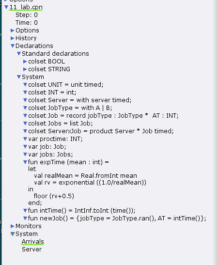{#fig:001 width=30%}

## Зададим параметры модели на графах сети

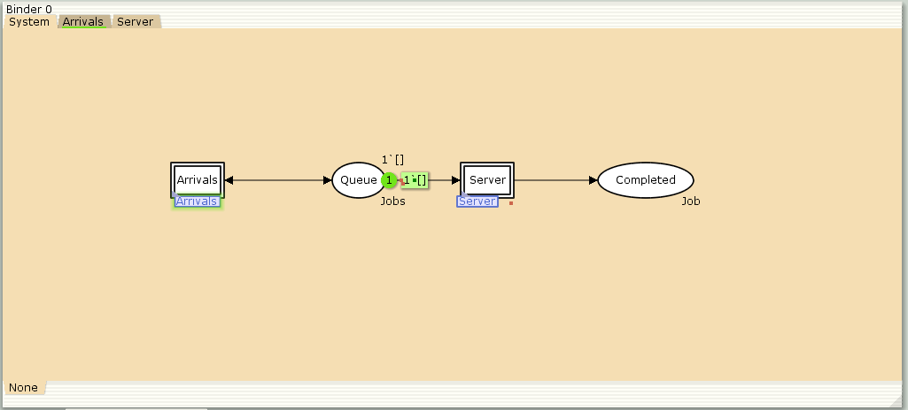{#fig:002 width=70%}

## Параметры элементов генератора заявок системы

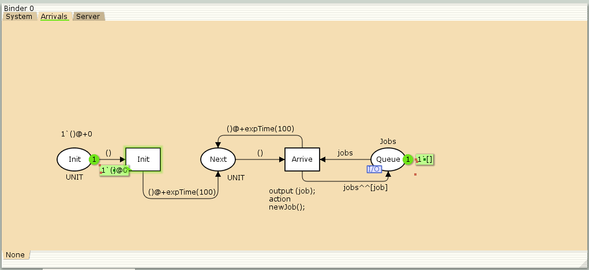{#fig:003 width=70%}

## Параметры элементов обработчика заявок системы

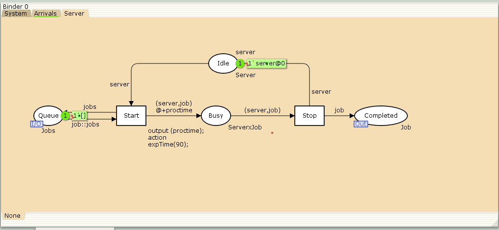{#fig:004 width=70%}

## Запуск системы обработки заявок в очереди

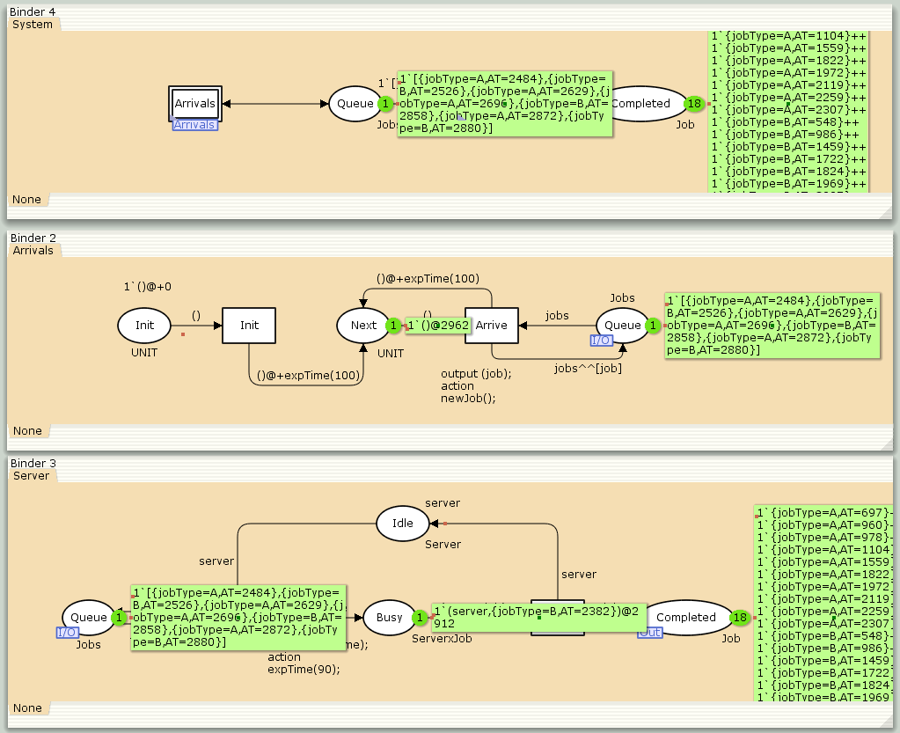{#fig:005 width=50%}

## Функция Predicate монитора Ostanovka

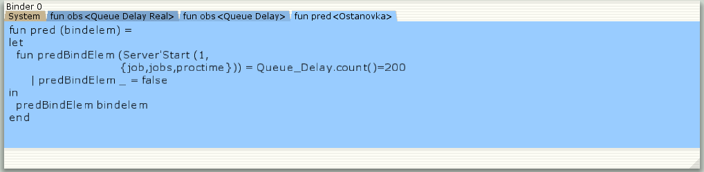{#fig:006 width=70%}

## Функция Observer монитора Queue Delay

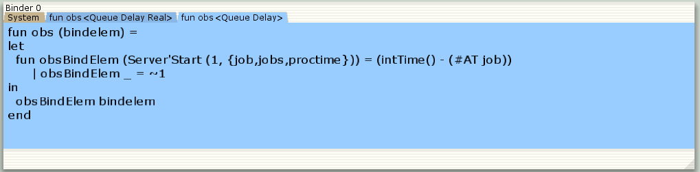{#fig:007 width=70%}

## Файл Queue_Delay.log

{#fig:008 width=70%}

## График значений задержки в очереди

```
#!/usr/bin/gnuplot -persist
# задаём текстовую кодировку,
# тип терминала, тип и размер шрифта

set encoding utf8
set term pngcairo font "Helvetica,9"

# задаём выходной файл графика
set out 'window_1.png'
plot "Queue_Delay.log" using ($4):($1) with lines
```

## График значений задержки в очереди

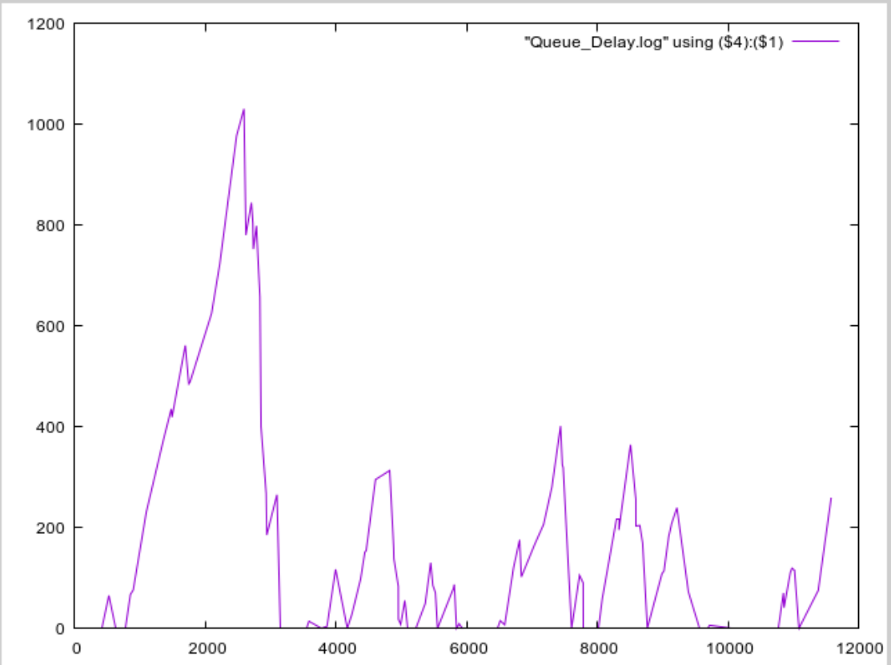{#fig:009 width=50%}

## Посчитаем задержку в действительных значениях

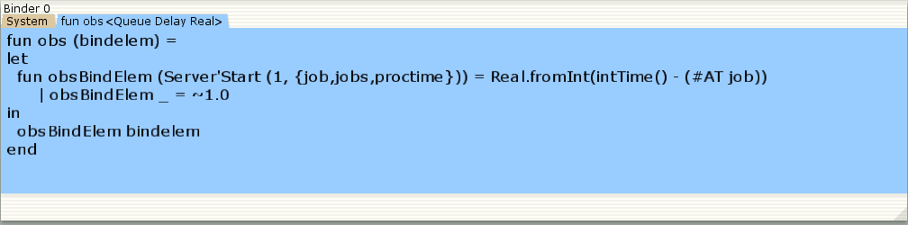{#fig:010 width=70%}

## Содержимое Queue_Delay_Real.log

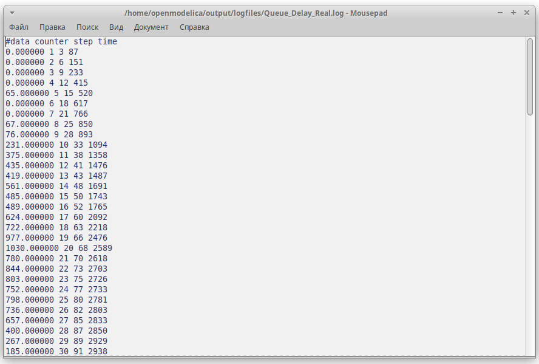{#fig:011 width=70%}

## Функция Observer монитора Long Delay Time

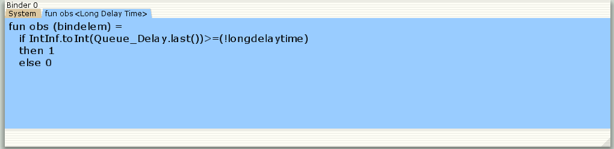{#fig:012 width=70%}

## Определение longdelaytime в декларациях

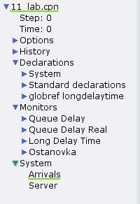{#fig:013 width=30%}

## Содержимое Long_Delay_Time.log

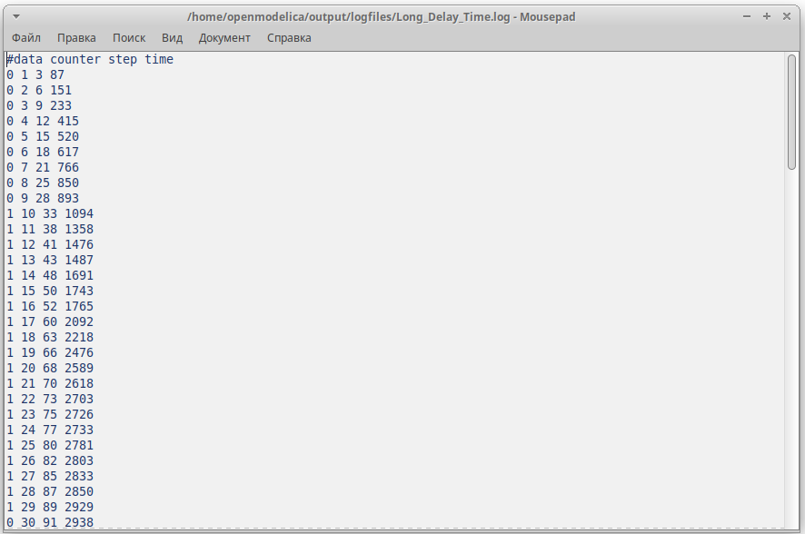{#fig:014 width=70%}

## График

```
#!/usr/bin/gnuplot -persist
# задаём текстовую кодировку,
# тип терминала, тип и размер шрифта

set encoding utf8
set term pngcairo font "Helvetica,9"

# задаём выходной файл графика
set out 'window_2.png'
set style line 2
plot [0:] [0:1.2] "Long_Delay_Time.log" using ($4):($1) with lines
```

## Периоды времени, когда значения задержки в очереди превышали заданное значение. График

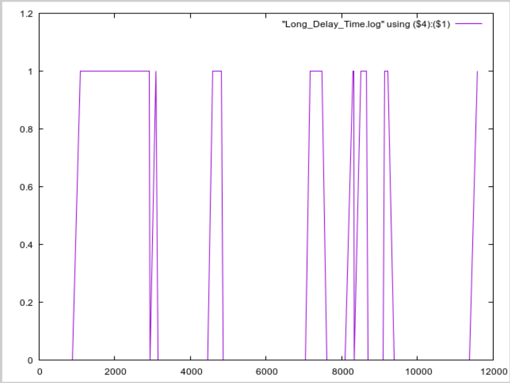{#fig:015 width=50%}

# Результаты

В процессе выполнения данной лабораторной работы я реализовала модель системы массового обслуживания $M|M|1$ в CPN Tools.
