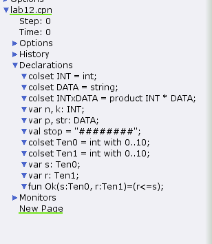
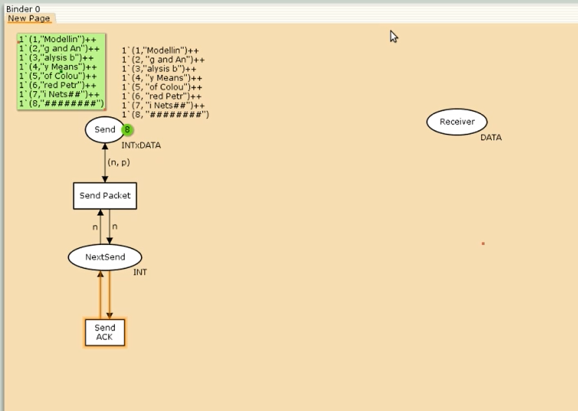
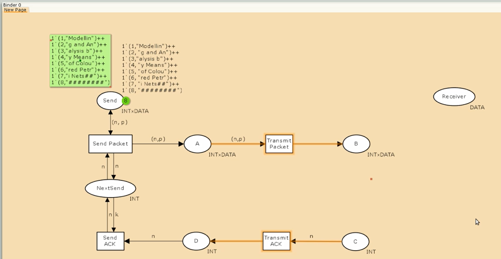
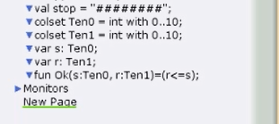
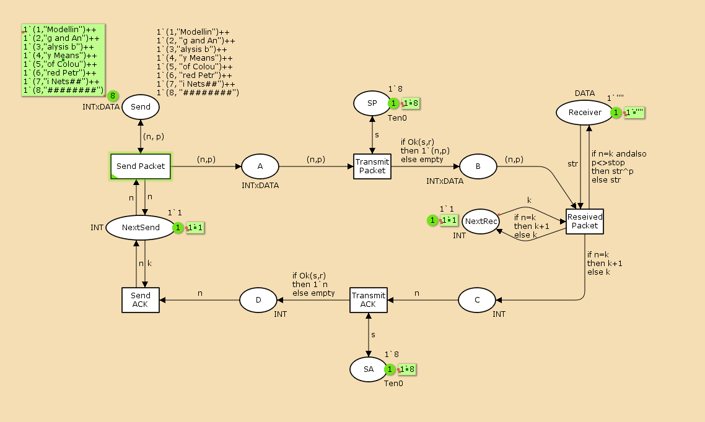
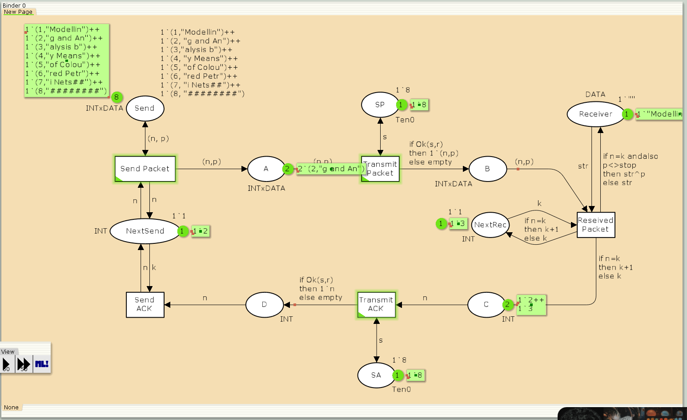
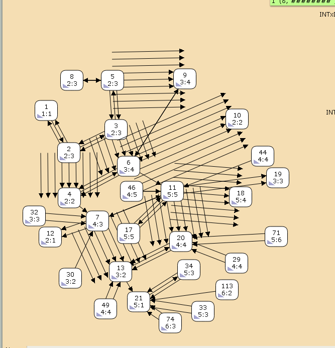
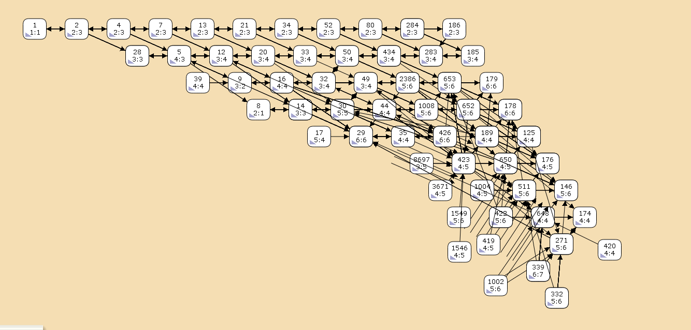

---
## Front matter
lang: ru-RU
title: "Лабораторная работа №12"
subtitle: "Дисциплина: Имитационное моделирование"
author:
  - Ганина Т. С.
institute:
  - Группа НФИбд-01-22
  - Российский университет дружбы народов, Москва, Россия
date: 22 апреля 2025

## i18n babel
babel-lang: russian
babel-otherlangs: english

## Formatting pdf
toc: false
toc-title: Содержание
slide_level: 2
aspectratio: 169
section-titles: true
theme: metropolis
header-includes:
 - \metroset{progressbar=frametitle,sectionpage=progressbar,numbering=fraction}
 - '\makeatletter'
 - '\beamer@ignorenonframefalse'
 - '\makeatother'
---

# Информация

## Докладчик

:::::::::::::: {.columns align=center}
::: {.column width="70%"}

  * Ганина Таисия Сергеевна
  * Студентка 3го курса, группа НФИбд-01-22
  * Фундаментальная информатика и информационные технологии
  * Российский университет дружбы народов
  * [Ссылка на репозиторий гитхаба tsganina](https://github.com/tsganina/study_2024-2025_simmod)

:::
::: {.column width="30%"}

:::
::::::::::::::

# Вводная часть

## Цели и задачи

Реализовать простой протокол передачи данных в CPN Tools.

## Задание

1. Реализовать простой протокол передачи данных в CPN Tools.
2. Вычислить пространство состояний, сформировать отчет о нем и построить граф.

## Задание деклараций системы

{#fig:001 width=40%}

## Построим начальный граф

{#fig:002 width=60%}

## Добавление промежуточных состояний

{#fig:003 width=60%}

## Задание деклараций

{#fig:004 width=60%}

## Модель простого протокола передачи данных

{#fig:005 width=70%}

## Запуск модели простого протокола передачи данных

{#fig:006 width=70%}

## Упражнение (отчёт о пространстве состояний)

```
Statistics
------------------------------------------------------------------------
  State Space
     Nodes:  26881
     Arcs:   442501
     Secs:   300
     Status: Partial
  Scc Graph
     Nodes:  14135
     Arcs:   371353
     Secs:   15
```

## Упражнение (отчёт о пространстве состояний)

```
Home Properties
------------------------------------------------------------------------
  Home Markings
     None
 Liveness Properties
------------------------------------------------------------------------
  Dead Markings
     9476 [26881,26880,26879,26878,26877,...]
  Dead Transition Instances
     None
  Live Transition Instances
     None
```

## Пространство состояний

{#fig:008 width=30%}

## Пространство состояний

{#fig:009 width=60%}

# Результаты

В ходе выполнения данной лабораторной работы я реализовала простой протокол передачи данных в CPN Tools.
