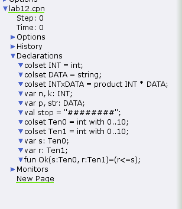
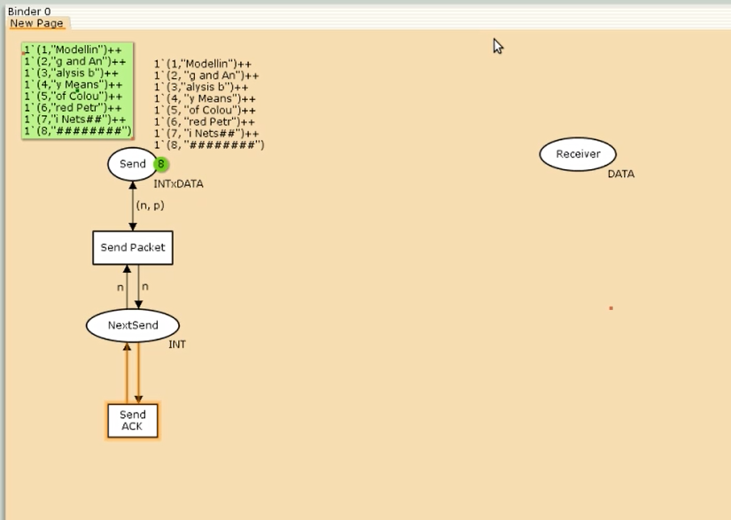
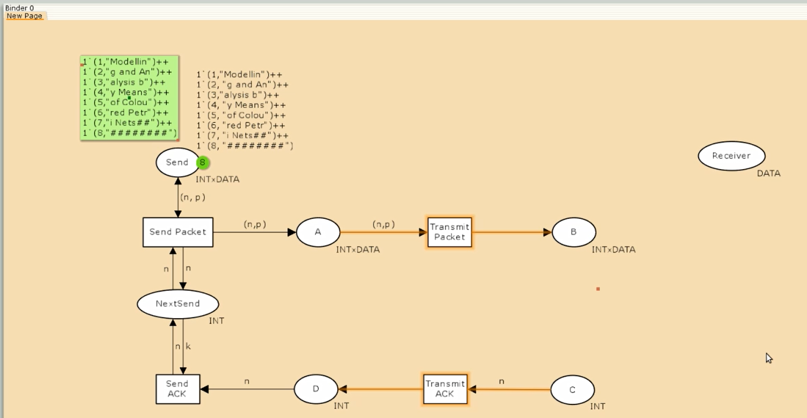
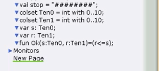
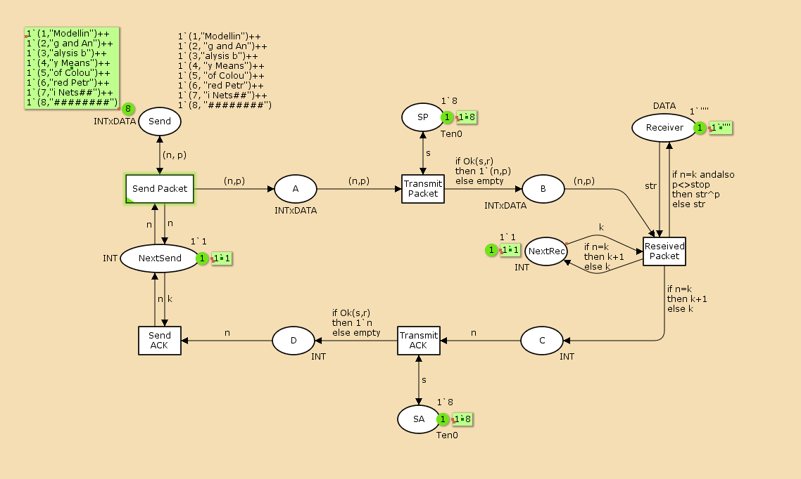
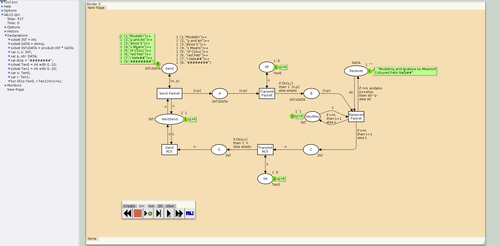
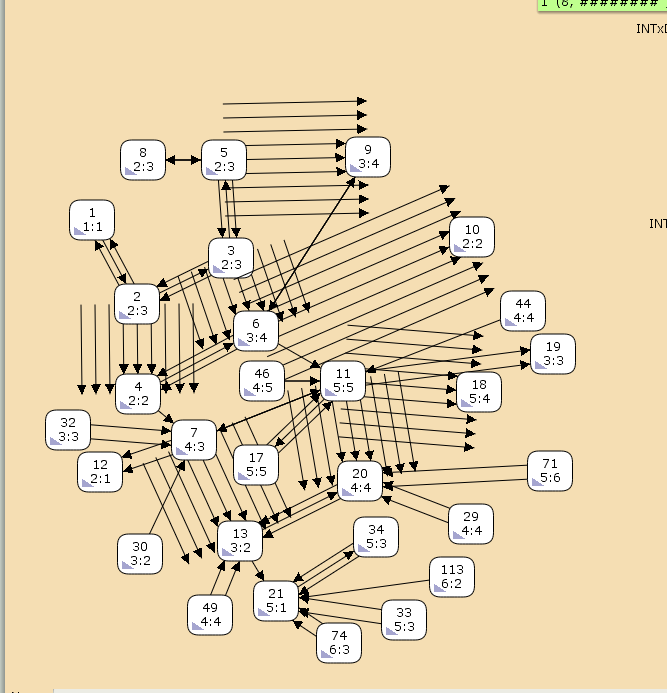
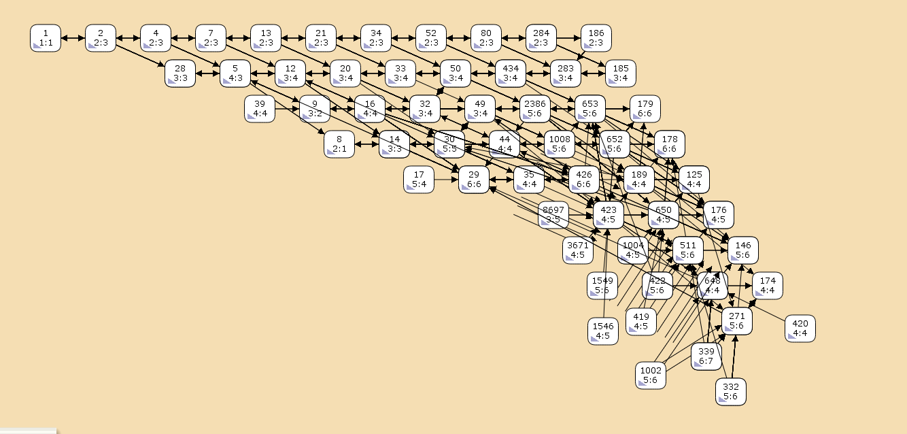
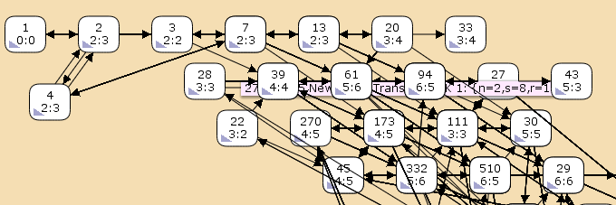

---
## Front matter
title: "Отчёт по лабораторной работе №12"
subtitle: "Имитационное моделирование"
author: "Ганина Таисия Сергеевна, НФИбд-01-22"

## Generic otions
lang: ru-RU
toc-title: "Содержание"

## Bibliography
bibliography: bib/cite.bib
csl: pandoc/csl/gost-r-7-0-5-2008-numeric.csl

## Pdf output format
toc: true # Table of contents
toc-depth: 2
lof: true # List of figures
lot: true # List of tables
fontsize: 12pt
linestretch: 1.5
papersize: a4
documentclass: scrreprt
## I18n polyglossia
polyglossia-lang:
  name: russian
  options:
	- spelling=modern
	- babelshorthands=true
polyglossia-otherlangs:
  name: english
## I18n babel
babel-lang: russian
babel-otherlangs: english
## Fonts
mainfont: PT Serif
romanfont: PT Serif
sansfont: PT Sans
monofont: PT Mono
mainfontoptions: Ligatures=TeX
romanfontoptions: Ligatures=TeX
sansfontoptions: Ligatures=TeX,Scale=MatchLowercase
monofontoptions: Scale=MatchLowercase,Scale=0.9
## Biblatex
biblatex: true
biblio-style: "gost-numeric"
biblatexoptions:
  - parentracker=true
  - backend=biber
  - hyperref=auto
  - language=auto
  - autolang=other*
  - citestyle=gost-numeric
## Pandoc-crossref LaTeX customization
figureTitle: "Рис."
tableTitle: "Таблица"
listingTitle: "Листинг"
lofTitle: "Список иллюстраций"
lotTitle: "Список таблиц"
lolTitle: "Листинги"
## Misc options
indent: true
header-includes:
  - \usepackage{indentfirst}
  - \usepackage{float} # keep figures where there are in the text
  - \floatplacement{figure}{H} # keep figures where there are in the text
---

# Цель работы

Реализовать простой протокол передачи данных в CPN Tools.

# Задание

1. Реализовать простой протокол передачи данных в CPN Tools.
2. Вычислить пространство состояний, сформировать отчет о нем и построить граф.

# Теоретическое введение

CPN Tools — специальное программное средство, предназначенное для моделирования иерархических временных раскрашенных сетей Петри. Такие сети эквивалентны машине Тьюринга и составляют универсальную алгоритмическую систему, позволяющую описать произвольный объект.
CPN Tools позволяет визуализировать модель с помощью графа сети Петри и применить язык программирования CPN ML (Colored Petri Net Markup Language) для формализованного описания модели.

**Назначение CPN Tools:**

- разработка сложных объектов и моделирование процессов в различных приклад-
ных областях, в том числе:
- моделирование производственных и бизнес-процессов;
- моделирование систем управления производственными системами и роботами;
- спецификация и верификация протоколов, оценка пропускной способности сетей
и качества обслуживания, проектирование телекоммуникационных устройств
и сетей.

**Основные функции CPN Tools:**

- создание (редактирование) моделей;
- анализ поведения моделей с помощью имитации динамики сети Петри;
- построение и анализ пространства состояний модели.

[@first; @second].

# Выполнение лабораторной работы

## Построение модели с помощью CPNTools

Основные состояния: источник (Send), получатель (Receiver).
Действия (переходы): отправить пакет (Send Packet), отправить подтверждение (Send ACK).
Промежуточное состояние: следующий посылаемый пакет (NextSend).
Зададим декларации модели (рис. @fig:001).

{#fig:001 width=70%}

Состояние Send имеет тип INTxDATA и следующую начальную маркировку (в соответствии с передаваемой фразой).

Стоповый байт ("########") определяет, что сообщение закончилось. Состояние Receiver имеет тип DATA и начальное значение 1'"" (т.е. пустая строка, поскольку состояние собирает данные и номер пакета его не интересует). Состояние NextSend имеет тип INT и начальное значение 1'1. Поскольку пакеты представляют собой кортеж, состоящий из номера пакета и строки, то выражение у двусторонней дуги будет иметь значение (n,p). Кроме того, необходимо взаимодействовать с состоянием, которое будет сообщать номер следующего посылаемого пакета данных. Поэтому переход Send Packet соединяем с состоянием NextSend двумя дугами с выражениями n (рис. 12.1). Также необходимо получать информацию с подтверждениями о получении данных. От перехода Send Packet к состоянию NextSend дуга с выражением n, обратно -- k.

Построим начальный граф(рис. @fig:002):

{#fig:002 width=70%}

Зададим промежуточные состояния (A, B с типом INTxDATA, C, D с типом INTxDATA) для переходов (рис. 12.2): передать пакет Transmit Packet (передаём (n,p)), передать подтверждение Transmit ACK (передаём целое число k). Добавляем переход получения пакета (Receive Packet). От состояния Receiver идёт дуга к переходу Receive Packet со значением той строки (str), которая находится в состоянии Receiver. Обратно: проверяем, что номер пакета новый и строка не равна стоп-биту. Если это так, то строку добавляем к полученным данным. Кроме того, необходимо знать, каким будет номер следующего пакета. Для этого добавляем состояние NextRec с типом INT и начальным значением 1'1 (один пакет), связываем его дугами с переходом Receive Packet. Причём к переходу идёт дуга с выражением k, от перехода — if n=k then k+1 else k. 

Связываем состояния B и C с переходом Receive Packet. От состояния B к переходу Receive Packet — выражение (n,p), от перехода Receive Packet к состоянию C — выражение if n=k then k+1 else k. От перехода Receive Packet к состоянию Receiver: if n=k andalso p<>stop then str^p else str. (если n=k и мы не получили стоп-байт, то направляем в состояние строку и к ней прикрепляем p, в противном случае посылаем только строку).

На переходах Transmit Packet и Transmit ACK зададим потерю пакетов. Для этого на интервале от 0 до 10 зададим пороговое значение и, если передаваемое значение превысит этот порог, то считаем, что произошла потеря пакета, если нет, то передаём пакет дальше. Для этого задаём вспомогательные состояния SP и SA с типом Ten0 и начальным значением 1`8, соединяем с соответствующими переходами(рис. @fig:003):

{#fig:003 width=70%}

В декларациях задаём (рис. @fig:004):

{#fig:004 width=70%}

Таким образом, получим модель простого протокола передачи данных (рис. 12.3).
Пакет последовательно проходит: состояние Send, переход Send Packet, состояние A, с некоторой вероятностью переход Transmit Packet, состояние B, попадает
на переход Receive Packet, где проверяется номер пакета и если нет совпадения,
то пакет направляется в состояние Received, а номер пакета передаётся последовательно в состояние C, с некоторой вероятностью в переход Transmit ACK,
далее в состояние D, переход Receive ACK, состояние NextSend (увеличивая на 1
номер следующего пакета), переход Send Packet. Так продолжается до тех пор,
пока не будут переданы все части сообщения. Последней будет передана стоп-последовательность(рис. @fig:005):

{#fig:005 width=70%}

Запустим модель и получим следующий результат (рис. @fig:006, @fig:007):

{#fig:006 width=70%}

{#fig:007 width=70%}

## Упражнение

Вычислим пространство состояний. Прежде, чем пространство состояний может быть вычислено и проанализировано, необходимо сформировать код пространства состояний. Этот код создается, когда используется инструмент "Войти в пространство состояний". Вход в пространство состояний занимает некоторое время. 

Сформируем отчёт о пространстве состояний и проанализируем его. Чтобы сохранить отчет, необходимо применить инструмент Сохранить отчет о пространстве состояний к листу, содержащему страницу сети и ввести имя файла отчета.

Из него можно увидеть:

- 26881 состояний и 442501 переходов за 300 секунд анализа, что указывает на высокую сложность модели с нелинейным ростом состояний.
- Частичный статус анализа означает, что полное исследование пространства состояний не завершено.
- Указаны границы в виде мультимножеств.
- Dead Markings: 9227 около 30% состояний являются тупиковыми.
- Home Markings: None - в модели нет устойчивых состояний, куда система возвращается после любых операций. Это характерно для протоколов без цикличности.


```
CPN Tools state space report for:
/home/openmodelica/Desktop/lab12.cpn
Report generated: Fri Apr 18 22:44:16 2025


 Statistics
------------------------------------------------------------------------

  State Space
     Nodes:  26881
     Arcs:   442501
     Secs:   300
     Status: Partial

  Scc Graph
     Nodes:  14135
     Arcs:   371353
     Secs:   15


 Boundedness Properties
------------------------------------------------------------------------

  Best Integer Bounds
                             Upper      Lower
     New_Page'A 1            21         0
     New_Page'B 1            10         0
     New_Page'C 1            7          0
     New_Page'D 1            5          0
     New_Page'NextRec 1      1          1
     New_Page'NextSend 1     1          1
     New_Page'Receiver 1     1          1
     New_Page'SA 1           1          1
     New_Page'SP 1           1          1
     New_Page'Send 1         8          8

  Best Upper Multi-set Bounds
     New_Page'A 1        21`(1,"Modellin")++
17`(2,"g and An")++
12`(3,"alysis b")++
7`(4,"y Means")++
2`(5,"of Colou")
     New_Page'B 1        10`(1,"Modellin")++
8`(2,"g and An")++
6`(3,"alysis b")++
3`(4,"y Means")++
1`(5,"of Colou")
     New_Page'C 1        7`2++
5`3++
4`4++
2`5
     New_Page'D 1        5`2++
4`3++
3`4++
1`5
     New_Page'NextRec 1  1`1++
1`2++
1`3++
1`4++
1`5
     New_Page'NextSend 1 1`1++
1`2++
1`3++
1`4++
1`5
     New_Page'Receiver 1 1`""++
1`"Modellin"++
1`"Modelling and An"++
1`"Modelling and Analysis b"++
1`"Modelling and Analysis by Means"
     New_Page'SA 1       1`8
     New_Page'SP 1       1`8
     New_Page'Send 1     1`(1,"Modellin")++
1`(2,"g and An")++
1`(3,"alysis b")++
1`(4,"y Means")++
1`(5,"of Colou")++
1`(6,"red Petr")++
1`(7,"i Nets##")++
1`(8,"########")

  Best Lower Multi-set Bounds
     New_Page'A 1        empty
     New_Page'B 1        empty
     New_Page'C 1        empty
     New_Page'D 1        empty
     New_Page'NextRec 1  empty
     New_Page'NextSend 1 empty
     New_Page'Receiver 1 empty
     New_Page'SA 1       1`8
     New_Page'SP 1       1`8
     New_Page'Send 1     1`(1,"Modellin")++
1`(2,"g and An")++
1`(3,"alysis b")++
1`(4,"y Means")++
1`(5,"of Colou")++
1`(6,"red Petr")++
1`(7,"i Nets##")++
1`(8,"########")


 Home Properties
------------------------------------------------------------------------

  Home Markings
     None


 Liveness Properties
------------------------------------------------------------------------

  Dead Markings
     9476 [26881,26880,26879,26878,26877,...]

  Dead Transition Instances
     None

  Live Transition Instances
     None


 Fairness Properties
------------------------------------------------------------------------
       New_Page'Reseived_Packet 1
                         No Fairness
       New_Page'Send_ACK 1    No Fairness
       New_Page'Send_Packet 1 Impartial
       New_Page'Transmit_ACK 1
                         No Fairness
       New_Page'Transmit_Packet 1
                         Impartial


```

Пространство состояний для модели я формировала частично, так как оно очень большое. Части этого пространства можно увидеть на следующих снимках экрана (рис. @fig:008, @fig:009, @fig:010):

{#fig:008 width=70%}

{#fig:009 width=70%}

{#fig:010 width=70%}

# Выводы

В ходе выполнения данной лабораторной работы я реализовала простой протокол передачи данных в CPN Tools.

# Список литературы{.unnumbered}

::: {#refs}
:::
