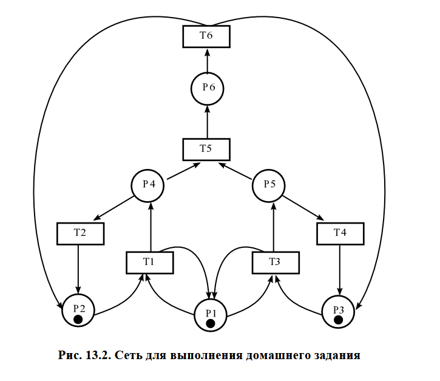
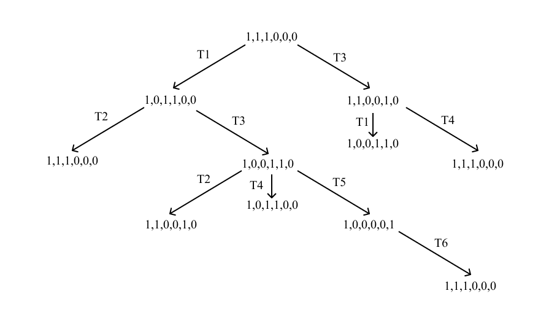
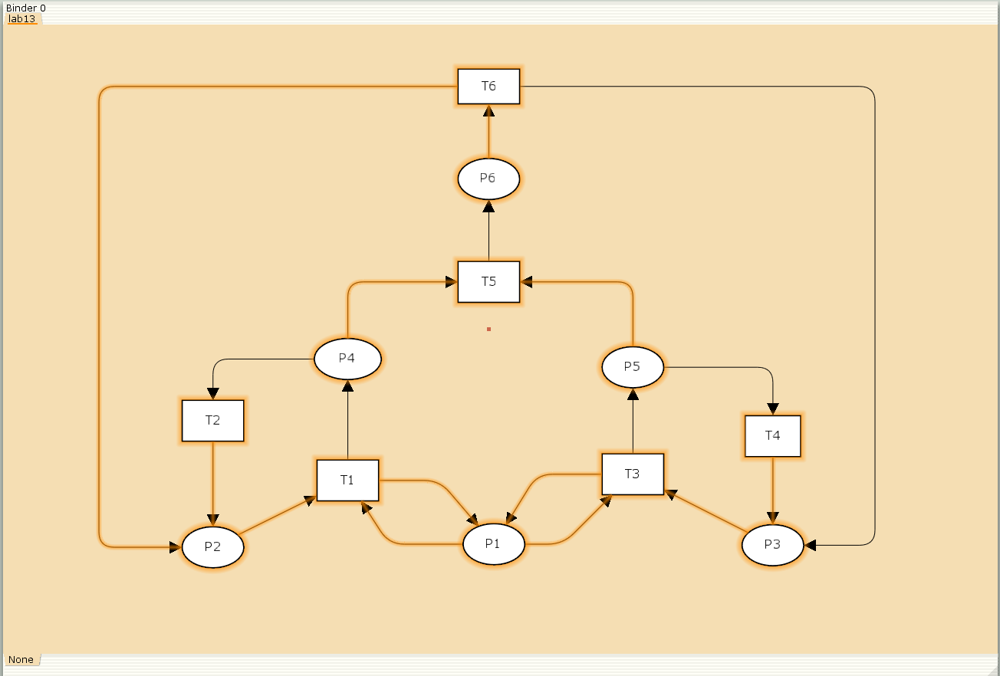
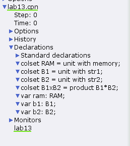
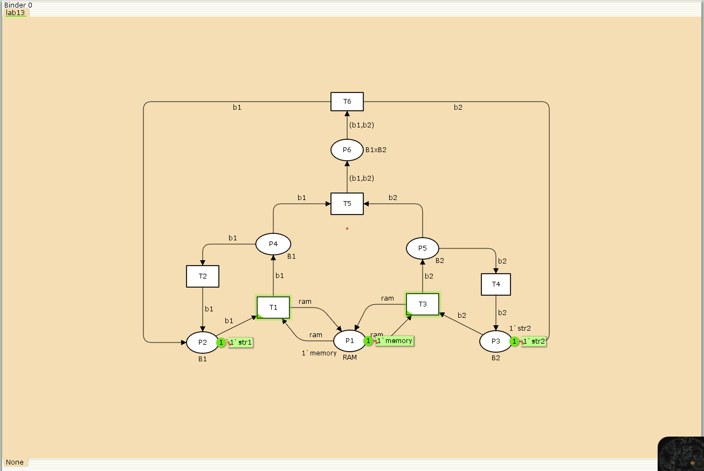
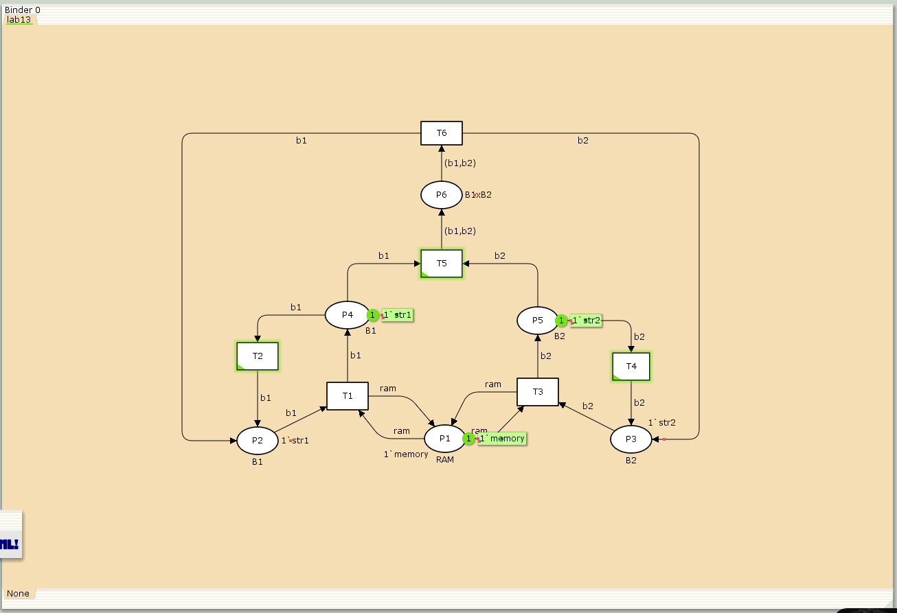
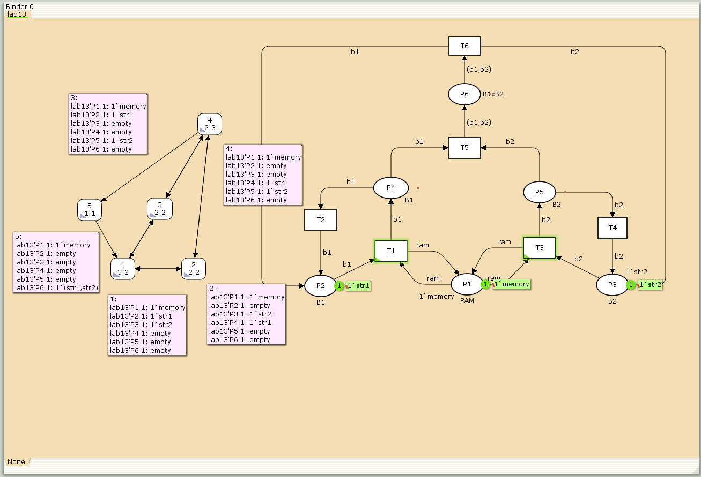

---
## Front matter
lang: ru-RU
title: "Лабораторная работа №13"
subtitle: "Дисциплина: Имитационное моделирование"
author:
  - Ганина Т. С.
institute:
  - Группа НФИбд-01-22
  - Российский университет дружбы народов, Москва, Россия
date: 26 апреля 2025

## i18n babel
babel-lang: russian
babel-otherlangs: english

## Formatting pdf
toc: false
toc-title: Содержание
slide_level: 2
aspectratio: 169
section-titles: true
theme: metropolis
header-includes:
 - \metroset{progressbar=frametitle,sectionpage=progressbar,numbering=fraction}
 - '\makeatletter'
 - '\beamer@ignorenonframefalse'
 - '\makeatother'
---

# Информация

## Докладчик

:::::::::::::: {.columns align=center}
::: {.column width="70%"}

  * Ганина Таисия Сергеевна
  * Студентка 3го курса, группа НФИбд-01-22
  * Фундаментальная информатика и информационные технологии
  * Российский университет дружбы народов
  * [Ссылка на репозиторий гитхаба tsganina](https://github.com/tsganina/study_2024-2025_simmod)

:::
::: {.column width="30%"}

:::
::::::::::::::

# Вводная часть

## Цели и задачи

Выполнить задание для самостоятельной работы.

## Задание

1. Используя теоретические методы анализа сетей Петри, провести анализ сети. Определить, является ли сеть безопасной, ограниченной, сохраняющей, имеются ли тупики.
2. Промоделировать сеть Петри с помощью CPNTools.
3. Вычислить пространство состояний. Сформировать отчёт о пространстве состояний и проанализировать его. Построить граф пространства состояний.

## Задание

{#fig:001 width=50%}

## Дерево достижимости

{#fig:002 width=70%}

## Модель

{#fig:003 width=70%}

## Задание деклараций

{#fig:004 width=40%}

## Готовая модель

{#fig:005 width=70%}

## Запуск модели

{#fig:006 width=70%}

## Пространство состояний. Отчёт

```
 Statistics
------------------------------------------------------------------------
  State Space
     Nodes:  5
     Arcs:   10
     Secs:   0
     Status: Full
  Scc Graph
     Nodes:  1
     Arcs:   0
     Secs:   0  
```
## Пространство состояний. Отчёт

```
 Boundedness Properties
------------------------------------------------------------------------
  Best Integer Bounds
                             Upper      Lower
     lab13'P1 1              1          1
     lab13'P2 1              1          0
     lab13'P3 1              1          0
     lab13'P4 1              1          0
     lab13'P5 1              1          0
     lab13'P6 1              1          0
```

## Пространство состояний. Отчёт

```
  Best Upper Multi-set Bounds
     lab13'P1 1          1`memory
     lab13'P2 1          1`str1
     lab13'P3 1          1`str2
     lab13'P4 1          1`str1
     lab13'P5 1          1`str2
     lab13'P6 1          1`(str1,str2)
```

## Пространство состояний. Отчёт

```
  Best Lower Multi-set Bounds
     lab13'P1 1          1`memory
     lab13'P2 1          empty
     lab13'P3 1          empty
     lab13'P4 1          empty
     lab13'P5 1          empty
     lab13'P6 1          empty
```

## Пространство состояний. Отчёт

```
 Home Properties
------------------------------------------------------------------------
  Home Markings
     All
 Liveness Properties
------------------------------------------------------------------------
  Dead Markings
     None
  Dead Transition Instances
     None
  Live Transition Instances
     All
```

## Пространство состояний. Граф

{#fig:007 width=70%}

# Результаты

В ходе данной лабораторной работы я выполнила задание для самостоятельной работы. Проанализировала (используя дерево достижимости) сеть Петри, построила модель в CPNTools, вычислила пространство состояний, сформировав отчёт и построив граф.
