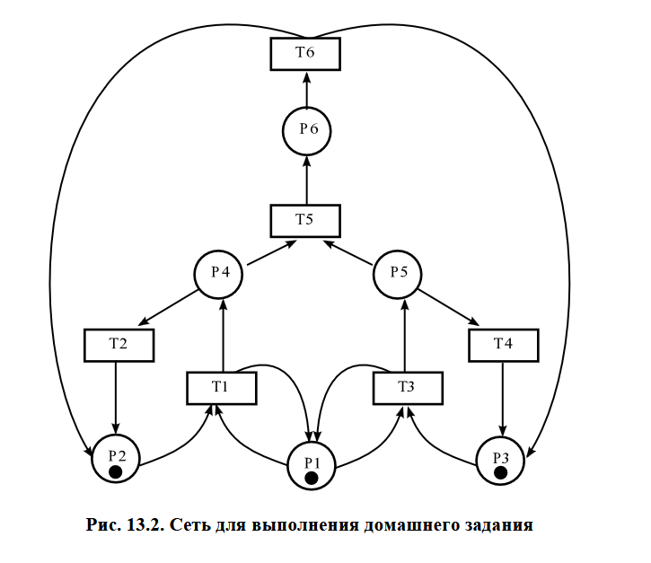
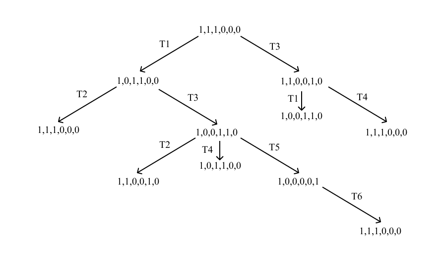
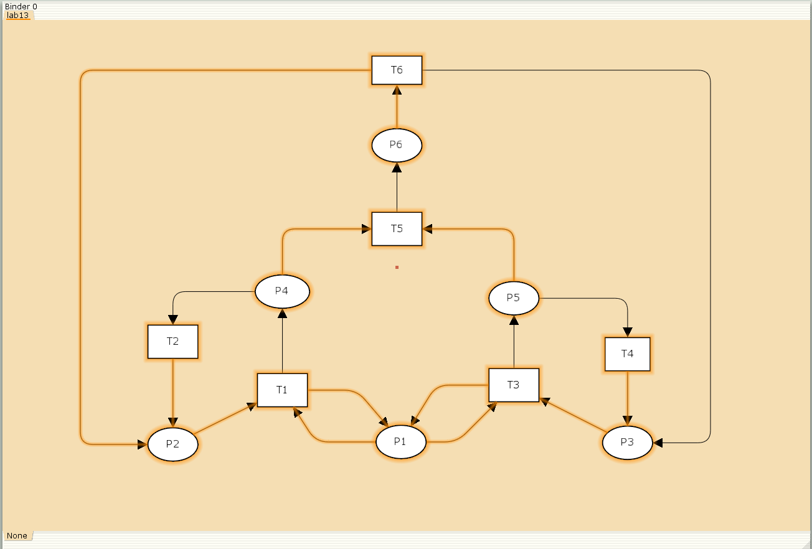
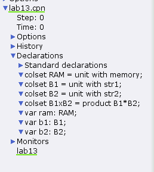
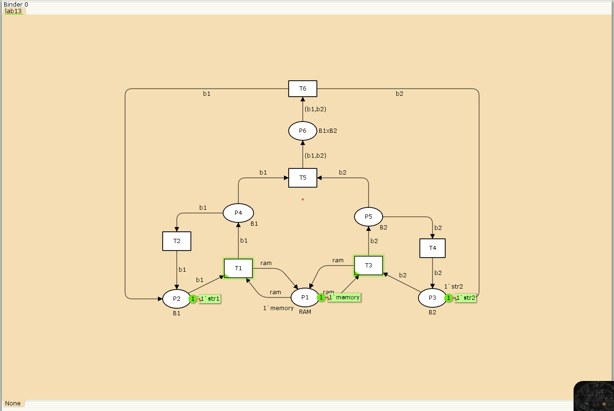
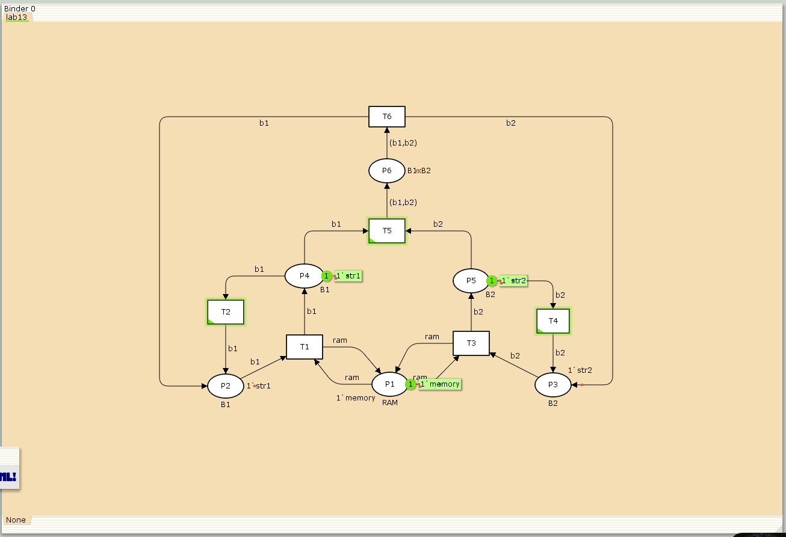
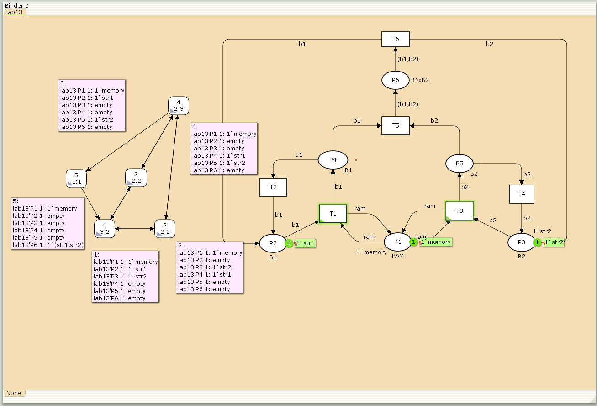

---
## Front matter
title: "Отчёт по лабораторной работе №13"
subtitle: "Имитационное моделирование"
author: "Ганина Таисия Сергеевна, НФИбд-01-22"

## Generic otions
lang: ru-RU
toc-title: "Содержание"

## Bibliography
bibliography: bib/cite.bib
csl: pandoc/csl/gost-r-7-0-5-2008-numeric.csl

## Pdf output format
toc: true # Table of contents
toc-depth: 2
lof: true # List of figures
lot: true # List of tables
fontsize: 12pt
linestretch: 1.5
papersize: a4
documentclass: scrreprt
## I18n polyglossia
polyglossia-lang:
  name: russian
  options:
	- spelling=modern
	- babelshorthands=true
polyglossia-otherlangs:
  name: english
## I18n babel
babel-lang: russian
babel-otherlangs: english
## Fonts
mainfont: PT Serif
romanfont: PT Serif
sansfont: PT Sans
monofont: PT Mono
mainfontoptions: Ligatures=TeX
romanfontoptions: Ligatures=TeX
sansfontoptions: Ligatures=TeX,Scale=MatchLowercase
monofontoptions: Scale=MatchLowercase,Scale=0.9
## Biblatex
biblatex: true
biblio-style: "gost-numeric"
biblatexoptions:
  - parentracker=true
  - backend=biber
  - hyperref=auto
  - language=auto
  - autolang=other*
  - citestyle=gost-numeric
## Pandoc-crossref LaTeX customization
figureTitle: "Рис."
tableTitle: "Таблица"
listingTitle: "Листинг"
lofTitle: "Список иллюстраций"
lotTitle: "Список таблиц"
lolTitle: "Листинги"
## Misc options
indent: true
header-includes:
  - \usepackage{indentfirst}
  - \usepackage{float} # keep figures where there are in the text
  - \floatplacement{figure}{H} # keep figures where there are in the text
---

# Цель работы

Выполнить задание для самостоятельной работы.

# Задание

1. Используя теоретические методы анализа сетей Петри, провести анализ сети, (рис. @fig:001). Определить, является ли сеть безопасной, ограниченной, сохраняющей, имеются ли тупики.
2. Промоделировать сеть Петри с помощью CPNTools.
3. Вычислить пространство состояний. Сформировать отчёт о пространстве состояний и проанализировать его. Построить граф пространства состояний.

{#fig:001 width=70%}

# Теоретическое введение

CPN Tools — специальное программное средство, предназначенное для моделирования иерархических временных раскрашенных сетей Петри. Такие сети эквивалентны машине Тьюринга и составляют универсальную алгоритмическую систему, позволяющую описать произвольный объект.
CPN Tools позволяет визуализировать модель с помощью графа сети Петри и применить язык программирования CPN ML (Colored Petri Net Markup Language) для формализованного описания модели.

**Назначение CPN Tools:**

- разработка сложных объектов и моделирование процессов в различных приклад-
ных областях, в том числе:
- моделирование производственных и бизнес-процессов;
- моделирование систем управления производственными системами и роботами;
- спецификация и верификация протоколов, оценка пропускной способности сетей
и качества обслуживания, проектирование телекоммуникационных устройств
и сетей.

**Основные функции CPN Tools:**

- создание (редактирование) моделей;
- анализ поведения моделей с помощью имитации динамики сети Петри;
- построение и анализ пространства состояний модели.

[@first; @second].

# Выполнение лабораторной работы

Заявка (команды программы, операнды) поступает в оперативную память (ОП), затем передается на прибор (центральный процессор, ЦП) для обработки. После этого заявка может равновероятно обратиться к оперативной памяти или к одному из двух внешних запоминающих устройств (B1 и B2). Прежде чем записать информацию на внешний накопитель, необходимо вторично обратиться к центральному процессору, определяющему состояние накопителя и выдающему необходимую управляющую информацию. Накопители (B1 и B2) могут работать в 3-х режимах:

1) B1 — занят, B2 — свободен;
2) B2 — свободен, B1 — занят;
3) B1 — занят, B2 — занят.

Множество позиций:

- P1 — состояние оперативной памяти (свободна / занята);
- P2 — состояние внешнего запоминающего устройства B1 (свободно / занято);
- P3 — состояние внешнего запоминающего устройства B2 (свободно / занято);
- P4 — работа на ОП и B1 закончена;
- P5 — работа на ОП и B2 закончена;
- P6 — работа на ОП, B1 и B2 закончена;

Множество переходов:

- T1 — ЦП работает только с RAM и B1;
- T2 — обрабатываются данные из RAM и с B1 переходят на устройство вывода;
- T3 — CPU работает только с RAM и B2;
- T4 — обрабатываются данные из RAM и с B2 переходят на устройство вывода;
- T5 — CPU работает только с RAM и с B1, B2;
- T6 — обрабатываются данные из RAM, B1, B2 и переходят на устройство вывода.

Функционирование сети Петри можно расматривать как срабатывание переходов,
в ходе которого происходит перемещение маркеров по позициям:

- работа CPU с RAM и B1 отображается запуском перехода T1 (удаление маркеров
из P1, P2 и появление в P1, P4), что влечет за собой срабатывание перехода T2,
т.е. передачу данных с RAM и B1 на устройство вывода;
- работа CPU с RAM и B2 отображается запуском перехода T3 (удаление маркеров
из P1 и P3 и появление в P1 и P5), что влечет за собой срабатывание перехода T4,
т.е. передачу данных с RAM и B2 на устройство вывода;
- работа CPU с RAM, B1 и B2 отображается запуском перехода T5 (удаление
маркеров из P4 и P5 и появление в P6), далее срабатывание перехода T6, и данные
из RAM, B1 и B2 передаются на устройство вывода;
- состояние устройств восстанавливается при срабатывании: RAM — переходов
T1 или T2; B1 — переходов T2 или T6; B2 — переходов T4 или T6.


## Анализ сети

Построим дерево достижимости для данной сети Петри (рис. @fig:002).

{#fig:002 width=70%}

Эта сеть:

- безопасна, потому что в каждой позиции количество фишек не превышает 1 (Позиция является k-безопасной (k-ограниченной), если количество фишек в ней не может превышать целое число k);
- ограничена, потому что существует такое целое k, что число фишек в каждой позиции не может превысить k (в данном случае k=1);
- сеть не является сохраняющей, так как при переходах T5 и T6 количество фишек меняется;
- сеть не имеет тупиков.

## Моделирование сети Петри с помощью CPNTools

В начале я построила заданную модель в CPNTools, создав позиции  и переходы: с помощью контекстного меню создаем новую сеть, далее нам понадобятся 6 позиций и 6 блоков переходов, затем их нужно соединить (рис. @fig:003):

{#fig:003 width=70%}

После этого я задала декларации, исходя их текста задания (рис. @fig:004):

{#fig:004 width=70%}

Потом задала параметры и начальные состояния (рис. @fig:005):

{#fig:005 width=70%}

Запустив модель, можно посмотреть, как она работает (рис. @fig:006):

{#fig:006 width=70%}

## Пространство состояний. Отчёт, граф

Вычислим пространство состояний. Прежде, чем пространство состояний может быть вычислено и проанализировано, необходимо сформировать код пространства состояний. Этот код создается, когда используется инструмент "Войти в пространство состояний". Вход в пространство состояний занимает некоторое время. 

Сформируем отчёт о пространстве состояний и проанализируем его. Чтобы сохранить отчет, необходимо применить инструмент Сохранить отчет о пространстве состояний к листу, содержащему страницу сети и ввести имя файла отчета.

Из него можно увидеть:

1. **Общие параметры сети** 

    - Содержит 5 состояний и 10 переходов. Анализ проведён полностью меньше, чем за секунду.

2. **Безопасность**  

    - Все позиции (P1-P6) ограничены одной меткой. P1 всегда хранит метку "memory". P6 временно содержит комбинацию меток (str1, str2).

3. **Достижимость**

    - Маркировка home для всех состояний, так как в любую позицию мы можем попасть из любой другой маркировки.
    - Маркировка dead равная None, так как нет состояний, из которых переходов быть не может.

4. **Активность переходов** 

    - Все переходы T1-T6 живые (никогда не блокируются).  
    - T5 требует "условной справедливости", T6 - "абсолютной" (особые условия срабатывания).
    
В конце указано, что бесконечно часто могут происходить переходы T1, T2, T3, T4, но не обязательно, также состояние T5 необходимо для того, чтобы система не попадала в тупик, а состояние T6 происходит всегда, если доступно.


```
CPN Tools state space report for:
/home/openmodelica/Desktop/lab13.cpn
Report generated: Sat Apr 26 17:13:02 2025


 Statistics
------------------------------------------------------------------------

  State Space
     Nodes:  5
     Arcs:   10
     Secs:   0
     Status: Full

  Scc Graph
     Nodes:  1
     Arcs:   0
     Secs:   0


 Boundedness Properties
------------------------------------------------------------------------

  Best Integer Bounds
                             Upper      Lower
     lab13'P1 1              1          1
     lab13'P2 1              1          0
     lab13'P3 1              1          0
     lab13'P4 1              1          0
     lab13'P5 1              1          0
     lab13'P6 1              1          0

  Best Upper Multi-set Bounds
     lab13'P1 1          1`memory
     lab13'P2 1          1`str1
     lab13'P3 1          1`str2
     lab13'P4 1          1`str1
     lab13'P5 1          1`str2
     lab13'P6 1          1`(str1,str2)

  Best Lower Multi-set Bounds
     lab13'P1 1          1`memory
     lab13'P2 1          empty
     lab13'P3 1          empty
     lab13'P4 1          empty
     lab13'P5 1          empty
     lab13'P6 1          empty


 Home Properties
------------------------------------------------------------------------

  Home Markings
     All


 Liveness Properties
------------------------------------------------------------------------

  Dead Markings
     None

  Dead Transition Instances
     None

  Live Transition Instances
     All


 Fairness Properties
------------------------------------------------------------------------
       lab13'T1 1             No Fairness
       lab13'T2 1             No Fairness
       lab13'T3 1             No Fairness
       lab13'T4 1             No Fairness
       lab13'T5 1             Just
       lab13'T6 1             Fair

```

После этого я построила граф пространства состояний (рис. @fig:007):

{#fig:007 width=70%}

Граф состоит из 5 узлов (состояний) и 10 переходов, представляющих различные конфигурации меток в модели.

Состояние 1 (3:2):

- P1: Содержит метку 'memory'.
- P2: Содержит метку 'str1'.
- P3: Содержит метку 'str2'.
- P4, P5, P6: Пустые.

Состояние 2 (2:2):

- P1: Содержит метку 'memory'.
- P3: Содержит метку 'str2'.
- P4: Содержит метку 'str1'
- P2, P5, P6: Пустые.

И так далее можно провести анализ.

# Выводы

В ходе данной лабораторной работы я выполнила задание для самостоятельной работы. Проанализировала (используя дерево достижимости) сеть Петри, построила модель в CPNTools, вычислила пространство состояний, сформировав отчёт и построив граф.

# Список литературы{.unnumbered}

::: {#refs}
:::
