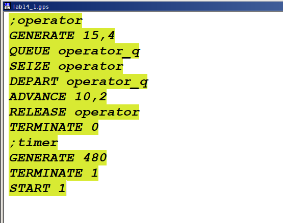
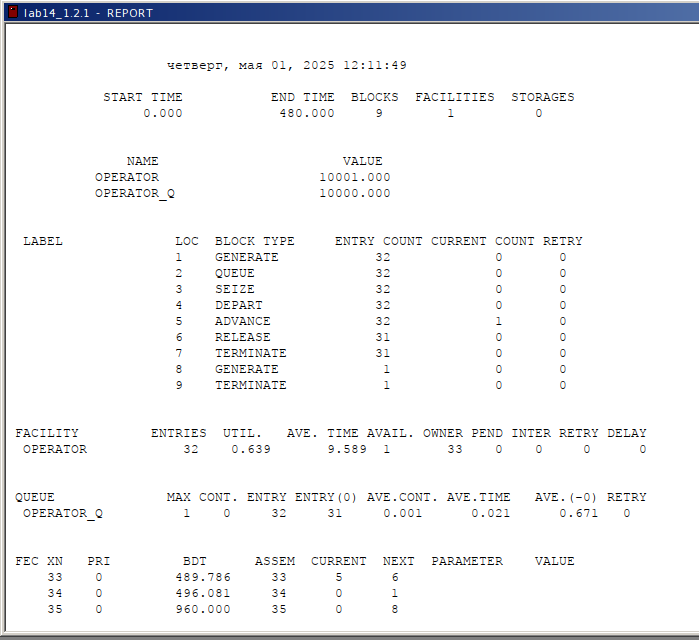
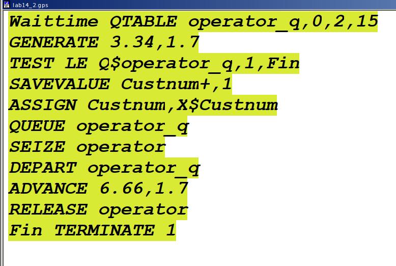
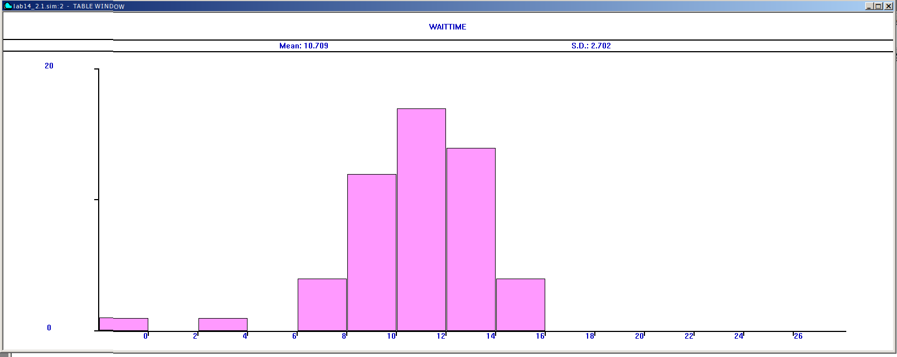
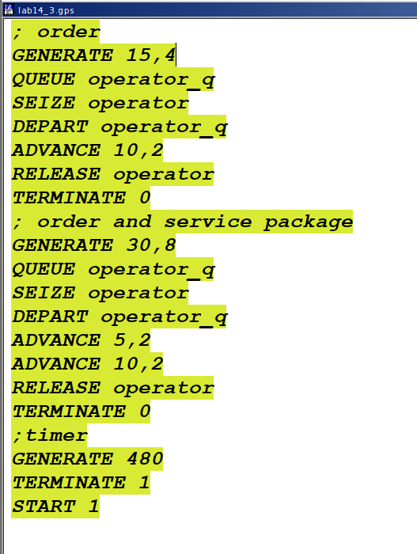
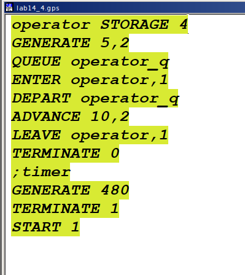
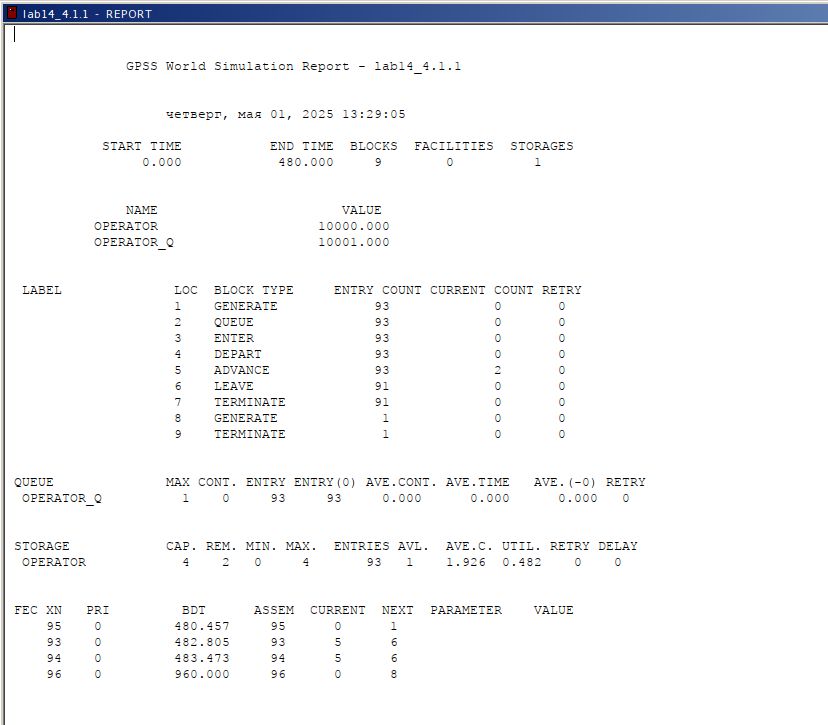
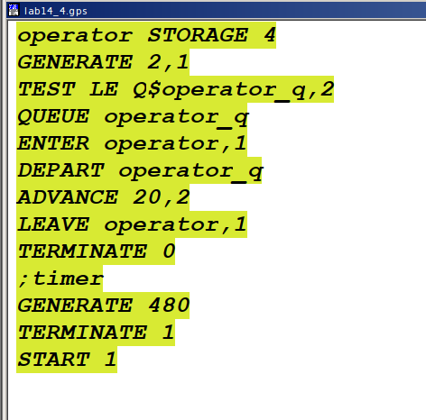

---
## Front matter
lang: ru-RU
title: "Лабораторная работа №14"
subtitle: "Дисциплина: Имитационное моделирование"
author:
  - Ганина Т. С.
institute:
  - Группа НФИбд-01-22
  - Российский университет дружбы народов, Москва, Россия
date: 1 мая 2025

## i18n babel
babel-lang: russian
babel-otherlangs: english

## Formatting pdf
toc: false
toc-title: Содержание
slide_level: 2
aspectratio: 169
section-titles: true
theme: metropolis
header-includes:
 - \metroset{progressbar=frametitle,sectionpage=progressbar,numbering=fraction}
 - '\makeatletter'
 - '\beamer@ignorenonframefalse'
 - '\makeatother'
---

# Информация

## Докладчик

:::::::::::::: {.columns align=center}
::: {.column width="70%"}

  * Ганина Таисия Сергеевна
  * Студентка 3го курса, группа НФИбд-01-22
  * Фундаментальная информатика и информационные технологии
  * Российский университет дружбы народов
  * [Ссылка на репозиторий гитхаба tsganina](https://github.com/tsganina/study_2024-2025_simmod)

:::
::: {.column width="30%"}

:::
::::::::::::::

# Вводная часть

## Цели и задачи

Реализовать модели обработки заказов и провести анализ результатов.

## Задание

Реализовать с помощью gpss:

- модель оформления заказов клиентов одним оператором;
- построение гистограммы распределения заявок в очереди;
- модель обслуживания двух типов заказов от клиентов в интернет-магазине;
- модель оформления заказов несколькими операторами.

## Модель оформления заказов клиентов одним оператором

{#fig:001 width=50%}

## Отчёт по модели оформления заказов в интернет-магазине

{#fig:002 width=50%}

## Модель оформления заказов клиентов одним оператором, упражнение

{#fig:003 width=30%}

## Отчёт по модели оформления заказов в интернет-магазине, упражнение

{#fig:004 width=50%}

## Построение гистограммы распределения заявок в очереди

{#fig:005 width=70%}

## Получим отчет симуляции

{#fig:006 width=50%}

## Получим отчет симуляции

{#fig:007 width=50%}

## Гистограмма распределения заявок в очереди

{#fig:008 width=70%}

## Модель обслуживания двух типов заказов от клиентов в интернет-магазине

{#fig:009 width=30%}

## Отчёт по модели оформления заказов двух типов

{#fig:010 width=70%}

## Отчёт по модели оформления заказов двух типов

{#fig:011 width=50%}

## Модель обслуживания двух типов заказов, число заказов с дополнительным пакетом услуг составляет 30% от общего числа заказов

{#fig:012 width=30%}

## Отчёт по модели оформления заказов двух типов заказов, упражнение

{#fig:013 width=30%}

## Модель оформления заказов несколькими операторами

{#fig:014 width=30%}

## Отчет по модели оформления заказов несколькими операторами

{#fig:015 width=50%}

## Упражнение, требуется учесть возможные отказы клиентов от заказа

{#fig:016 width=50%}

## Отчет по модели оформления заказов несколькими операторами с учетом отказов клиентов

{#fig:017 width=30%}

# Результаты

В ходе данной лабораторной работы я реализовала следующее:

- модель оформления заказов клиентов одним оператором;
- построение гистограммы распределения заявок в очереди;
- модель обслуживания двух типов заказов от клиентов в интернет-магазине;
- модель оформления заказов несколькими операторами.
