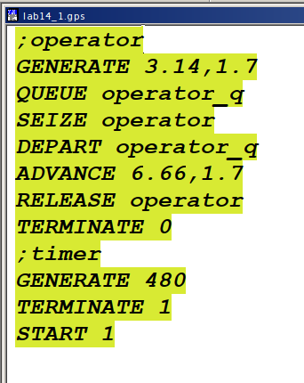
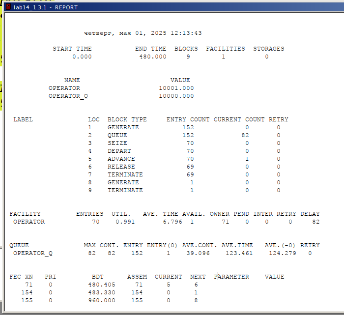
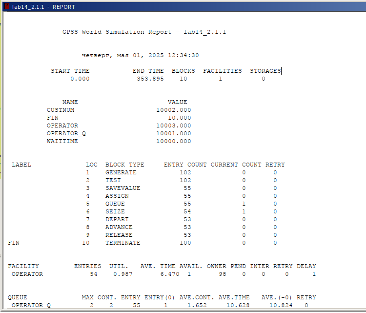
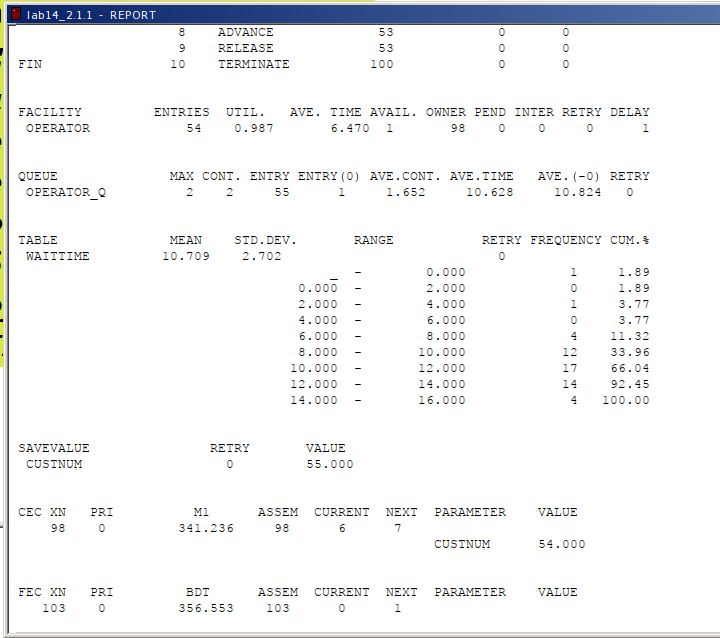
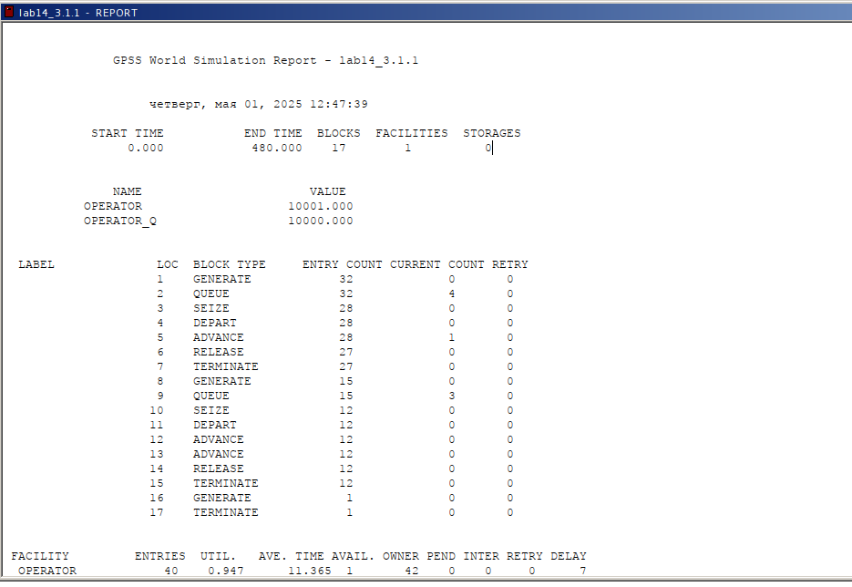
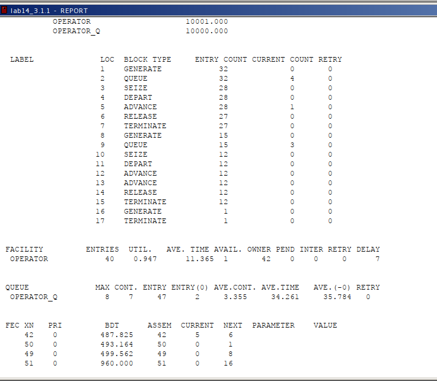
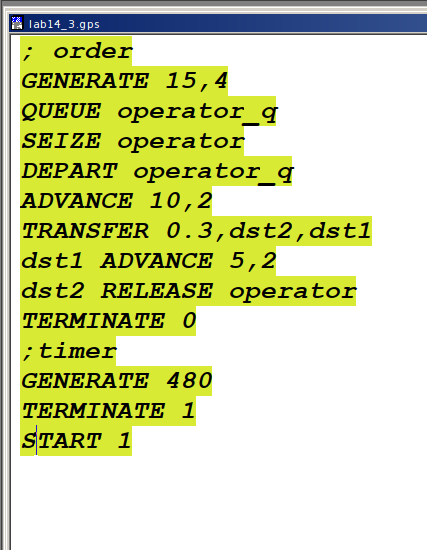
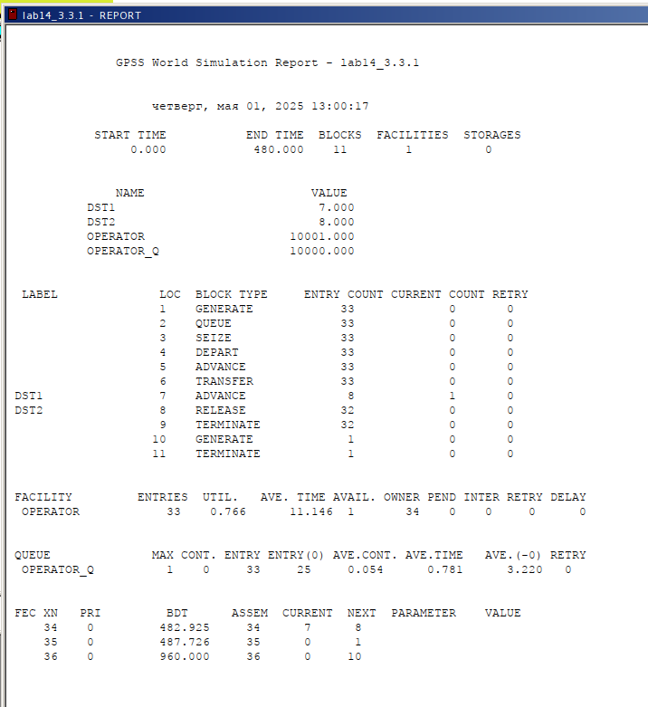

---
## Front matter
title: "Отчёт по лабораторной работе №14"
subtitle: "Имитационное моделирование"
author: "Ганина Таисия Сергеевна, НФИбд-01-22"

## Generic otions
lang: ru-RU
toc-title: "Содержание"

## Bibliography
bibliography: bib/cite.bib
csl: pandoc/csl/gost-r-7-0-5-2008-numeric.csl

## Pdf output format
toc: true # Table of contents
toc-depth: 2
lof: true # List of figures
lot: true # List of tables
fontsize: 12pt
linestretch: 1.5
papersize: a4
documentclass: scrreprt
## I18n polyglossia
polyglossia-lang:
  name: russian
  options:
	- spelling=modern
	- babelshorthands=true
polyglossia-otherlangs:
  name: english
## I18n babel
babel-lang: russian
babel-otherlangs: english
## Fonts
mainfont: PT Serif
romanfont: PT Serif
sansfont: PT Sans
monofont: PT Mono
mainfontoptions: Ligatures=TeX
romanfontoptions: Ligatures=TeX
sansfontoptions: Ligatures=TeX,Scale=MatchLowercase
monofontoptions: Scale=MatchLowercase,Scale=0.9
## Biblatex
biblatex: true
biblio-style: "gost-numeric"
biblatexoptions:
  - parentracker=true
  - backend=biber
  - hyperref=auto
  - language=auto
  - autolang=other*
  - citestyle=gost-numeric
## Pandoc-crossref LaTeX customization
figureTitle: "Рис."
tableTitle: "Таблица"
listingTitle: "Листинг"
lofTitle: "Список иллюстраций"
lotTitle: "Список таблиц"
lolTitle: "Листинги"
## Misc options
indent: true
header-includes:
  - \usepackage{indentfirst}
  - \usepackage{float} # keep figures where there are in the text
  - \floatplacement{figure}{H} # keep figures where there are in the text
---

# Цель работы

Реализовать модели обработки заказов и провести анализ результатов.

# Задание

Реализовать с помощью gpss:

- модель оформления заказов клиентов одним оператором;
- построение гистограммы распределения заявок в очереди;
- модель обслуживания двух типов заказов от клиентов в интернет-магазине;
- модель оформления заказов несколькими операторами.

# Теоретическое введение

GPSS (General Purpose Simulation System) — это один из первых специализированных языков программирования для имитационного моделирования, созданный в 1961 году американским инженером Джеффри Гордоном в корпорации IBM. Первоначально язык разрабатывался для нужд моделирования сложных логистических и производственных процессов в промышленных и военных системах, где требовался учёт случайных событий и взаимодействия большого количества объектов во времени.

GPSS стал знаковым инструментом в истории моделирования: он заложил основы событийного подхода и ввёл понятие транзакта как активного объекта, перемещающегося по блокам логики системы. Эти концепции впоследствии легли в основу многих других языков и программных сред моделирования. Благодаря модульной структуре и простой записи моделей, GPSS получил широкое распространение в университетах и научных учреждениях как средство обучения и анализа дискретных систем.

Практическое применение GPSS охватывает широкий спектр задач:

- Организация работы производственных цехов: моделирование потока деталей между станками, учёт времени обработки, простоев и загрузки оборудования;

- Системы массового обслуживания: моделирование очередей в банках, поликлиниках, аэропортах с целью оценки времени ожидания и необходимости в дополнительном персонале;

- Логистика и склады: моделирование перемещения товаров между зонами хранения, погрузки и разгрузки, анализ загрузки транспортных средств;

- Транспорт: моделирование движения автобусов, поездов, планирование расписаний с учётом времени на посадку и высадку пассажиров;

- Военные приложения: планирование операций снабжения, имитация действий в сложных логистических цепочках.

Одним из достоинств GPSS является то, что язык допускает использование случайных величин (например, времени обслуживания или интервалов между заявками), что позволяет создавать реалистичные модели, приближенные к поведению реальных систем. Также GPSS даёт возможность легко собирать статистику по ключевым метрикам: времени пребывания объектов в системе, загрузке ресурсов, количеству отказов и пр.

Несмотря на то, что с момента своего создания прошло более шестидесяти лет, GPSS продолжает использоваться как в учебных целях, так и в инженерной практике благодаря своей простоте, наглядности и эффективности в решении прикладных задач, связанных с анализом и оптимизацией дискретных процессов.

[@first; @second].

# Выполнение лабораторной работы

## Модель оформления заказов клиентов одним оператором

Порядок блоков в модели соответствует порядку фаз обработки заказа в реальной системе:

1) клиент оставляет заявку на заказ в интернет-магазине;
2) если необходимо, заявка от клиента ожидает в очереди освобождения оператора для оформления заказа;
3) заявка от клиента принимается оператором для оформления заказа;
4) оператор оформляет заказ;
5) клиент получает подтверждение об оформлении заказа (покидает систему).

Модель будет состоять из двух частей: моделирование обработки заказов в интернет-магазине и задание времени моделирования. Для задания равномерного распределения поступления заказов используем блок `GENERATE`, для задания равномерного времени обслуживания (задержки в системе) -- `ADVANCE`. Для моделирования ожидания заявок клиентов в очереди используем блоки `QUEUE` и `DEPART`, в которых в качестве имени очереди укажем `operator_q` Для моделирования поступления заявок для оформления заказов к оператору используем блоки `SEIZE` и `RELEASE` с параметром `operator` — имени «устройства обслуживания».

Требуется, чтобы модельное время было 8 часов. Соответственно, параметр блока `GENERATE` -- 480 (8 часов по 60 минут, всего 480 минут). Работа программы начинается с оператора `START` с начальным значением счётчика завершений, равным 1; заканчивается -- оператором `TERMINATE` с параметром 1, что задаёт ординарность потока в модели.

Таким образом, имеем (рис. @fig:001).

{#fig:001 width=70%}

После запуска симуляции получаем отчёт (рис. @fig:002).

{#fig:002 width=70%}

Результаты работы модели:

- модельное время в начале моделирования: `START TIME`=0.0;
- абсолютное время или момент, когда счетчик завершений принял значение 0: `END TIME`=480.0;
- количество блоков, использованных в текущей модели, к моменту завершения моделирования: `BLOCKS`=9;
- количество одноканальных устройств, использованных в модели к моменту завершения моделирования: `FACILITIES`=1;
- количество многоканальных устройств, использованных в текущей модели к моменту завершения моделирования: `STORAGES`=0. Имена, используемые в программе модели: `operator`, `operator_q`. 

Далее идёт информация о блоках текущей модели, в частности, `ENTRY COUNT` -- количество транзактов, вошедших в блок с начала процедуры моделирования. 

Затем идёт информация об одноканальном устройстве `FACILITY` (оператор, оформляющий заказ), откуда видим, что к оператору попало 33 заказа от клиентов (значение поля `OWNER`=33), но одну заявку оператор не успел принять в обработку до окончания рабочего времени (значение поля `ENTRIES`=32). Полезность работы оператора составила 0, 639. При этом среднее время занятости оператора составило 9, 589 мин.

Далее информация об очереди:

- `QUEUE`=`operator_q` -- имя объекта типа «очередь»;
- `MAX`=1 -- в очереди находилось не более одной ожидающей заявки от клиента;
- `CONT`=0 -- на момент завершения моделирования очередь была пуста;
- `ENTRIES`=32 -- общее число заявок от клиентов, прошедших через очередь в течение периода моделирования;
- `ENTRIES(O)`=31 -- число заявок от клиентов, попавших к оператору без ожидания в очереди;
- `AVE.CONT`=0, 001 заявок от клиентов в среднем были в очереди;
- `AVE.TIME`=0.021 минут в среднем заявки от клиентов провели в очереди (с учётом всех входов в очередь);
- `AVE.(–0)`=0, 671 минут в среднем заявки от клиентов провели в очереди (без учета «нулевых» входов в очередь).

В конце отчёта идёт информация о будущих событиях:

- XN=33 -- порядковый номер заявки от клиента, ожидающей поступления для оформления заказа у оператора;
- PRI=0 -- все клиенты (из заявки) равноправны;
- BDT=489, 786 -- время назначенного события, связанного с данным транзактом;
- ASSEM=33 -- номер семейства транзактов;
- CURRENT=5 -- номер блока, в котором находится транзакт;
- NEXT=6 -- номер блока, в который должен войти транзакт.

**Упражнение**

Скорректируйте модель в соответствии с изменениями входных
данных: интервалы поступления заказов распределены равномерно с интервалом
3.14 &plusmn; 1.7 мин; время оформления заказа также распределено равномерно на интер-
вале 6.66 &plusmn; 1.7 мин. Проанализируйте отчёт, сравнив результаты с результатами
предыдущего моделирования.

Я изменила строки GENERATE и ADVANCE (рис. @fig:003).

{#fig:003 width=70%}

После запуска симуляции получаем отчёт (рис. @fig:004).

{#fig:004 width=70%}

Проанализируем отчёт:

- модельное время в начале моделирования: `START TIME`=0.0;
- абсолютное время или момент, когда счетчик завершений принял значение 0: `END TIME`=480.0;
- количество блоков, использованных в текущей модели, к моменту завершения моделирования: `BLOCKS`=9;
- количество одноканальных устройств, использованных в модели к моменту завершения моделирования: `FACILITIES`=1;
- количество многоканальных устройств, использованных в текущей модели к моменту завершения моделирования: `STORAGES`=0. Имена, используемые в программе модели: `operator`, `operator_q`. 

Далее идёт информация о блоках текущей модели, в частности, `ENTRY COUNT` -- количество транзактов, вошедших в блок с начала процедуры моделирования = 152.

Затем идёт информация об одноканальном устройстве `FACILITY` (оператор, оформляющий заказ), откуда видим, что к оператору попало 71 заказа от клиентов (значение поля `OWNER`=71), но одну заявку оператор не успел принять в обработку до окончания рабочего времени (значение поля `ENTRIES`=70). Полезность работы оператора составила 0,991. При этом среднее время занятости оператора составило 6,796 мин.

Далее информация об очереди:

- `QUEUE`=`operator_q` -- имя объекта типа «очередь»;
- `MAX`= 82 -- в очереди находилось 82 ожидающих заявки от клиента;
- `CONT`= 82 -- на момент завершения моделирования очередь была полна (82 заявки);
- `ENTRIES`= 152 -- общее число заявок от клиентов, прошедших через очередь в течение периода моделирования;
- `ENTRIES(O)`= 1 -- число заявок от клиентов, попавших к оператору без ожидания в очереди;
- `AVE.CONT`= 39,096 заявок от клиентов в среднем были в очереди;
- `AVE.TIME` = 123,461 минут в среднем заявки от клиентов провели в очереди (с учётом всех входов в очередь);
- `AVE.(–0)`=124,279 минут в среднем заявки от клиентов провели в очереди (без учета «нулевых» входов в очередь).

В конце отчёта идёт информация о будущих событиях.

## Построение гистограммы распределения заявок в очереди

Требуется построить гистограмму распределения заявок, ожидающих обработки в очереди в примере из предыдущего упражнения. Для построения гистограммы необходимо сформировать таблицу значений заявок в очереди, записываемых в неё с определённой частотой.

Команда описания такой таблицы `QTABLE` имеет следующий формат: `Name QTABLE A,B,C,D`
Здесь `Name` -- метка, определяющая имя таблицы. Далее должны быть заданы операнды: `А` задается элемент данных, чьё частотное распределение будет заноситься в таблицу (может быть именем, выражением в скобках или системным числовым атрибутом (СЧА)); `B` задается верхний предел первого частотного интервала; `С` задает ширину частотного интервала — разницу между верхней и нижней границей каждого частотного класса; `D` задаёт число частотных интервалов. 

Код программы будет следующим(рис. @fig:005).

{#fig:005 width=70%}

Здесь `Waittime` — метка оператора таблицы очередей `QTABLE`, в данном случае название таблицы очереди заявок на заказы. Строка с оператором `TEST` по смыслу аналогично действиям оператора `IF` и означает, что если в очереди 0 или 1 заявка, то осуществляется переход к следующему оператору, в данном случае к оператору `SAVEVALUE`, в противном случае (в очереди более одной заявки) происходит переход к оператору с меткой `Fin`, то есть заявка удаляется из системы, не попадая на обслуживание. Строка с оператором `SAVEVALUE` с помощью операнда `Custnum` подсчитывает число заявок на заказ, попавших в очередь. Далее оператору `ASSIGN` присваивается значение СЧА оператора `Custnum`.

Получим отчет симуляции (рис. @fig:006, @fig:007).

{#fig:006 width=70%}

{#fig:007 width=70%}

И гистограмму(рис. @fig:008):

{#fig:008 width=70%}

**Упражнение**

Требуется проанализировать отчёт и гистограмму по результатам моделирования.

Проанализируем отчёт:

- модельное время в начале моделирования: `START TIME`=0.0;
- абсолютное время или момент, когда счетчик завершений принял значение 0: `END TIME`=353.895;
- количество блоков, использованных в текущей модели, к моменту завершения моделирования: `BLOCKS`=10;
- количество одноканальных устройств, использованных в модели к моменту завершения моделирования: `FACILITIES`=1;
- количество многоканальных устройств, использованных в текущей модели к моменту завершения моделирования: `STORAGES`=0. 

Имена, используемые в программе модели: `custnum`, `fin`, `operator`, `operator_q`, `waittime`. 

- количество транзактов, вошедших в блок с начала процедуры моделирования `ENTRY COUNT` = 102;

Затем идёт информация об одноканальном устройстве `FACILITY` (оператор, оформляющий заказ), откуда видим, что к оператору попало 98 заказов от клиентов (значение поля `OWNER`=98), но оператор успел принять в обработку до окончания рабочего времени только 54 (значение поля `ENTRIES`=54). Полезность работы оператора составила 0,987. При этом среднее время занятости оператора составило 6,470 мин.

Далее информация об очереди:

- `QUEUE`=`operator_q` -- имя объекта типа «очередь»;
- `MAX`=2 -- в очереди находилось не более двух ожидающих заявок от клиента;
- `CONT`=2 -- на момент завершения моделирования в очереди было два клиента;
- `ENTRIES`=55 -- общее число заявок от клиентов, прошедших через очередь в течение периода моделирования;
- `ENTRIES(O)`=1 -- число заявок от клиентов, попавших к оператору без ожидания в очереди;
- `AVE.CONT`=1,652 заявок от клиентов в среднем были в очереди;
- `AVE.TIME`=10,628 минут в среднем заявки от клиентов провели в очереди (с учётом всех входов в очередь);
- `AVE.(-0)`=10,824 минут в среднем заявки от клиентов провели в очереди (без учета «нулевых» входов в очередь).

Также появилась таблица с информацией для гистограммы: частотность разделена на 15 частотных интервалов с шагом 2 и началом в 0, а также в таблице указана частота, количество обрабатываемых заявок. 

В конце отчёта идёт информация о будущих событиях.

Проанализируем гистограмму:

Частотное распределение времени обработки заявок было сформировано на основе 15 равных интервалов шириной 2 минуты, начиная с нуля, в соответствии с заданными параметрами.

- Максимальное количество заявок (17) обрабатывалось в интервале 10–12 минут.
- Второй по частоте интервал — 12–14 минут, в котором обрабатывалось 14 заявок.
- Третий по частоте — 8–10 минут с 12 заявками.
- Во всех остальных интервалах количество заявок варьировалось от 0 до 4, что свидетельствует о низкой вероятности соответствующего времени обработки.

## Модель обслуживания двух типов заказов от клиентов в интернет-магазине

Необходимо реализовать отличие в оформлении обычных заказов и заказов с дополнительным пакетом услуг. Такую систему можно промоделировать с помощью двух сегментов. Один из них моделирует оформление обычных заказов, а второй -- заказов с дополнительным пакетом услуг. В каждом из сегментов пара `QUEUE–DEPART` должна описывать одну и ту же очередь, а пара блоков `SEIZE–RELEASE` должна описывать в каждом из двух сегментов одно и то же устройство и моделировать работу оператора.
Код и отчет результатов моделирования следующие (рис. @fig:009, @fig:010, @fig:011).

{#fig:009 width=70%}

{#fig:010 width=70%}

{#fig:011 width=70%}

**Задание**: проанализировать отчёт.

Результаты работы модели:

- модельное время в начале моделирования: `START TIME`=0.0;
- абсолютное время или момент, когда счетчик завершений принял значение 0: `END TIME`=480.0;
- количество блоков, использованных в текущей модели, к моменту завершения моделирования: `BLOCKS`=17;
- количество одноканальных устройств, использованных в модели к моменту завершения моделирования: `FACILITIES`=1;
- количество многоканальных устройств, использованных в текущей модели к моменту завершения моделирования: `STORAGES`=0. 

Имена, используемые в программе модели: `operator`, `operator_q`. 

- количество транзактов, вошедших в блок:
    - первого типа заказов с начала процедуры моделирования `ENTRY COUNT` = 32;
    - второго типа(с дополнительными услугами) `ENTRY COUNT` = 15; 
    - обработано 39 (потому что 12+27 = 39);

Затем идёт информация об одноканальном устройстве `FACILITY` (оператор, оформляющий заказ), откуда видим, что к оператору попало 42 заказ от клиентов (значение поля `OWNER`=42), но оператор успел принять в обработку до окончания рабочего времени только 40 (значение поля ENTRIES=40). Полезность работы оператора составила 0,947. При этом среднее время занятости оператора составило 11,365 мин.

Далее информация об очереди:

- `QUEUE`=`operator_q` -- имя объекта типа «очередь»;
- `MAX`=8 -- в очереди находилось не более восьми ожидающих заявок от клиента;
- `CONT`=7 -- на момент завершения моделирования в очереди было 7 клиентов;
- `ENTRIES`=47 -- общее число заявок от клиентов, прошедших через очередь в течение периода моделирования;
- `ENTRIES(O)`=2 -- число заявок от клиентов, попавших к оператору без ожидания в очереди;
- `AVE.CONT`=3,355 заявок от клиентов в среднем были в очереди;
- `AVE.TIME`=34,261 минут в среднем заявки от клиентов провели в очереди (с учётом всех входов в очередь);
- `AVE.(-0)`=35,784 минут в среднем заявки от клиентов провели в очереди (без учета «нулевых» входов в очередь).

В конце отчёта идёт информация о будущих событиях.

**Упражнение**

Нужно было скорректировать модель так, чтобы учитывалось условие, что число заказов с дополнительным пакетом услуг составляет 30% от общего числа заказов.

Из теории мы знаем, что:

Блок `TRANSFER` изменяет маршрут движения транзактов:

- `TRANSFER [A],B,[C],[D]`

Здесь A — режим перехода; B — метка первого альтернативного блока; C — метка
второго альтернативного блока; D — константа, используемая для относительной
переадресации транзактов.

Будем использовать один блок `order`, а разделим типы заявок с помощью переходов оператором `TRANSFER`. Каждый заказ обрабатывается $10 \pm 2$ минуты, после этого зададим оператор `TRANSFER`, в котором укажем, что с вероятностью 0.7 происходит обработка заявки (переход к блоку `dst2` `RELEASE operator`), а с вероятностью 0.3 дополнительно заказ обрабатывается еще $5 \pm 2$ минуты (переход к блоку `dst1` `ADVANCE` 5,2) и только после этого является обработанным ( рис. @fig:012).

{#fig:012 width=70%}

Проанализируем результаты моделирования (рис. @fig:013).

{#fig:013 width=70%}

Результаты работы модели:

- модельное время в начале моделирования: `START TIME`=0.0;
- абсолютное время или момент, когда счетчик завершений принял значение 0: `END TIME`=480.0;
- количество блоков, использованных в текущей модели, к моменту завершения моделирования: `BLOCKS`=11;
- количество одноканальных устройств, использованных в модели к моменту завершения моделирования: `FACILITIES`=1;
- количество многоканальных устройств, использованных в текущей модели к моменту завершения моделирования: `STORAGES`=0. 

Имена, используемые в программе модели: `operator`, `operator_q`. 

- количество транзактов, вошедших в блок заказов с начала процедуры моделирования `ENTRY COUNT` = 33;
- второго типа (с дополнительными услугами) `ENTRY COUNT` = 8; 
- обработано 32 заказа;

Затем идёт информация об одноканальном устройстве `FACILITY` (оператор, оформляющий заказ), откуда видим, что к оператору попало 34 заказа от клиентов (значение поля `OWNER`=34), но оператор успел принять в обработку до окончания рабочего времени только 33 (значение поля `ENTRIES`=33). Полезность работы оператора составила 0,766. При этом среднее время занятости оператора составило 11,146 мин.

Далее информация об очереди:

- `QUEUE`=`operator_q` -- имя объекта типа «очередь»;
- `MAX`=1 -- в очереди находилось не более одной ожидающей заявки от клиента;
- `CONT`=0 -- на момент завершения моделирования в очереди было ноль клиентов;
- `ENTRIES`=33 -- общее число заявок от клиентов, прошедших через очередь в течение периода моделирования;
- `ENTRIES(O)`=25 -- число заявок от клиентов, попавших к оператору без ожидания в очереди;
- `AVE.CON`T=0,054 заявок от клиентов в среднем были в очереди;
- `AVE.TIME`=0.781 минут в среднем заявки от клиентов провели в очереди (с учётом всех входов в очередь);
- `AVE.(-0)`=3,220 минут в среднем заявки от клиентов провели в очереди (без учета «нулевых» входов в очередь).

В конце отчёта идёт информация о будущих событиях.

## Модель оформления заказов несколькими операторами

В интернет-магазине заказы принимают 4 оператора. Интервалы поступления заказов распределены равномерно с интервалом $5 \pm 2$ мин. Время оформления заказа каждым оператором также распределено равномерно на интервале $10 \pm 2$ мин. обработка поступивших заказов происходит в порядке очереди (FIFO). Требуется определить характеристики очереди заявок на оформление заказов при условии, что заявка может обрабатываться одним из 4-х операторов в течение восьмичасового рабочего дня

Для задания количества доступных операторов в системе используется команда STORAGE operator 4, где operator — имя ресурса, а число 4 указывает на то, что одновременно могут работать четыре оператора.

На этапе обработки каждой заявки добавляется команда ENTER operator,1, обозначающая, что для начала обслуживания необходимо зарезервировать одного оператора (рис. @fig:014).

{#fig:014 width=70%}

**Упражнение**

1. Проанализируем отчет (рис. @fig:015).

{#fig:015 width=70%}

Результаты работы модели:

- модельное время в начале моделирования: `START TIME`=0.0;
- абсолютное время или момент, когда счетчик завершений принял значение 0: `END TIME`=480.0;
- количество блоков, использованных в текущей модели, к моменту завершения моделирования: `BLOCKS`=9;
- количество одноканальных устройств, использованных в модели к моменту завершения моделирования: `FACILITIES`=0;
- количество многоканальных устройств, использованных в текущей модели к моменту завершения моделирования: `STORAGES`=1. 

Имена, используемые в программе модели: `operator`, `operator_q`. 

- количество транзактов, вошедших в блок заказов с начала процедуры моделирования `ENTRY COUNT` = 93; обработан 91 заказ;

Далее информация об очереди:

- `QUEUE`=`operator_q` -- имя объекта типа «очередь»;
- `MAX`=1 -- в очереди находилось не более одной ожидающей заявки от клиента;
- `CONT`=0 -- на момент завершения моделирования в очереди было ноль клиентов;
- `ENTRIES`=93 -- общее число заявок от клиентов, прошедших через очередь в течение периода моделирования;
- `ENTRIES(O)`=93 -- число заявок от клиентов, попавших к оператору без ожидания в очереди;
- `AVE.CONT`=0,000 -- заявок от клиентов в среднем были в очереди;
- `AVE.TIME`=0,000 минут в среднем заявки от клиентов провели в очереди (с учётом всех входов в очередь);
- `AVE.(-0)`=0,000 минут в среднем заявки от клиентов провели в очереди (без учета «нулевых» входов в очередь).

Далее идет информация про многоканальное устройство STORAGE (представляющее операторов, оформляющих заказы), и мы можем сделать такие выводы:

- Общее число заявок, направленных к операторам, составило 93.

- Значение коэффициента полезности (или загрузки) STORAGE составило 0,482.

- Среднее время, в течение которого один оператор был занят одной заявкой, составило 1,926 минуты.

- `CAP.` = 4, что означает возможность одновременной работы до четырёх операторов.

- Максимальное число одновременно задействованных операторов: 4 — то есть в некоторые моменты все операторы находились в работе.

- Минимальное число задействованных операторов: 0 — были периоды, когда ни один оператор не был занят.

В конце отчёта идёт информация о будущих событиях.

2. Изменим модель: требуется учесть в ней возможные отказы клиентов от заказа -- когда при подаче заявки на заказ клиент видит в очереди более двух других заявок, он отказывается от подачи заявки, то есть отказывается от обслуживания (используем блок `TEST` и стандартный числовой атрибут Qj текущей длины очереди j).

Прочитаем информацию про `TEST`:

Блок `TEST` определяет направление движения транзакта в зависимости от выполнения условия, заданного алгебраическим соотношением:

`TEST XX A,B,[C]`

Здесь XX — знак логической операции: L — меньше, G — больше, E — равно, LE —
меньше или равно, GE — больше или равно, NE — не равно; A, B — сравниваемые
значения; C — метка блока, куда перемещается транзакт в случае невыполнения
заданного условия.

В модель я добавила строчку `TEST LE Q$operator_q,2`, которая проверяет, сколько человек стоит в очереди к операторам. Если в очереди не больше двух клиентов, заявка идёт дальше на обработку. Если клиентов больше двух — заявка уходит из системы, имитируя отказ пользователя из-за слишком долгого ожидания.

Ранее в отчёте было видно, что длина очереди ни разу не превышала двух человек. Это связано с тем, что заявки поступали довольно редко, и операторы успевали справляться с потоком. Чтобы проверить, как система поведёт себя при большей нагрузке, я изменила параметры модели:

- Вместо `GENERATE 5,2` теперь используется `GENERATE 2,1`, то есть заявки приходят чаще — примерно раз в 2 минуты с небольшим разбросом.

- Команда `ADVANCE 10,2` заменена на `ADVANCE 20,2`, чтобы одна заявка обрабатывалась дольше — в среднем 20 минут.

Таким образом, модель теперь работает в условиях, когда операторов может не хватать, и появляется шанс, что очередь превысит допустимый предел в два человека. Это позволяет проверить, как сработает фильтрация через `TEST`, и насколько сильно это повлияет на общий поток заявок (рис. fig:015).

{#fig:016 width=70%}

3. Проанализируем полученный отчет (рис. @fig:017).

{#fig:017 width=70%}

Результаты работы модели:

- модельное время в начале моделирования: `START TIME`=0.0;
- абсолютное время или момент, когда счетчик завершений принял значение 0: `END TIME`=480.0;
- количество блоков, использованных в текущей модели, к моменту завершения моделирования: `BLOCKS`=10;
- количество одноканальных устройств, использованных в модели к моменту завершения моделирования: `FACILITIES`=0;
- количество многоканальных устройств, использованных в текущей модели к моменту завершения моделирования: `STORAGES`=1. 

Имена, используемые в программе модели: `operator`, `operator_q`. 

- количество транзактов, вошедших в блок заказов с начала процедуры моделирования `ENTRY COUNT` = 239; 
- обработано 94 заказа; 
- 138 человек отказались оставлять заявки, поскольку очередь была более двух заявок.

Далее информация об очереди:

- `QUEUE`=`operator_q` -- имя объекта типа «очередь»;
- `MAX` = 3 -- в очереди находилось не более трех ожидающих заявок от клиента(как и было указано);
- `CONT` = 3 -- на момент завершения моделирования в очереди было три клиента;
- `ENTRIES`=101 -- общее число заявок от клиентов, прошедших через очередь в течение периода моделирования;
- `ENTRIES(O)`=4 -- число заявок от клиентов, попавших к оператору без ожидания в очереди;
- `AVE.CONT`=2,915 -- заявок от клиентов в среднем были в очереди;
- `AVE.TIME`=13,854 минут в среднем заявки от клиентов провели в очереди (с учётом всех входов в очередь);
- `AVE.(-0)`=14,425 минут в среднем заявки от клиентов провели в очереди (без учета «нулевых» входов в очередь).

Далее в отчёте представлена статистика по многоканальному устройству `STORAGE`, которое моделирует операторов, занимающихся оформлением заказов. Из данных видно следующее:

- К операторам было направлено 98 заявок от клиентов.
- Полезность работы (utilization) составила 0,988, то есть операторы были заняты почти всё время моделирования — 98,8 % времени.
- В среднем один оператор тратил 3,953 минуты на обработку одной заявки.

- `CAP.` = 4, что означает возможность одновременной работы до четырёх операторов.
- Максимальное число одновременно занятых операторов: 4.
- Минимальное число занятых операторов: 0 (были периоды простоя, хотя и редкие).

В конце отчёта идёт информация о будущих событиях.

# Выводы

В ходе данной лабораторной работы я реализовала следующее:

- модель оформления заказов клиентов одним оператором;
- построение гистограммы распределения заявок в очереди;
- модель обслуживания двух типов заказов от клиентов в интернет-магазине;
- модель оформления заказов несколькими операторами.

# Список литературы{.unnumbered}

::: {#refs}
:::
