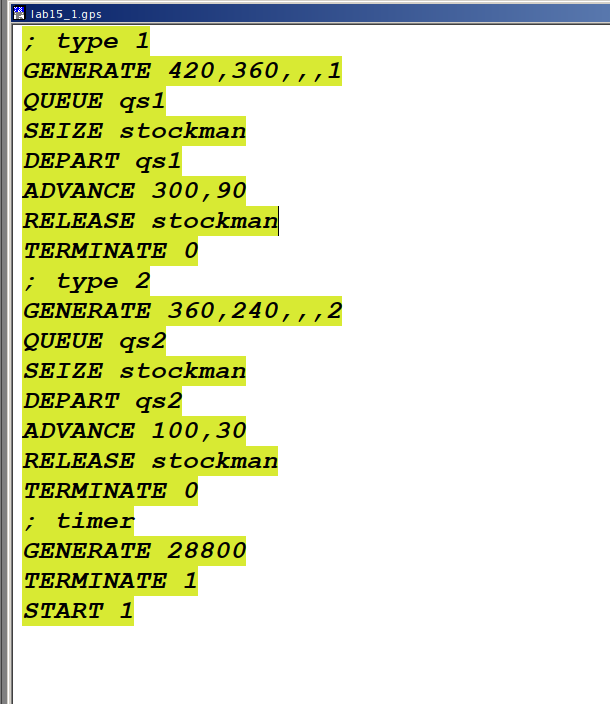
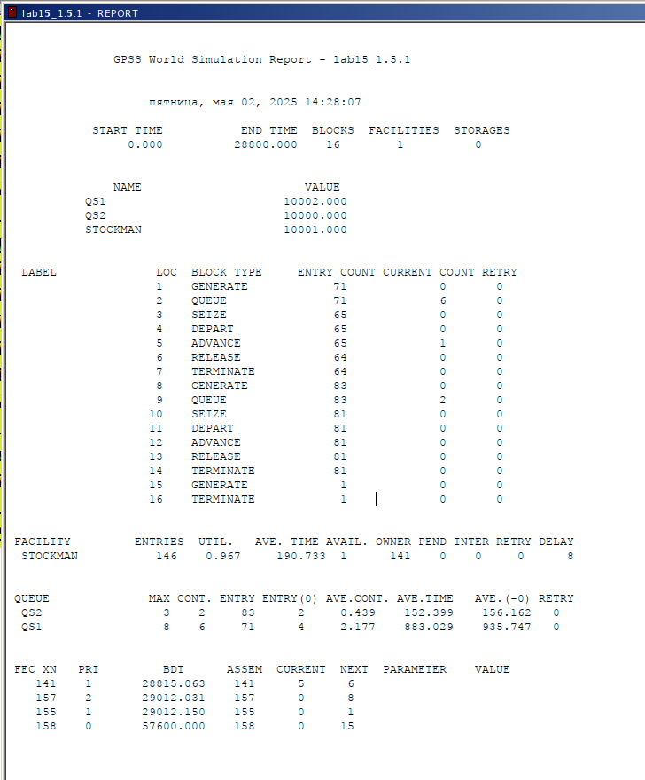
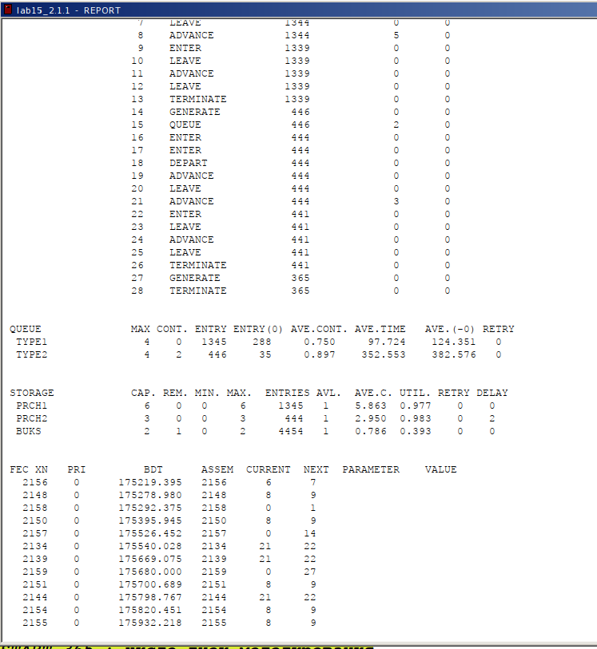

---
## Front matter
title: "Отчёт по лабораторной работе №15"
subtitle: "Имитационное моделирование"
author: "Ганина Таисия Сергеевна, НФИбд-01-22"

## Generic otions
lang: ru-RU
toc-title: "Содержание"

## Bibliography
bibliography: bib/cite.bib
csl: pandoc/csl/gost-r-7-0-5-2008-numeric.csl

## Pdf output format
toc: true # Table of contents
toc-depth: 2
lof: true # List of figures
lot: true # List of tables
fontsize: 12pt
linestretch: 1.5
papersize: a4
documentclass: scrreprt
## I18n polyglossia
polyglossia-lang:
  name: russian
  options:
	- spelling=modern
	- babelshorthands=true
polyglossia-otherlangs:
  name: english
## I18n babel
babel-lang: russian
babel-otherlangs: english
## Fonts
mainfont: PT Serif
romanfont: PT Serif
sansfont: PT Sans
monofont: PT Mono
mainfontoptions: Ligatures=TeX
romanfontoptions: Ligatures=TeX
sansfontoptions: Ligatures=TeX,Scale=MatchLowercase
monofontoptions: Scale=MatchLowercase,Scale=0.9
## Biblatex
biblatex: true
biblio-style: "gost-numeric"
biblatexoptions:
  - parentracker=true
  - backend=biber
  - hyperref=auto
  - language=auto
  - autolang=other*
  - citestyle=gost-numeric
## Pandoc-crossref LaTeX customization
figureTitle: "Рис."
tableTitle: "Таблица"
listingTitle: "Листинг"
lofTitle: "Список иллюстраций"
lotTitle: "Список таблиц"
lolTitle: "Листинги"
## Misc options
indent: true
header-includes:
  - \usepackage{indentfirst}
  - \usepackage{float} # keep figures where there are in the text
  - \floatplacement{figure}{H} # keep figures where there are in the text
---
# Цель работы

Выполнить моделирование обслуживания с приоритетами и провести анализ результатов.

# Задание

Реализовать с помощью gpss:

- Модель обслуживания механиков на складе.
- Модель обслуживания в порту судов двух типов.

# Теоретическое введение

GPSS (General Purpose Simulation System) — это один из первых специализированных языков программирования для имитационного моделирования, созданный в 1961 году американским инженером Джеффри Гордоном в корпорации IBM. Первоначально язык разрабатывался для нужд моделирования сложных логистических и производственных процессов в промышленных и военных системах, где требовался учёт случайных событий и взаимодействия большого количества объектов во времени.

GPSS стал знаковым инструментом в истории моделирования: он заложил основы событийного подхода и ввёл понятие транзакта как активного объекта, перемещающегося по блокам логики системы. Эти концепции впоследствии легли в основу многих других языков и программных сред моделирования. Благодаря модульной структуре и простой записи моделей, GPSS получил широкое распространение в университетах и научных учреждениях как средство обучения и анализа дискретных систем.

Практическое применение GPSS охватывает широкий спектр задач:

- Организация работы производственных цехов: моделирование потока деталей между станками, учёт времени обработки, простоев и загрузки оборудования;

- Системы массового обслуживания: моделирование очередей в банках, поликлиниках, аэропортах с целью оценки времени ожидания и необходимости в дополнительном персонале;

- Логистика и склады: моделирование перемещения товаров между зонами хранения, погрузки и разгрузки, анализ загрузки транспортных средств;

- Транспорт: моделирование движения автобусов, поездов, планирование расписаний с учётом времени на посадку и высадку пассажиров;

- Военные приложения: планирование операций снабжения, имитация действий в сложных логистических цепочках.

Одним из достоинств GPSS является то, что язык допускает использование случайных величин (например, времени обслуживания или интервалов между заявками), что позволяет создавать реалистичные модели, приближенные к поведению реальных систем. Также GPSS даёт возможность легко собирать статистику по ключевым метрикам: времени пребывания объектов в системе, загрузке ресурсов, количеству отказов и пр.

Несмотря на то, что с момента своего создания прошло более шестидесяти лет, GPSS продолжает использоваться как в учебных целях, так и в инженерной практике благодаря своей простоте, наглядности и эффективности в решении прикладных задач, связанных с анализом и оптимизацией дискретных процессов.

[@first; @second].

# Выполнение лабораторной работы

## Модель обслуживания механиков на складе

На фабрике на складе работает один кладовщик, который выдает запасные части
механикам, обслуживающим станки. Время, необходимое для удовлетворения запроса, зависит от типа запасной части. Запросы бывают двух категорий. 

- Для первой категории интервалы времени прихода механиков 420 &plusmn; 360 сек., время обслуживания — 300 &plusmn; 90 сек. 

- Для второй категории интервалы времени прихода механиков 360 &plusmn; 240 сек., время обслуживания — 100 &plusmn; 30 сек.

Порядок обслуживания механиков кладовщиком такой: запросы первой категории
обслуживаются только в том случае, когда в очереди нет ни одного запроса второй категории. Внутри одной категории дисциплина обслуживания — «первым пришел – первым обслужился». Необходимо создать модель работы кладовой, моделирование выполнять в течение восьмичасового рабочего дня.

Таким образом, имеем (рис. @fig:001).

{#fig:001 width=70%}

После запуска симуляции получаем отчёт (рис. @fig:002).

{#fig:002 width=70%}

Результаты работы модели:

- модельное время в начале моделирования: `START TIME`=0.0;
- абсолютное время или момент, когда счетчик завершений принял значение 0: `END TIME`=28800.000;
- количество блоков, использованных в текущей модели, к моменту завершения моделирования: `BLOCKS`=16;
- количество одноканальных устройств, использованных в модели к моменту завершения моделирования: `FACILITIES`=1;
- количество многоканальных устройств, использованных в текущей модели к моменту завершения моделирования: `STORAGES`=0. Имена, используемые в программе модели: `qs1`, `qs2`, `stockman`. 

Далее идёт информация о блоках текущей модели, в частности, `ENTRY COUNT` -- количество транзактов, вошедших в блок с начала процедуры моделирования. Было сгенерировано 71 заявка первого типа и 83 второго, а обработано 64 и 81 соответственно.

Затем идёт информация об одноканальном устройстве `FACILITY` (оператор, оформляющий заказ), откуда видим, что к оператору на обработку попало всего 146 заказов обоих типов. Полезность работы оператора составила 0,967. При этом среднее время занятости оператора составило 190,733 сек.

Далее информация об очереди:

Далее информация об очередях:

- `QUEUE`=QS1 -- имя объекта типа «очередь» для первого типа заявок;
- `MAX`=8 -- максимальное число ожидающих заявок от клиента в очереди;
- `CONT`=6 -- количество заявок в очереди на момент завершения моделирования;
- `ENTRIES`=71 -- общее число заявок от клиентов, прошедших через очередь в течение периода моделирования;
- `ENTRIES(O)`=4 -- число заявок от клиентов, попавших к оператору без ожидания в очереди;
- `AVE.CONT`=2,177 заявок от клиентов в среднем были в очереди;
- `AVE.TIME`=883,029 секунд в среднем заявки от клиентов провели в очереди (с учётом всех входов в очередь);
- `AVE.(–0)`=935,747 секунд в среднем заявки от клиентов провели в очереди (без учета «нулевых» входов в очередь).

- `QUEUE`=QS2 -- имя объекта типа «очередь» для второго типа заявок;
- `MAX`=3 -- максимальное число ожидающих заявок от клиента в очереди;
- `CONT`=2 -- количество заявок в очереди на момент завершения моделирования;
- `ENTRIES`=83 -- общее число заявок от клиентов, прошедших через очередь в течение периода моделирования;
- `ENTRIES(O)`=2 -- число заявок от клиентов, попавших к оператору без ожидания в очереди;
- `AVE.CONT`=0,439 заявок от клиентов в среднем были в очереди;
- `AVE.TIME`=152,399 секунд в среднем заявки от клиентов провели в очереди (с учётом всех входов в очередь);
- `AVE.(–0)`=156,162 секунд в среднем заявки от клиентов провели в очереди (без учета «нулевых» входов в очередь).

В конце отчёта идёт информация о будущих событиях:

- `XN`=141 -- порядковый номер заявки от клиента, ожидающей поступления для оформления заказа у оператора;
- `PRI`=1 -- следующая заявка с приоритетом 1, то есть первого типа;
- `BDT`=28815,063 -- время назначенного события, связанного с данным транзактом;
- `ASSEM`=141 -- номер семейства транзактов;
- `CURRENT`=5 -- номер блока, в котором находится транзакт;
- `NEXT`=6 -- номер блока, в который должен войти транзакт.

## Модель обслуживания в порту судов двух типов

Морские суда двух типов прибывают в порт, где происходит их разгрузка. В порту есть два буксира, обеспечивающих ввод и вывод кораблей из порта. К первому типу судов относятся корабли малого тоннажа, которые требуют использования одного буксира. Корабли второго типа имеют большие размеры, и для их ввода и вывода из порта требуется два буксира. Из-за различия размеров двух типов кораблей необходимы и причалы различного размера. Кроме того, корабли имеют различное время погрузки/разгрузки.

Требуется построить модель системы, в которой можно оценить время ожидания
кораблями каждого типа входа в порт. Время ожидания входа в порт включает время ожидания освобождения причала и буксира. Корабль, ожидающий освобождения причала, не обслуживается буксиром до тех пор, пока не будет предоставлен нужный причал. Корабль второго типа не займёт буксир до тех пор, пока ему не будут доступны оба буксира.

Параметры модели:

- для корабля первого типа:

    - интервал прибытия: 130 &plusmn; 30 мин;
    - время входа в порт: 30 &plusmn; 7 мин;
    - количество доступных причалов: 6;
    - время погрузки/разгрузки: 12 &plusmn; 2 час;
    - время выхода из порта: 20 &plusmn; 5 мин;
    
- для корабля второго типа:

    - интервал прибытия: 390 &plusmn; 60 мин;
    - время входа в порт: 45 &plusmn; 12 мин;
    - количество доступных причалов: 3;
    - время погрузки/разгрузки: 18 &plusmn; 4 час;
    - время выхода из порта: 35 &plusmn; 10 мин.
    - время моделирования: 365 дней по 8 часов.

Код программы будет следующим(рис. @fig:003).

{#fig:003 width=70%}

Получим отчет симуляции (рис. @fig:004, @fig:005).

{#fig:004 width=70%}

{#fig:005 width=70%}

Проанализируем отчёт:

- модельное время в начале моделирования: `START TIME`=0.0;
- абсолютное время или момент, когда счетчик завершений принял значение 0: `END TIME`=175200.000;
- количество блоков, использованных в текущей модели, к моменту завершения моделирования: `BLOCKS`=28;
- количество одноканальных устройств, использованных в модели к моменту завершения моделирования: `FACILITIES`=0;
- количество многоканальных устройств, использованных в текущей модели к моменту завершения моделирования: `STORAGES`=3. Имена, используемые в программе модели: `buks`, `prch1`, `prch2`, `type1`, `type2`. 

Далее идёт информация о блоках текущей модели, в частности, ENTRY COUNT -- количество транзактов, вошедших в блок с начала процедуры моделирования. Было сгенерировано 1345 заявок первого типа и 446 второго, а обработано 1339 и 365 соответственно.

Далее информация об очередях:

- `QUEUE`=TYPE1 -- имя объекта типа «очередь» для первого типа судов;
- `MAX`=4 -- максимальное число ожидающих заявок от клиента в очереди;
- `CONT`=0 -- на момент завершения моделирования очередь была пуста;
- `ENTRIES`=1345 -- общее число заявок от клиентов, прошедших через очередь в течение периода моделирования;
- `ENTRIES(O)`=288 -- число заявок от клиентов, попавших к оператору без ожидания в очереди;
- `AVE.CONT`=0,750 заявок от клиентов в среднем были в очереди;
- `AVE.TIME`=97,724 минут в среднем заявки от клиентов провели в очереди (с учётом всех входов в очередь);
- `AVE.(–0)`=124,351 минут в среднем заявки от клиентов провели в очереди (без учета «нулевых» входов в очередь).

- `QUEUE`=TYPE2 -- имя объекта типа «очередь» для второго типа судов;
- `MAX`=4 -- максимальное число ожидающих заявок от клиента в очереди;
- `CONT`=2 -- количество заявок в очереди на момент завершения моделирования;
- `ENTRIES`=446 -- общее число заявок от клиентов, прошедших через очередь в течение периода моделирования;
- `ENTRIES(O)`=35 -- число заявок от клиентов, попавших к оператору без ожидания в очереди;
- `AVE.CONT`=0,897 заявок от клиентов в среднем были в очереди;
- `AVE.TIME`=352,553 минут в среднем заявки от клиентов провели в очереди (с учётом всех входов в очередь);
- `AVE.(–0)`=382,576 минут в среднем заявки от клиентов провели в очереди (без учета «нулевых» входов в очередь).

Затем идёт информация о многоканальных устройствах `STORAGE`. У нас указано, что первого типа причалов 6, второго -- три, а буксиров 2.

Видим, что к первому типу причалов `PRCH1` на обработку попало всего 1345 судов(первого типа). Полезность работы причалов составила 0,977. При этом среднее время занятости причалов составило 5,863 мин. 

Ко второму типу причалов `PRCH1` на обработку попало всего 444 судов(второго типа). Полезность работы причалов составила 0,983. При этом среднее время занятости причалов составило 2,950 мин.

Есть два буксира `buks`. К ним поступили судна 4454 раз. Полезность работы -- 0,393, среднее время занятости -- 0,786.

Далее идёт информация о будущих событиях.

# Выводы

В ходе данной лабораторной работы я выполнила моделирование обслуживания с приоритетами и провела анализ результатов.

# Список литературы{.unnumbered}

::: {#refs}
:::
