---
## Front matter
title: "Отчёт по лабораторной работе №16"
subtitle: "Имитационное моделирование"
author: "Ганина Таисия Сергеевна, НФИбд-01-22"

## Generic otions
lang: ru-RU
toc-title: "Содержание"

## Bibliography
bibliography: bib/cite.bib
csl: pandoc/csl/gost-r-7-0-5-2008-numeric.csl

## Pdf output format
toc: true # Table of contents
toc-depth: 2
lof: true # List of figures
lot: true # List of tables
fontsize: 12pt
linestretch: 1.5
papersize: a4
documentclass: scrreprt
## I18n polyglossia
polyglossia-lang:
  name: russian
  options:
	- spelling=modern
	- babelshorthands=true
polyglossia-otherlangs:
  name: english
## I18n babel
babel-lang: russian
babel-otherlangs: english
## Fonts
mainfont: PT Serif
romanfont: PT Serif
sansfont: PT Sans
monofont: PT Mono
mainfontoptions: Ligatures=TeX
romanfontoptions: Ligatures=TeX
sansfontoptions: Ligatures=TeX,Scale=MatchLowercase
monofontoptions: Scale=MatchLowercase,Scale=0.9
## Biblatex
biblatex: true
biblio-style: "gost-numeric"
biblatexoptions:
  - parentracker=true
  - backend=biber
  - hyperref=auto
  - language=auto
  - autolang=other*
  - citestyle=gost-numeric
## Pandoc-crossref LaTeX customization
figureTitle: "Рис."
tableTitle: "Таблица"
listingTitle: "Листинг"
lofTitle: "Список иллюстраций"
lotTitle: "Список таблиц"
lolTitle: "Листинги"
## Misc options
indent: true
header-includes:
  - \usepackage{indentfirst}
  - \usepackage{float} # keep figures where there are in the text
  - \floatplacement{figure}{H} # keep figures where there are in the text
---

# Цель работы

Реализовать с помощью gpss модель двух стратегий обслуживания и оценить оптимальные параметры.

# Задание

Реализовать с помощью gpss:

- модель с двумя очередями;
- модель с одной очередью;
- изменить модели, чтобы определить оптимальное число пропускных пунктов.

# Теоретическое введение

GPSS (General Purpose Simulation System) — это один из первых специализированных языков программирования для имитационного моделирования, созданный в 1961 году американским инженером Джеффри Гордоном в корпорации IBM. Первоначально язык разрабатывался для нужд моделирования сложных логистических и производственных процессов в промышленных и военных системах, где требовался учёт случайных событий и взаимодействия большого количества объектов во времени.

GPSS стал знаковым инструментом в истории моделирования: он заложил основы событийного подхода и ввёл понятие транзакта как активного объекта, перемещающегося по блокам логики системы. Эти концепции впоследствии легли в основу многих других языков и программных сред моделирования. Благодаря модульной структуре и простой записи моделей, GPSS получил широкое распространение в университетах и научных учреждениях как средство обучения и анализа дискретных систем.

Практическое применение GPSS охватывает широкий спектр задач:

- Организация работы производственных цехов: моделирование потока деталей между станками, учёт времени обработки, простоев и загрузки оборудования;

- Системы массового обслуживания: моделирование очередей в банках, поликлиниках, аэропортах с целью оценки времени ожидания и необходимости в дополнительном персонале;

- Логистика и склады: моделирование перемещения товаров между зонами хранения, погрузки и разгрузки, анализ загрузки транспортных средств;

- Транспорт: моделирование движения автобусов, поездов, планирование расписаний с учётом времени на посадку и высадку пассажиров;

- Военные приложения: планирование операций снабжения, имитация действий в сложных логистических цепочках.

Одним из достоинств GPSS является то, что язык допускает использование случайных величин (например, времени обслуживания или интервалов между заявками), что позволяет создавать реалистичные модели, приближенные к поведению реальных систем. Также GPSS даёт возможность легко собирать статистику по ключевым метрикам: времени пребывания объектов в системе, загрузке ресурсов, количеству отказов и пр.

Несмотря на то, что с момента своего создания прошло более шестидесяти лет, GPSS продолжает использоваться как в учебных целях, так и в инженерной практике благодаря своей простоте, наглядности и эффективности в решении прикладных задач, связанных с анализом и оптимизацией дискретных процессов.

[@first; @second].

# Выполнение лабораторной работы

## Постановка задачи

На пограничном контрольно -пропускном пункте транспорта имеются 2 пункта пропуска. Интервалы времени между поступлением автомобилей имеют экспоненциальное распределение со средним значением $\mu$. Время прохождения автомобилями пограничного контроля имеет равномерное распределение на интервале [a, b].
Предлагается две стратегии обслуживания прибывающих автомобилей:

1. автомобили образуют две очереди и обслуживаются соответствующими пунктами
пропуска;
2. автомобили образуют одну общую очередь и обслуживаются освободившимся
пунктом пропуска.
Исходные данные: $\mu$ = 1, 75 мин, a = 1 мин, b = 7 мин.

Целью моделирования является определение:

- характеристик качества обслуживания автомобилей, в частности, средних длин очередей; среднего времени обслуживания автомобиля; среднего времени пребывания автомобиля на пункте пропуска;
- наилучшей стратегии обслуживания автомобилей на пункте пограничного контроля;
- оптимального количества пропускных пунктов.

В качестве критериев, используемых для сравнения стратегий обслуживания
автомобилей, выберем:
- коэффициенты загрузки системы;
- максимальные и средние длины очередей;
- средние значения времени ожидания обслуживания.

Для первой стратегии обслуживания, когда прибывающие автомобили образуют
две очереди и обслуживаются соответствующими пропускными пунктами, имеем
следующую модель (рис. @fig:001).

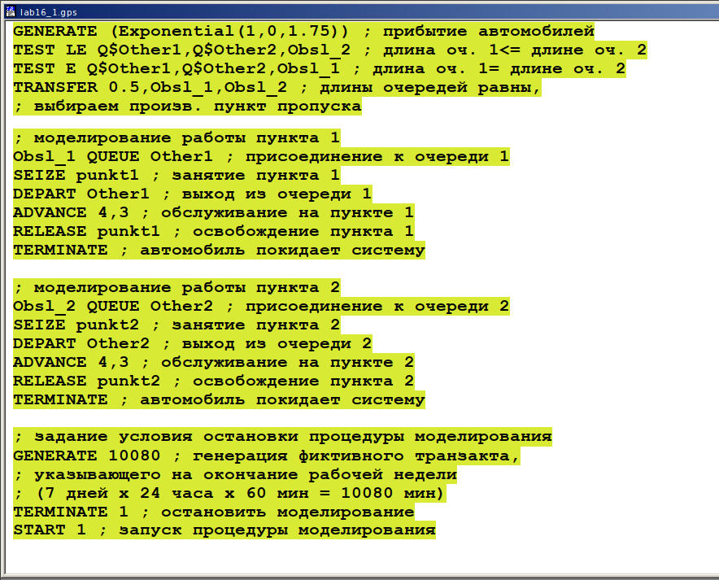{#fig:001 width=70%}

После запуска симуляции получаем отчёт (рис. @fig:002).

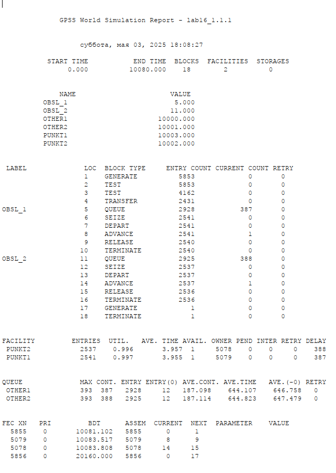{#fig:002 width=70%}

## Модель для второй стратегии обслуживания

Составим модель для второй стратегии обслуживания, когда прибывающие автомобили образуют одну очередь и обслуживаются освободившимся пропускным пунктом. Теперь мы используем многоканальное устройство (рис. @fig:003).

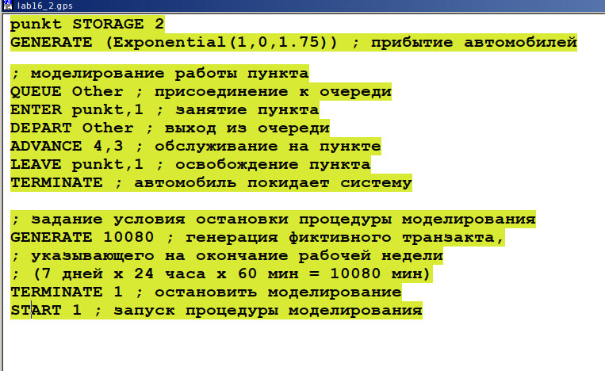{#fig:003 width=70%}

После запуска симуляции получаем отчёт (рис. @fig:004).

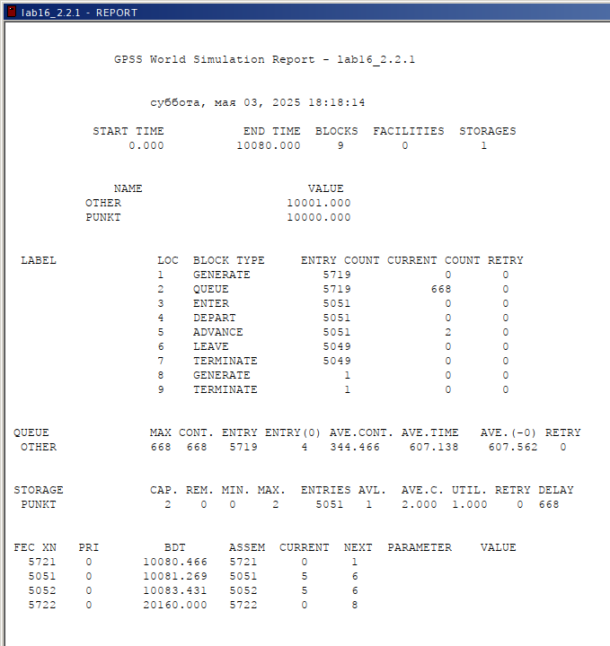{#fig:004 width=70%}

Сведём полученные статистики моделирования в таблицу (табл. [-@tbl:sravni]).

: Сравнение стратегий {#tbl:sravni}

| Показатель                 | стратегия 1 |         |          |  стратегия 2 |
|----------------------------|-------------|---------|----------|--------------|
|                            | пункт 1     | пункт 2 | в целом  |              |
| Поступило автомобилей      | 2928        | 2925    | 5853     | 5719         |
| Обслужено автомобилей      | 2540        | 2536    | 5076     | 5049         |
| Коэффициент загрузки       | 0,997       | 0,996   | 0,9965   | 1            |
| Максимальная длина очереди | 393         | 393     | 786      | 668          |
| Средняя длина очереди      | 187,098     | 187,114 | 374,212  | 344,466      |
| Среднее время ожидания     | 644,107     | 644,823 | 644,465  | 607,138      |

По сравнению видно, что в первой стратегии через два пункта прошло больше автомобилей (5853), из них было обслужено 5076, то есть 777 машин не были приняты (примерно 13%). Во второй стратегии поступило 5719 автомобилей, обслужили 5049, и потери составили 670 машин (около 12%). 

Несмотря на большее количество обслуженных машин в первой стратегии, во второй процент потерь меньше. Также во второй стратегии коэффициент загрузки равен 1, что означает отсутствие простоев. Максимальная и средняя длина очереди, а также среднее время ожидания во второй стратегии тоже ниже. Это говорит о более равномерной и устойчивой работе. В целом, вторая стратегия показала себя лучше с точки зрения эффективности и организации процесса.

## Оптимизация модели двух стратегий обслуживания

Теперь нужно поменять модели так, чтобы определить оптимальное число пропускных пунктов (от 1 до 4). Условия:

- коэффициент загрузки пропускных пунктов принадлежит интервалу [0, 5; 0, 95];
- среднее число автомобилей, одновременно находящихся на контрольно пропускном пункте, не должно превышать 3;
- среднее время ожидания обслуживания не должно превышать 4 мин.

Если у нас 1 пункт, то модель будет выглядеть одинаково (рис. @fig:005).

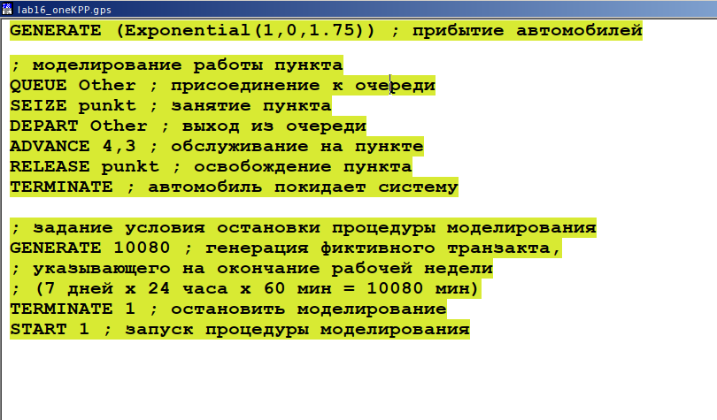{#fig:005 width=70%}

После запуска симуляции получаем отчёт (рис. @fig:006).

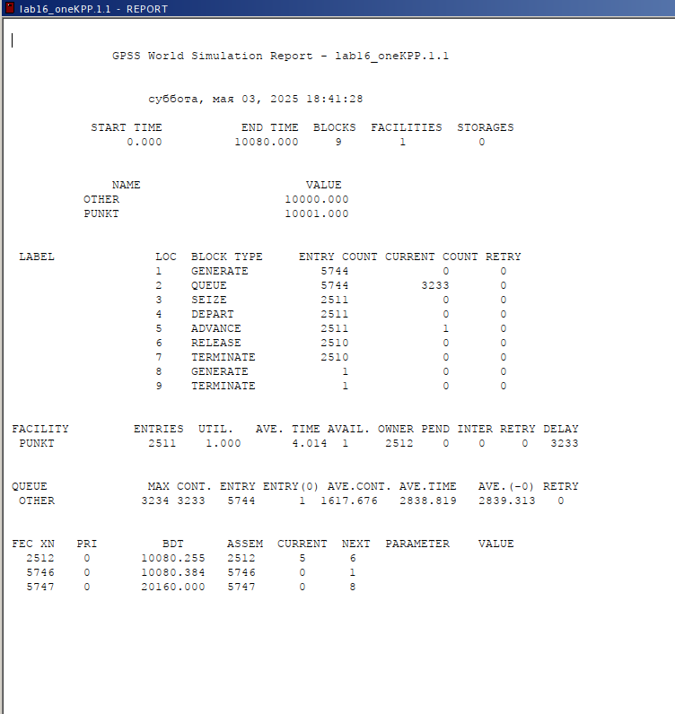{#fig:006 width=70%}

Здесь легко заметить, что условия не выполняются. Слишком большое время ожидания, коэффициент загрузки равен 1, среднее число автомобилей велико.

Так как модели с 2 пропускными пунктами у нас уже реализованы, и под условия также не подходят, перейдём к 3 и 4 пунктам.

Далее попробуем смоделировать три КПП для первой стратегии (рис. @fig:007).

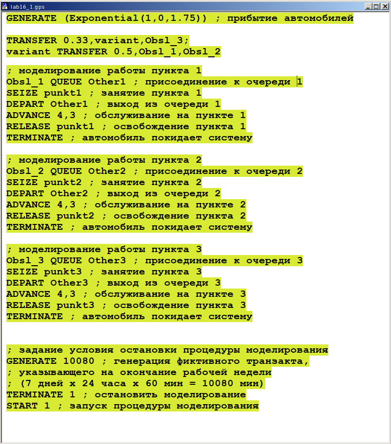{#fig:007 width=70%}

После запуска симуляции получаем отчёт (рис. @fig:008).

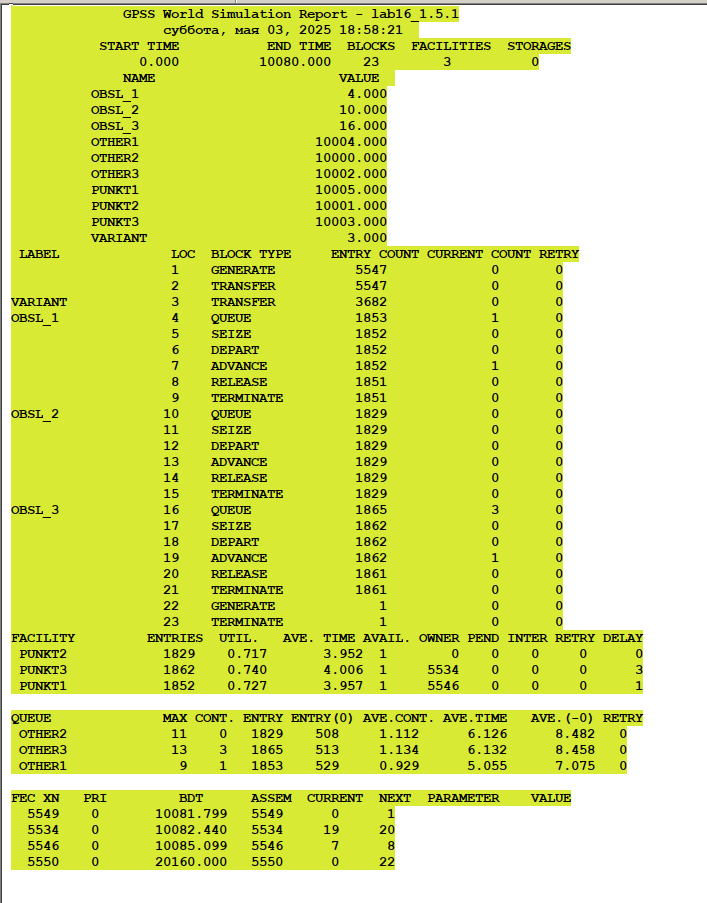{#fig:008 width=70%}

В этом случае среднее количество автомобилей в очереди меньше 3 и коэффициент загрузки в нужном диапазоне, но среднее время ожидания больше 4.

А вот **для второй стратегии три КПП -- оптимальное количество** (рис. @fig:009).

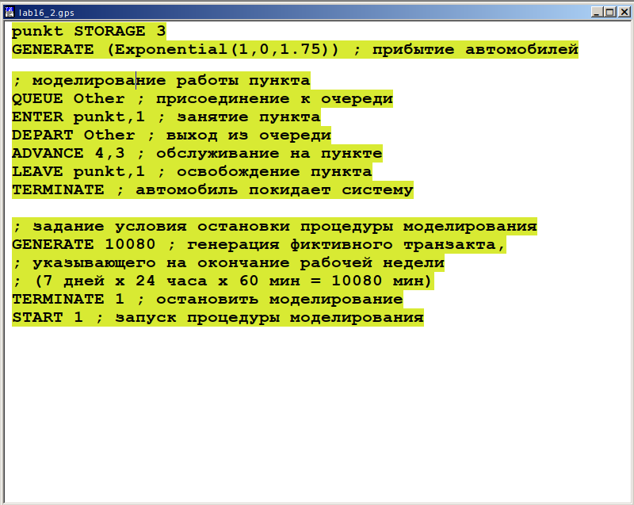{#fig:009 width=70%}

После запуска симуляции получаем отчёт (рис. @fig:010).

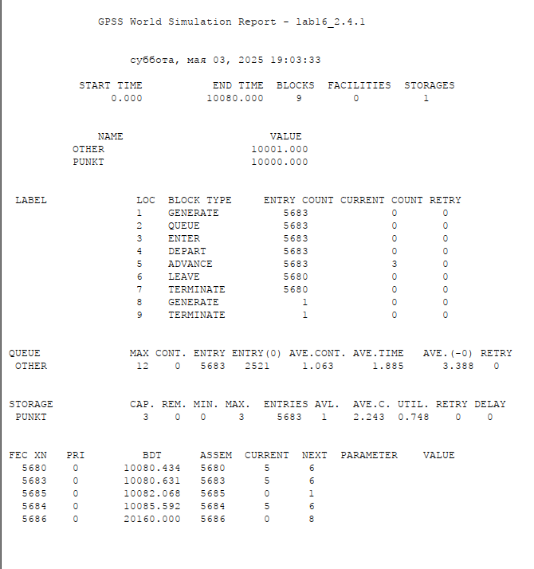{#fig:010 width=70%}

В этом случае все критерии выполняются.

И перейдём к четырём пропускным пунктам. Для первой стратегии получим:(рис. @fig:011)

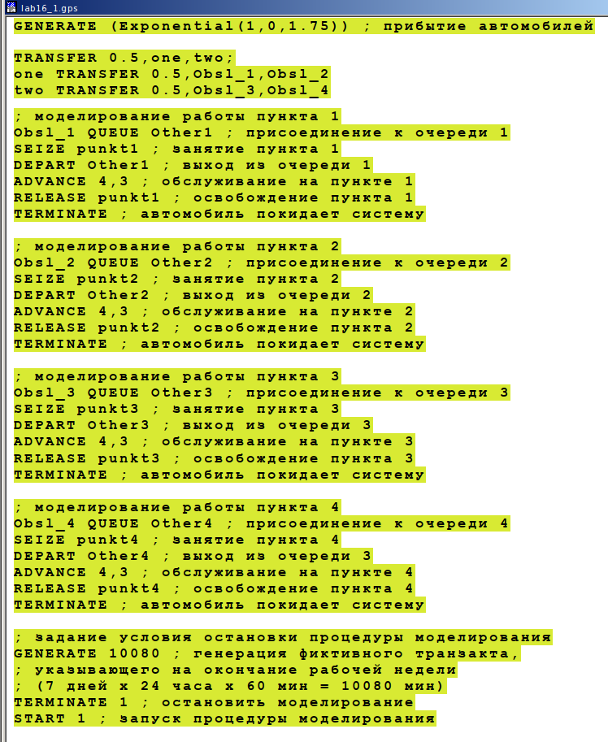{#fig:011 width=70%}

После запуска симуляции получаем отчёт (рис. @fig:012, @fig:013).

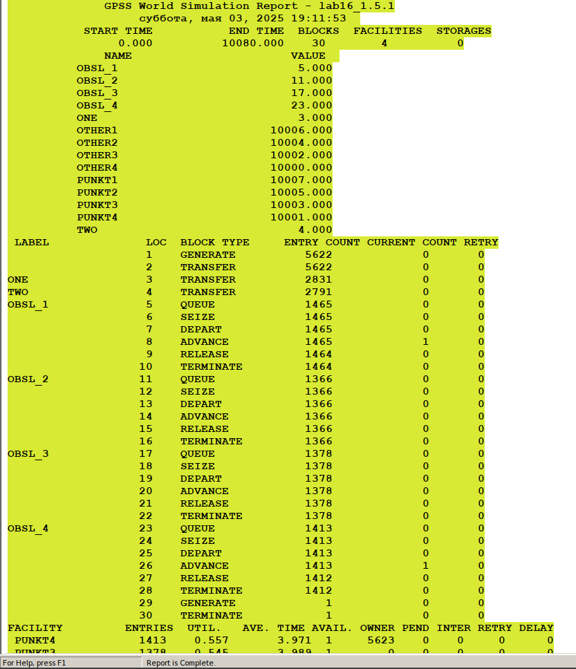{#fig:012 width=70%}

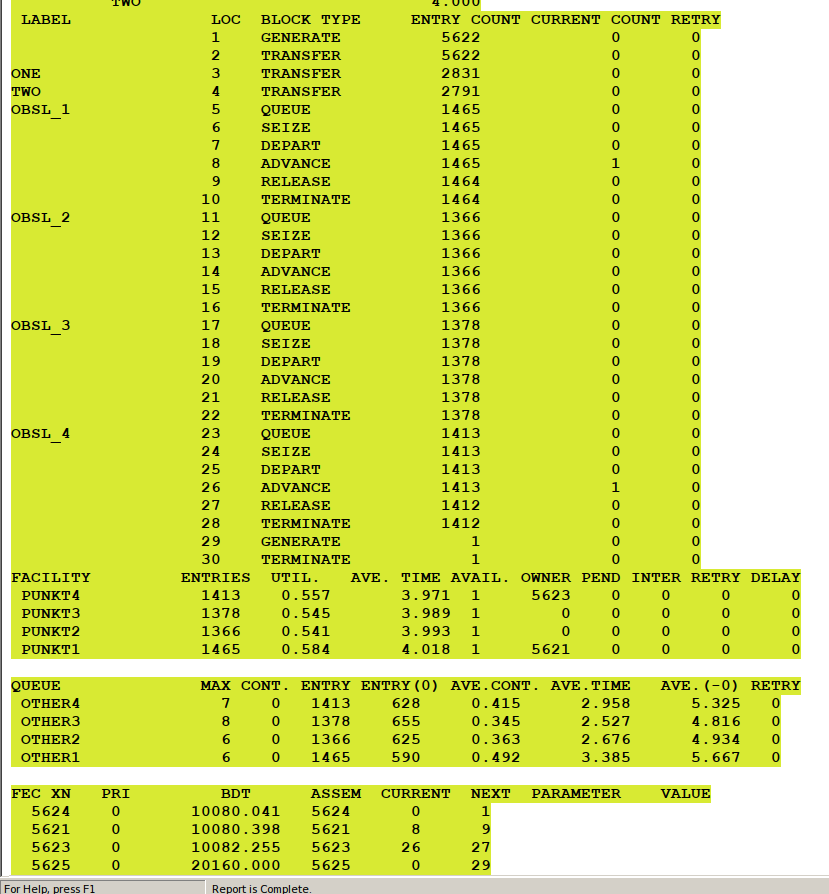{#fig:013 width=70%}

Для первой стратегии это количество пропускных пунктов (четыре) является оптимальным, так как выполняются все критерии: среднее количество автомобилей в очереди меньше 3 и коэффициент загрузки в нужном диапазоне, а также среднее время ожидания меньше 4.

И для второй стратегии, хоть мы уже и нашли оптимальное количество КПП, смоделируем работу с 4-мя КПП: (рис. @fig:014).

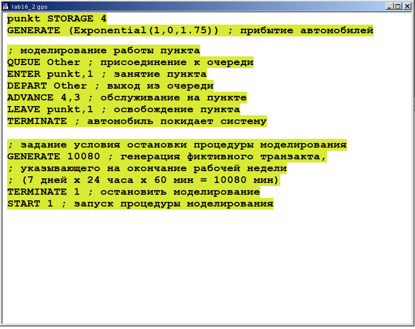{#fig:014 width=70%}

После запуска симуляции получаем отчёт (рис. @fig:015).

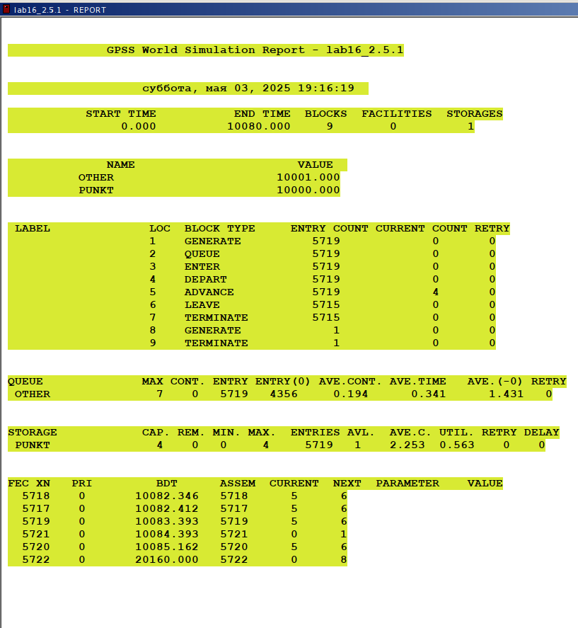{#fig:015 width=70%}

Все условия выполняются, но по отчёту можно сделать вывод, что четвертый пункт не играет значительной роли, и лишь немного разгружает остальные три пункта, что не является необходимым. Можно сделать вывод, что 4 пропускной пункт излишне разгружает систему.

В результате анализа наилучшим количеством пропускных пунктов будет **3 при втором типе обслуживания** и **4 при первом**.

# Выводы

В ходе данной лабораторной работы я реализовала с помощью gpss:

- модель с двумя очередями;
- модель с одной очередью;
- изменить модели, чтобы определить оптимальное число пропускных пунктов.

# Список литературы{.unnumbered}

::: {#refs}
:::
