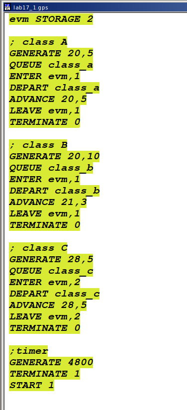
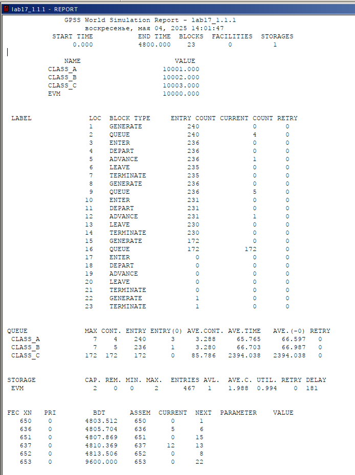
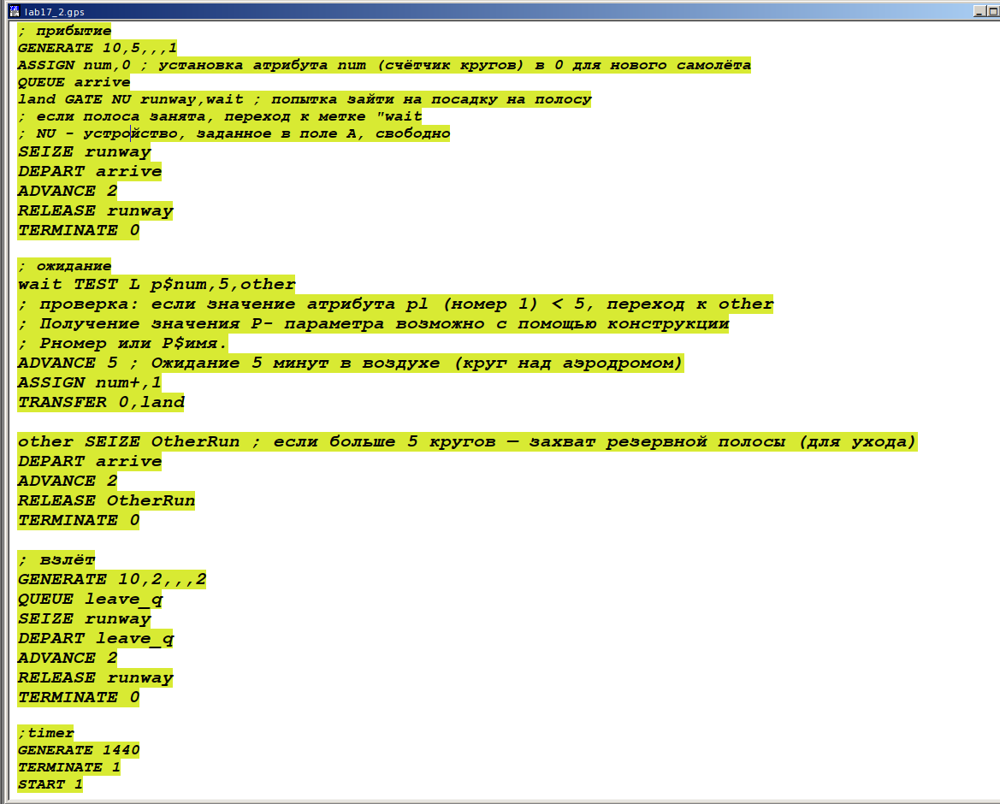
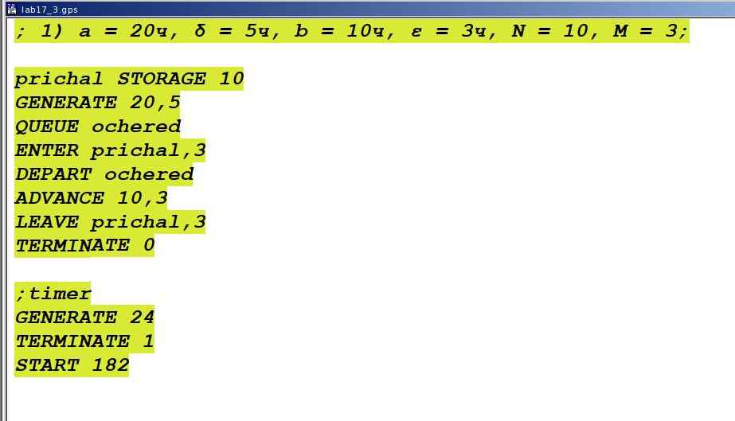
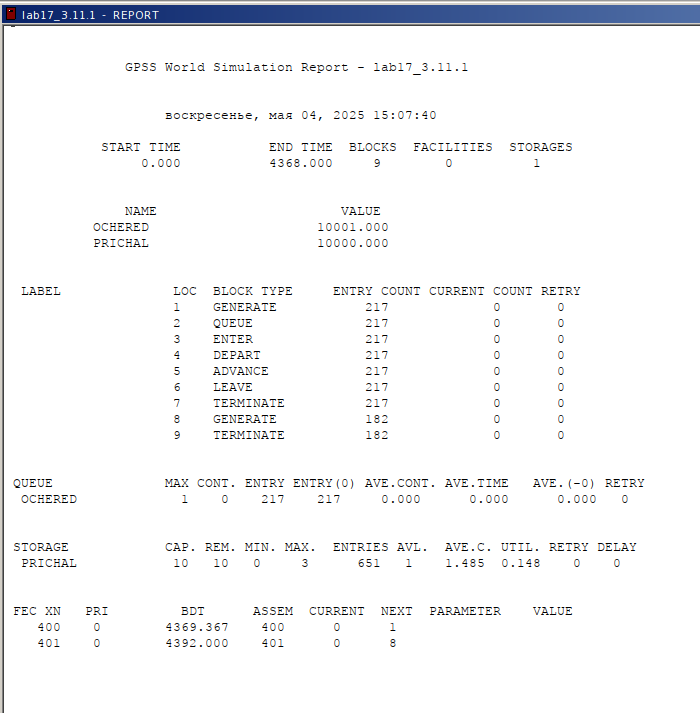
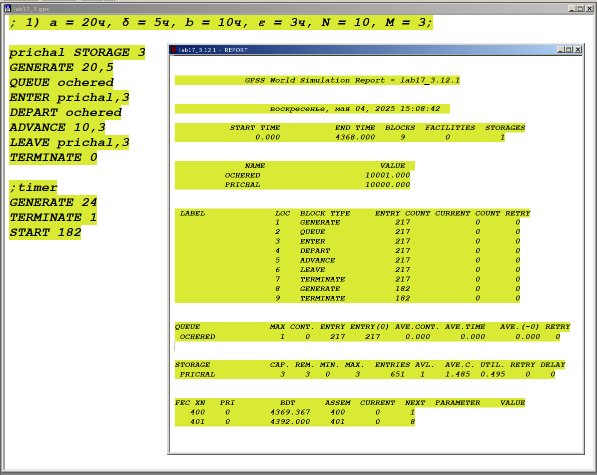
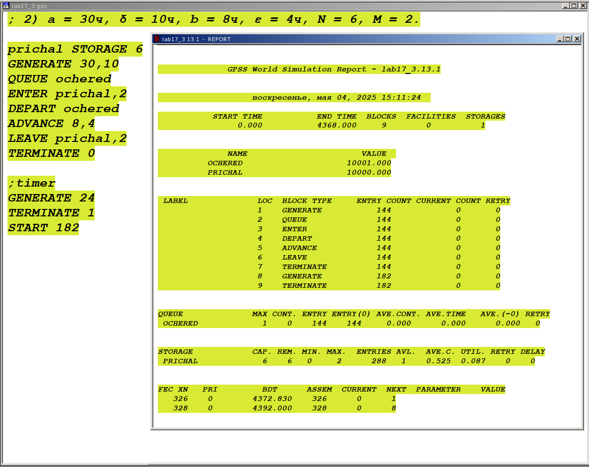
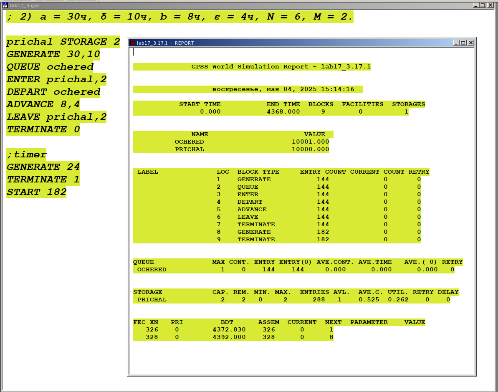

---
## Front matter
lang: ru-RU
title: "Лабораторная работа №17"
subtitle: "Дисциплина: Имитационное моделирование"
author:
  - Ганина Т. С.
institute:
  - Группа НФИбд-01-22
  - Российский университет дружбы народов, Москва, Россия
date: 4 мая 2025

## i18n babel
babel-lang: russian
babel-otherlangs: english

## Formatting pdf
toc: false
toc-title: Содержание
slide_level: 2
aspectratio: 169
section-titles: true
theme: metropolis
header-includes:
 - \metroset{progressbar=frametitle,sectionpage=progressbar,numbering=fraction}
 - '\makeatletter'
 - '\beamer@ignorenonframefalse'
 - '\makeatother'
---

# Информация

## Докладчик

:::::::::::::: {.columns align=center}
::: {.column width="70%"}

  * Ганина Таисия Сергеевна
  * Студентка 3го курса, группа НФИбд-01-22
  * Фундаментальная информатика и информационные технологии
  * Российский университет дружбы народов
  * [Ссылка на репозиторий гитхаба tsganina](https://github.com/tsganina/study_2024-2025_simmod)

:::
::: {.column width="30%"}

:::
::::::::::::::

# Вводная часть

## Цель 

Реализовать с помощью gpss задания для самостоятельной работы.

## Задание

Реализовать с помощью gpss:

- модель работы вычислительного центра;
- модель работы аэропорта;
- модель работы морского порта.

## Модель работы вычислительного центра

{#fig:001 width=20%}

## Модель работы вычислительного центра

{#fig:002 width=35%}

## Модель работы аэропорта

{#fig:003 width=50%}

## Модель работы аэропорта

{#fig:004 width=40%}

## Модель работы морского порта (1 вариант)

{#fig:005 width=50%}

## Модель работы морского порта (1 вариант)

{#fig:006 width=40%}

## Оптимизированная модель работы морского порта (1 вариант)

{#fig:007 width=60%}

## Модель работы морского порта (2 вариант)

{#fig:008 width=60%}

## Оптимизированная модель работы морского порта (2 вариант)

{#fig:009 width=60%}

# Результаты

В результате выполнения данной лабораторной работы я реализовала с помощью gpss:

- модель работы вычислительного центра;
- модель работы аэропорта;
- модель работы морского порта.
