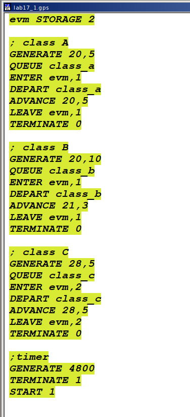
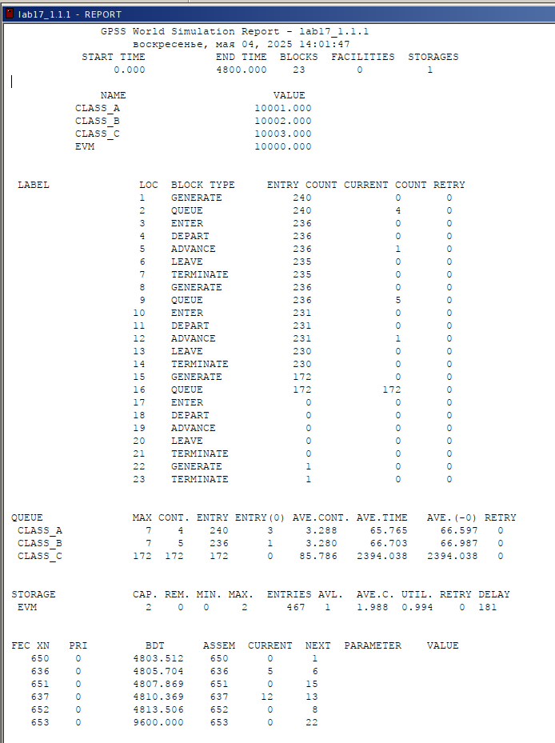
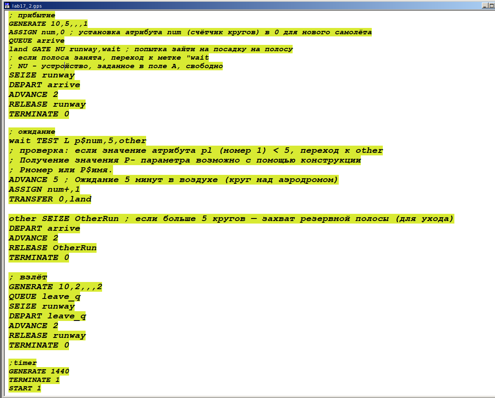
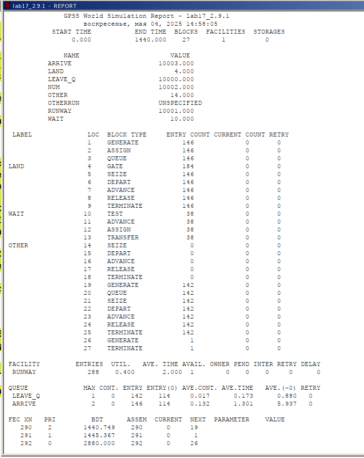
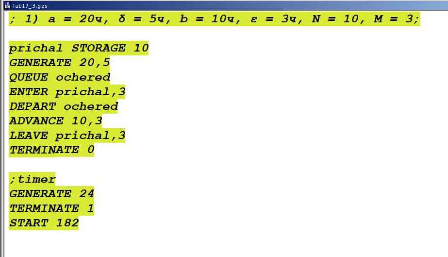
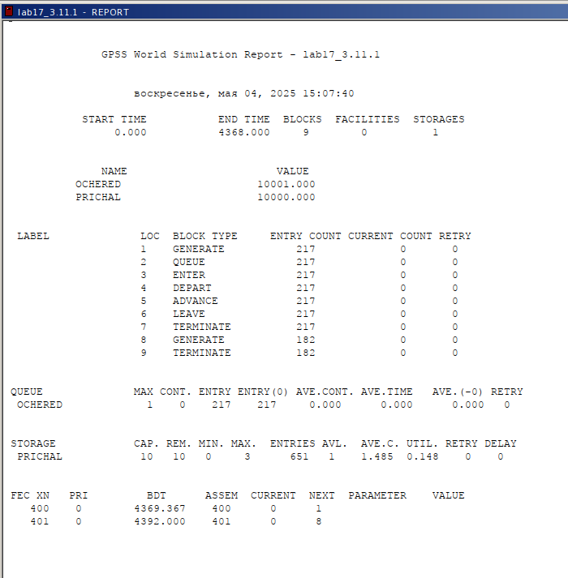
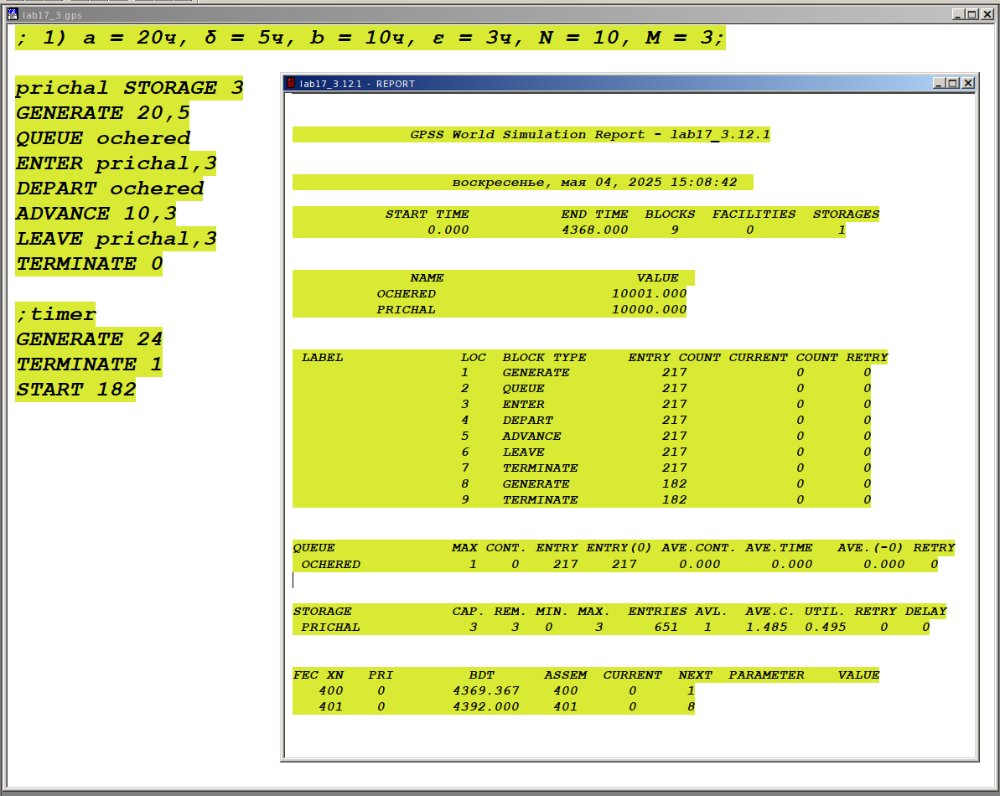
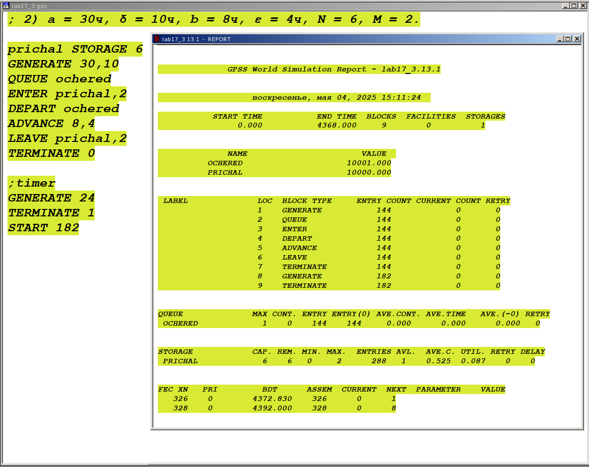
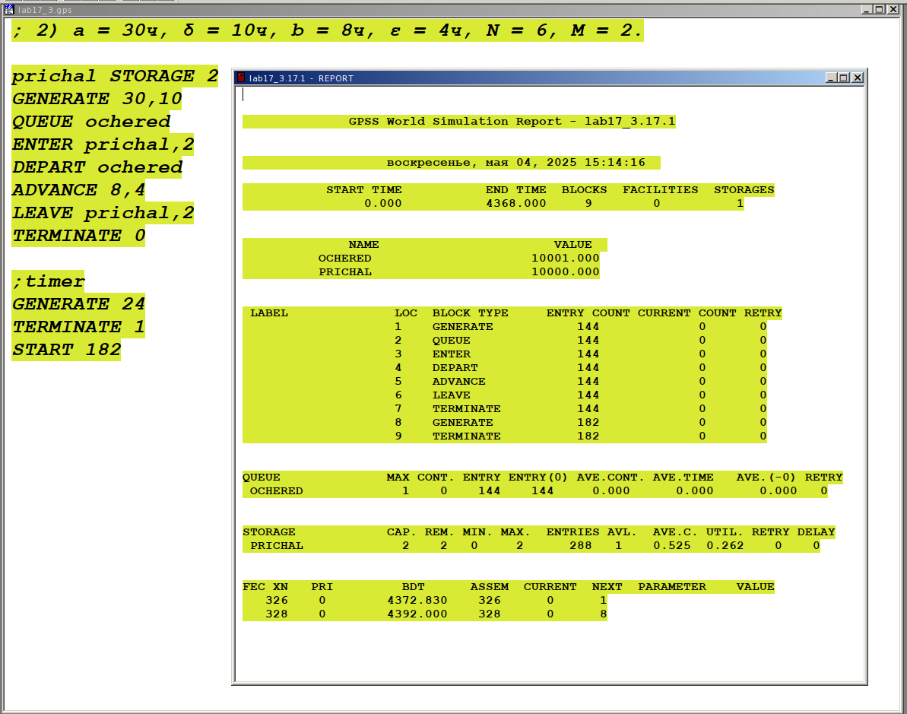

---
## Front matter
title: "Отчёт по лабораторной работе №17"
subtitle: "Имитационное моделирование"
author: "Ганина Таисия Сергеевна, НФИбд-01-22"

## Generic otions
lang: ru-RU
toc-title: "Содержание"

## Bibliography
bibliography: bib/cite.bib
csl: pandoc/csl/gost-r-7-0-5-2008-numeric.csl

## Pdf output format
toc: true # Table of contents
toc-depth: 2
lof: true # List of figures
lot: true # List of tables
fontsize: 12pt
linestretch: 1.5
papersize: a4
documentclass: scrreprt
## I18n polyglossia
polyglossia-lang:
  name: russian
  options:
	- spelling=modern
	- babelshorthands=true
polyglossia-otherlangs:
  name: english
## I18n babel
babel-lang: russian
babel-otherlangs: english
## Fonts
mainfont: PT Serif
romanfont: PT Serif
sansfont: PT Sans
monofont: PT Mono
mainfontoptions: Ligatures=TeX
romanfontoptions: Ligatures=TeX
sansfontoptions: Ligatures=TeX,Scale=MatchLowercase
monofontoptions: Scale=MatchLowercase,Scale=0.9
## Biblatex
biblatex: true
biblio-style: "gost-numeric"
biblatexoptions:
  - parentracker=true
  - backend=biber
  - hyperref=auto
  - language=auto
  - autolang=other*
  - citestyle=gost-numeric
## Pandoc-crossref LaTeX customization
figureTitle: "Рис."
tableTitle: "Таблица"
listingTitle: "Листинг"
lofTitle: "Список иллюстраций"
lotTitle: "Список таблиц"
lolTitle: "Листинги"
## Misc options
indent: true
header-includes:
  - \usepackage{indentfirst}
  - \usepackage{float} # keep figures where there are in the text
  - \floatplacement{figure}{H} # keep figures where there are in the text
---

# Цель работы

Реализовать с помощью gpss задания для самостоятельной работы.

# Задание

Реализовать с помощью gpss:

- модель работы вычислительного центра;
- модель работы аэропорта;
- модель работы морского порта.

# Теоретическое введение

GPSS (General Purpose Simulation System) — это один из первых специализированных языков программирования для имитационного моделирования, созданный в 1961 году американским инженером Джеффри Гордоном в корпорации IBM. Первоначально язык разрабатывался для нужд моделирования сложных логистических и производственных процессов в промышленных и военных системах, где требовался учёт случайных событий и взаимодействия большого количества объектов во времени.

GPSS стал знаковым инструментом в истории моделирования: он заложил основы событийного подхода и ввёл понятие транзакта как активного объекта, перемещающегося по блокам логики системы. Эти концепции впоследствии легли в основу многих других языков и программных сред моделирования. Благодаря модульной структуре и простой записи моделей, GPSS получил широкое распространение в университетах и научных учреждениях как средство обучения и анализа дискретных систем.

Практическое применение GPSS охватывает широкий спектр задач:

- Организация работы производственных цехов: моделирование потока деталей между станками, учёт времени обработки, простоев и загрузки оборудования;

- Системы массового обслуживания: моделирование очередей в банках, поликлиниках, аэропортах с целью оценки времени ожидания и необходимости в дополнительном персонале;

- Логистика и склады: моделирование перемещения товаров между зонами хранения, погрузки и разгрузки, анализ загрузки транспортных средств;

- Транспорт: моделирование движения автобусов, поездов, планирование расписаний с учётом времени на посадку и высадку пассажиров;

- Военные приложения: планирование операций снабжения, имитация действий в сложных логистических цепочках.

Одним из достоинств GPSS является то, что язык допускает использование случайных величин (например, времени обслуживания или интервалов между заявками), что позволяет создавать реалистичные модели, приближенные к поведению реальных систем. Также GPSS даёт возможность легко собирать статистику по ключевым метрикам: времени пребывания объектов в системе, загрузке ресурсов, количеству отказов и пр.

Несмотря на то, что с момента своего создания прошло более шестидесяти лет, GPSS продолжает использоваться как в учебных целях, так и в инженерной практике благодаря своей простоте, наглядности и эффективности в решении прикладных задач, связанных с анализом и оптимизацией дискретных процессов.

[@first; @second].

# Выполнение лабораторной работы

## Модель работы вычислительного центра

На вычислительном центре в обработку принимаются три класса заданий А, В и С.
Исходя из наличия оперативной памяти ЭВМ задания классов А и В могут решаться
одновременно, а задания класса С монополизируют ЭВМ. 

Задания класса А поступают через $20 \pm 5$ мин, класса В — через $20 \pm 10$ мин, класса С — через $28 \pm 5$ мин.

Требуют для выполнения: класс А — $20 \pm 5$ мин, класс В — 21 \pm 3 мин, класс
С — $28 \pm 5$ мин. 

Задачи класса С загружаются в ЭВМ, если она полностью свободна. Задачи классов А и В могут дозагружаться к решающей задаче. Смоделировать работу ЭВМ за 80 ч. Определить её загрузку.

Я использовала при моделировании многоканальное устройство `evm` на две заявки. Классы A, B занимают по одному месту, а класс С занимает сразу два места. Таймер выставила на 4800 минут (80*60). В итоге я получила следующую модель (рис. @fig:001).

{#fig:001 width=70%}

После запуска симуляции я получила отчёт (рис. @fig:002).

{#fig:002 width=70%}

В задании требовалось определить загрузку ЭВМ - она равна 0,994.

## Модель работы аэропорта

Самолёты прибывают для посадки в район аэропорта каждые $10 \pm 5$ мин. Если взлетно-посадочная полоса свободна, прибывший самолёт получает разрешение на посадку. Если полоса занята, самолет выполняет полет по кругу и возвращается в аэропорт каждые 5 мин. Если после пятого круга самолет не получает разрешения на посадку, он отправляется на запасной аэродром.

В аэропорту через каждые $10 \pm 2$ мин к взлетно -посадочной полосе выруливают готовые к взлёту самолёты и получают разрешение на взлёт, если полоса свободна. Для взлета и посадки самолёты занимают полосу ровно на 2 мин. Если при свободной полосе одновременно один самолёт прибывает для посадки, а другой -- для взлёта, то полоса предоставляется взлетающей машине.

Требуется:

- выполнить моделирование работы аэропорта в течение суток;
- подсчитать количество самолётов, которые взлетели, сели и были направлены на запасной аэродром;
- определить коэффициент загрузки взлетно-посадочной полосы.

Модель получилась следующая (рис. @fig:003):

{#fig:003 width=70%}

После запуска симуляции я получила отчёт (рис. @fig:004).

{#fig:004 width=70%}

Прибытие самолётов задаётся командой `GENERATE 10,5,,,1`.
Для каждого нового самолёта устанавливается счётчик кругов: `ASSIGN num,0` - установка атрибута num (счётчик кругов) в 0 для нового самолёта.

Далее самолёт пытается занять посадочную полосу. Если полоса занята, самолёт переходит к ожиданию (метка wait). Здесь проверяется, сколько кругов уже сделал самолёт: `TEST L p$num,5,other` -- если значение атрибута `p$num < 5`, переход к `other`.
Если кругов меньше пяти, самолёт ждёт 5 минут, делая круг над аэродромом: `ADVANCE 5` и увеличивает свой счётчик: `ASSIGN num+1,1`. После этого самолёт снова пытается занять полосу.

Если же самолёт сделал уже 5 кругов, он уходит на запасную полосу (метка other): `SEIZE OtherRun`.

Также в коде реализован процесс взлёта: `GENERATE 10,2,,,2`
создаёт поток самолётов на взлёт, которые занимают полосу (`SEIZE runway`), взлетают (`ADVANCE 2`) и освобождают её (`RELEASE runway`).

В конце моделирования используется таймер: `GENERATE 1440` и `TERMINATE 1`, что завершает моделирование через 1440 минут (сутки).

Взлетело 142 самолета, село 146, а в запасной аэропорт отправилось 0. В запасной аэропорт не отправились самолеты, поскольку процессы обработки длятся всего 2 минуты, что намного быстрее, чем генерации новых самолетов. Коэффициент загрузки полосы равняется 0,4, полоса большую часть времени не используется.

## Модель работы морского порта

Морские суда прибывают в порт каждые $[\alpha \pm \delta]$ часов. В порту имеется N причалов. Каждый корабль по длине занимает M причалов и находится в порту $[b \pm \varepsilon]$ часов.
Требуется построить GPSS-модель для анализа работы морского порта в течение полугода, определить оптимальное количество причалов для эффективной работы порта.

Рассмотрим два варианта исходных данных:

1) $a = 20$ ч, $\delta = 5$ ч, $b = 10$ ч, $\varepsilon = 3$ ч, $N = 10$, $M = 3$;
2) $a = 30$ ч, $\delta = 10$ ч, $b = 8$ ч, $\varepsilon = 4$ ч, $N = 6$, $M = 2$.

**Первый вариант модели**

В этой модели я снова использовала многоканальное устройство и через него задавала количество причалов. После этого всё шло по стандартной схеме - "генерировалось" судно, оно вставало в очередь, после -- получало место у причалов, занимая три причала. Заняв место, судно покидало очередь, проводило необходимое время у причала. Потом освобождаются занятые места (3 причала), так как судно отчаливает.

Модель получилась следующая (рис. @fig:005):

{#fig:005 width=70%}

После запуска симуляции я получила отчёт (рис. @fig:006).

{#fig:006 width=70%}

Судна обрабатываются быстрее, чем успевают приходить новые, так как очередь не набирается. По отчёту видно, что коэффициент загрузки довольно мал - всего 0,148. Это указывает на то, что подбирая оптимальное количество причалов, их можно уменьшить. Наименьшее возможное число причалов равно 3, так как каждый корабль в длину занимает именно 3 причала. Я заменила строчку `prichal STORAGE 10` на `prichal STORAGE 3` и получила следующее (рис. @fig:007):

{#fig:007 width=70%}

Здесь уже коэффициент загрузки равен 0,495, что является более эффективным.

**Второй вариант модели**

Во втором варианте модели у нас изменились лишь параметры, так что модель выглядит идентично (рис. @fig:008):

{#fig:008 width=70%}

В задании также сказано оптимизировать модель, потому что на данном этапе коэффициент загрузки ничтожно мал - всего 0,087. Так что, как и в прошлый раз, я сократила количество причалов до минимально возможного  (рис. @fig:009).

{#fig:009 width=70%}

В данном случае видно, что коэффициент загрузки стал равен 0,262, что уже выше, чем в прошлый раз.

# Выводы

В результате выполнения данной лабораторной работы я реализовала с помощью gpss:

- модель работы вычислительного центра;
- модель работы аэропорта;
- модель работы морского порта.

# Список литературы{.unnumbered}

::: {#refs}
:::
