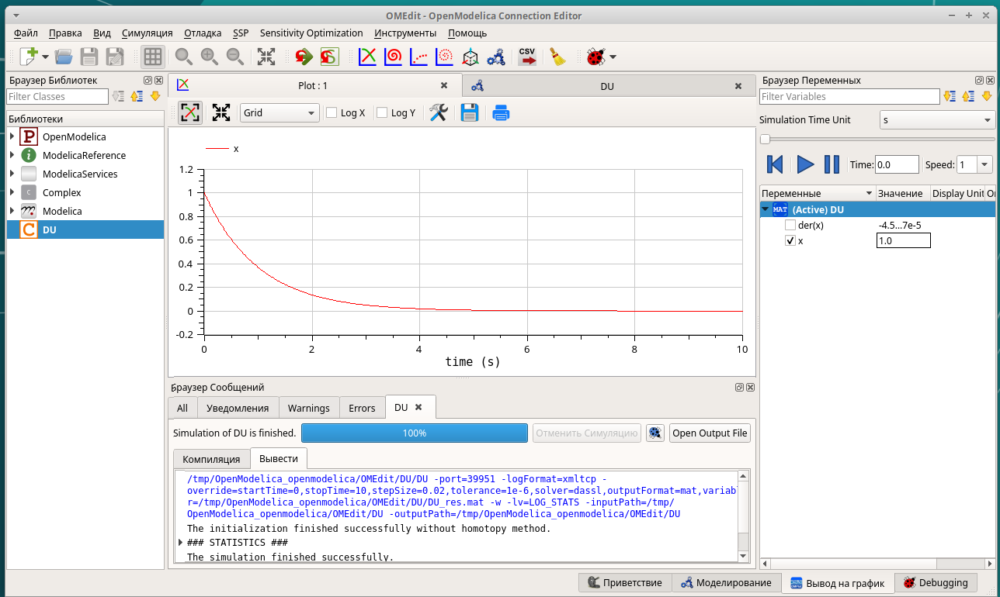

---
## Front matter
title: "Отчёт по упражнению (Scilab, подсистема xcos)"
subtitle: "Дисциплина: Имитационное моделирование"
author: "Ганина Таисия Сергеевна, НФИбд-01-22"

## Generic otions
lang: ru-RU
toc-title: "Содержание"

## Bibliography
bibliography: bib/cite.bib
csl: pandoc/csl/gost-r-7-0-5-2008-numeric.csl

## Pdf output format
toc: true # Table of contents
toc-depth: 2
lof: true # List of figures
lot: true # List of tables
fontsize: 12pt
linestretch: 1.5
papersize: a4
documentclass: scrreprt
## I18n polyglossia
polyglossia-lang:
  name: russian
  options:
	- spelling=modern
	- babelshorthands=true
polyglossia-otherlangs:
  name: english
## I18n babel
babel-lang: russian
babel-otherlangs: english
## Fonts
mainfont: PT Serif
romanfont: PT Serif
sansfont: PT Sans
monofont: PT Mono
mainfontoptions: Ligatures=TeX
romanfontoptions: Ligatures=TeX
sansfontoptions: Ligatures=TeX,Scale=MatchLowercase
monofontoptions: Scale=MatchLowercase,Scale=0.9
## Biblatex
biblatex: true
biblio-style: "gost-numeric"
biblatexoptions:
  - parentracker=true
  - backend=biber
  - hyperref=auto
  - language=auto
  - autolang=other*
  - citestyle=gost-numeric
## Pandoc-crossref LaTeX customization
figureTitle: "Рис."
tableTitle: "Таблица"
listingTitle: "Листинг"
lofTitle: "Список иллюстраций"
lotTitle: "Список таблиц"
lolTitle: "Листинги"
## Misc options
indent: true
header-includes:
  - \usepackage{indentfirst}
  - \usepackage{float} # keep figures where there are in the text
  - \floatplacement{figure}{H} # keep figures where there are in the text
---

# Цель работы

Целью данной работы является приобретение навыков использования  Scilab, а именно - подсистемы xcos. Также необходимо создать простую модель в OpenModelica.

# Задание

1. Построить с помощью xcos фигуры Лиссажу.
2. Выполнить моделирование в OMEdit.

# Теоретическое введение

Scilab — система компьютерной математики, предназначенная для решения вычислительных задач. Основное окно Scilab содержит обозреватель файлов, командное окно, обозреватель переменных и журнал команд.

Программа xcos является приложением к пакету Scilab. Для вызова окна xcos необходимо в меню основного окна Scilab выбрать `Инструменты -> Визуальное моделирование xcos`.
При моделировании с использованием xcos реализуется принцип визуального программирования, в соответствии с которым пользователь на экране из палитры блоков создаёт модель и осуществляет расчёты.

OpenModelica — среда объектно-ориентированного моделирования и моделирования на языке Modelica. OMEdit (OpenModelica Connection Editor) — графический пользовательский интерфейс для редактирования модели в OpenModelica. [@lab_ruk]

# Выполнение лабораторной работы

## Построить с помощью xcos фигуры Лиссажу.

Первым делом я запустила Scilab, после выбрала `Инструменты -> Визуальное моделирование xcos` (рис. @fig:001, @fig:002).

{#fig:001 width=70%}

{#fig:002 width=70%}

После этого я составила модель функционирования двух источников синусоидального сигнала, позволяющую в зависимости от задаваемых параметров построить различные фигуры Лиссажу.

В работе я использовала следующие блоки из палитры:

- CLOCK_c - запуск часов модельного времени;
- GENSIN_f - блок генератора синусоидального сигнала;
- CSCOPEXY - анимированное регистрирующее устройство для построения графика типа y = f(x);
- TEXT_f - задаёт текст примечаний.
(рис. @fig:003, @fig:004)

{#fig:003 width=70%}

{#fig:004 width=70%}

Я меняла частоту и фазу, чтобы получить разные фигуры. В подписи к рисунку, а также на самих скриншотах можно увидеть параметры, которые были заданы для каждого графика. (рис. @fig:005, @fig:006, @fig:007, @fig:008, @fig:009, @fig:010, @fig:011, @fig:012, @fig:013, @fig:014, @fig:015, @fig:016, @fig:017, @fig:018, @fig:019, @fig:020, @fig:021, @fig:022, @fig:023, @fig:024, @fig:025, @fig:026).

{#fig:005 width=70%}

{#fig:006 width=70%}

{#fig:007 width=70%}

{#fig:008 width=70%}

{#fig:009 width=70%}

{#fig:010 width=70%}

{#fig:011 width=70%}

{#fig:012 width=70%}

{#fig:013 width=70%}

{#fig:014 width=70%}

{#fig:015 width=70%}

{#fig:016 width=70%}

{#fig:017 width=70%}

{#fig:018 width=70%}

{#fig:019 width=70%}

{#fig:020 width=70%}

{#fig:021 width=70%}

{#fig:022 width=70%}

{#fig:023 width=70%}

{#fig:024 width=70%}

{#fig:025 width=70%}

{#fig:026 width=70%}

## Реализация модели в OpenModelica

Далее я моделировала класс дифференциального уравнениия $x'=-x$. Для этого я зашла в OMEdit (`OMEdit &`) и создала этот класс (рис. @fig:027, @fig:028).

{#fig:027 width=70%}

{#fig:028 width=70%}

В результате симуляции я получила такие графики: (рис. @fig:029, @fig:030, @fig:031,  @fig:032,  @fig:033)

{#fig:029 width=70%}

{#fig:030 width=70%}

{#fig:031 width=70%}

{#fig:032 width=70%}

{#fig:033 width=70%}

# Выводы

В результате выполнения лабораторной работы я научилась работать со средствами моделирования xcos и OpenModelica.

# Список литературы{.unnumbered}

::: {#refs}
:::

